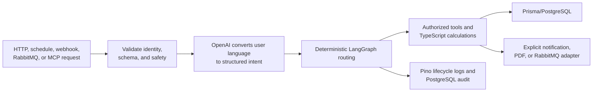
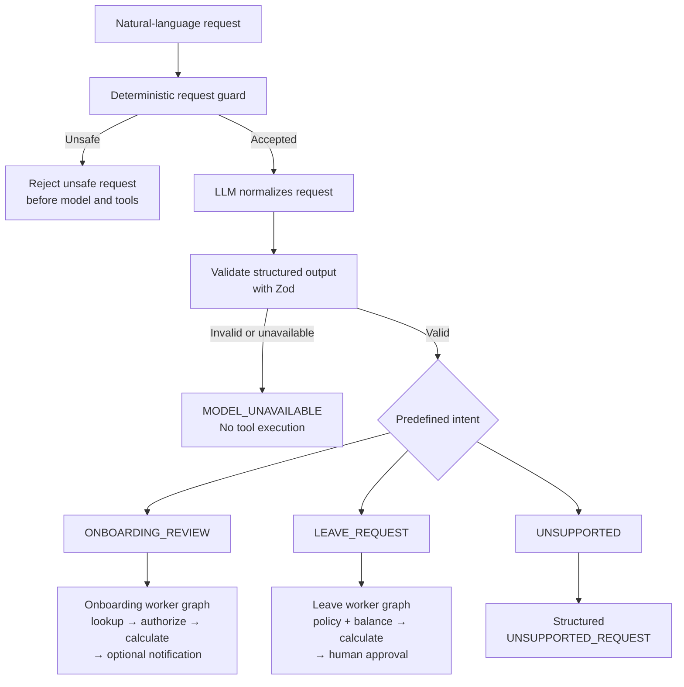

# Agentic LLMOps for HCM

A TypeScript HR backend for Human Capital Management (HCM), demonstrating LLM orchestration, LangGraph workflows, RAG, MCP tools, guardrails, human approval, automated triggers, and LangSmith observability.

The system translates natural-language requests into a validated, predefined intent. Deterministic application code then:

- resolves identity and authorizes access;
- selects a worker graph;
- performs deterministic calculations;
- persists workflow and audit state; and
- executes only explicitly permitted side effects.

> [!IMPORTANT]
> This repository is a development and learning implementation, not a production HCM system. `X-Employee-Id` is a mock development identity, manager notifications use a development adapter, and all seeded employee and policy data is synthetic.

[](https://nodejs.org/)
[](https://www.typescriptlang.org/)
[](LICENSE)

## Contents

- [Project overview](#project-overview)
- [Quick start](#quick-start)
- [How the system works](#how-the-system-works)
- [Where the LLM is used](#where-the-llm-is-used)
- [Intent normalization and routing](#intent-normalization-and-routing)
- [HCM workflows](#hcm-workflows)
- [Policy knowledge and RAG](#policy-knowledge-and-rag)
- [Security and guardrails](#security-and-guardrails)
- [Observability and logging](#observability-and-logging)
- [LLMOps, tracing, and evaluation](#llmops-tracing-and-evaluation)
- [Interfaces and automation](#interfaces-and-automation)
- [Data and repository structure](#data-and-repository-structure)
- [Testing](#testing)
- [Current limitations](#current-limitations)
- [Production-readiness roadmap](#production-readiness-roadmap)
- [Extending the system](#extending-the-system)
- [Project delivery](#project-delivery)
- [Further documentation](#further-documentation)

## Project overview

The API implements two conversational employee workflows and one policy-knowledge capability:

- **Onboarding review:** The initial or probationary review period for a new employee. The system finds the active review, calculates days remaining, applies a warning threshold, and optionally notifies a manager when an authorized request explicitly asks for it.
- **Annual leave:** Paid vacation entitlement. The system reads the policy and balance, calculates an eligible proposal, pauses for human approval, then creates one submitted request. An authorized download generates its PDF on demand.
- **Policy knowledge:** Repository-managed policy PDFs are indexed into PostgreSQL/pgvector. The system retrieves relevant excerpts before asking the model for an answer backed by page and chunk citations.

### Terminology

| Term                               | Meaning in this project                                                                                       |
| ---------------------------------- | ------------------------------------------------------------------------------------------------------------- |
| HCM                                | Human Capital Management: software and workflows for employee records and employment processes.               |
| LLM                                | Large language model. OpenAI models interpret user language and return structured intent or grounded answers. |
| Deterministic                      | Controlled by application code and expected to produce the same result from the same validated input.         |
| RAG                                | Retrieval-augmented generation: retrieve relevant policy text before asking the model to answer.              |
| MCP                                | Model Context Protocol: a standard interface through which clients discover and call exposed tools.           |
| Idempotent                         | Safe to repeat without creating duplicate records or repeating an external action.                            |
| Side effect                        | An operation that changes data or contacts another component, such as a notification or event publish.        |
| LangGraph checkpoint               | Persisted workflow state that lets a conversation continue across requests or API restarts.                   |
| Personally identifiable data (PII) | Employee information such as identifiers, names, email addresses, or phone numbers.                           |

### Implemented capabilities

| Area                   | Implemented behavior                                                                                             |
| ---------------------- | ---------------------------------------------------------------------------------------------------------------- |
| Language understanding | OpenAI `ChatOpenAI`, a versioned prompt, timeout, one bounded retry, and strict Zod output                       |
| Agent orchestration    | A LangGraph supervisor with deterministic routing to onboarding and leave subgraphs                              |
| Conversations          | PostgreSQL-backed checkpoints for multi-turn continuation and human approval                                     |
| Business workflows     | Authorized tools, deterministic calculations, idempotent leave submission, and on-demand PDF generation          |
| Knowledge retrieval    | Explicit PDF indexing, OpenAI embeddings, pgvector retrieval, grounded answers, and page/chunk sources           |
| Interfaces             | JSON, Server-Sent Events (SSE), read-only MCP tools, webhook, scheduler, and RabbitMQ triggers                   |
| Security               | Pre-model checks, protected-tool authorization, explicit side-effect permission, thread ownership, and redaction |
| Operations             | Pino JSON logs, PostgreSQL audit records, optional LangSmith traces, LangGraph Studio, and offline evaluation    |

## Quick start

### Prerequisites

- Node.js 22 or newer
- npm
- Docker Desktop with Docker Compose
- an OpenAI API key

### Prepare configuration

```bash
cp .env.example .env
```

Set these values in `.env`:

```dotenv
OPENAI_API_KEY=your-api-key
WEBHOOK_API_KEY=replace-with-at-least-32-random-characters
```

The remaining values have development defaults. See the [complete configuration reference](docs/configuration.md) for application, Docker, evaluation, scheduler, RabbitMQ, and tracing settings.

### Option A: local API with Docker infrastructure

```bash
npm install
docker compose up -d postgres rabbitmq
npm run db:generate
npm run db:migrate
npm run db:seed
npm run dev
```

The API listens on `http://localhost:3000`.

### Option B: full Docker Compose stack

```bash
docker compose up -d --build
docker compose exec api npm run db:seed
```

The API listens on `http://localhost:3300`. The process uses container port `3000`; `API_PORT=3300` controls only the host mapping. Seeding resets the sample runtime and indexed knowledge data, so never use it against data that must be preserved.

### Check the service

Use port `3300` instead when running the full Docker Compose stack.

```bash
curl http://localhost:3000/health
```

Expected HTTP `200` header:

```http
Content-Type: application/json
```

Representative body:

```json
{ "status": "ok" }
```

This response has no variable fields.

```bash
curl http://localhost:3000/ready
```

When PostgreSQL is reachable, expect HTTP `200` header:

```http
Content-Type: application/json
```

Representative body:

```json
{ "status": "ready" }
```

When PostgreSQL is unavailable, expect HTTP `503` with the same JSON content type:

```json
{ "status": "not_ready" }
```

The status and body vary with PostgreSQL availability; neither readiness body contains variable IDs, dates, or timestamps.

### Run the first onboarding review

The seeded `EMP-201` identity represents an employee reviewing their own status:

```bash
curl --request POST \
  --url http://localhost:3000/api/v1/agent/invoke \
  --header 'Content-Type: application/json' \
  --header 'X-Employee-Id: EMP-201' \
  --data '{"query":"Review my onboarding status"}'
```

Representative HTTP response:

```http
HTTP/1.1 200 OK
Content-Type: application/json
X-Thread-Id: <thread-id>
```

```json
{
  "status": "COMPLETED",
  "message": "Employee onboarding review completed.",
  "threadId": "<thread-id>",
  "runId": "<run-id>",
  "correlationId": "<correlation-id>",
  "data": {
    "employeeCode": "EMP-201",
    "fullName": "Samira Noor",
    "reviewEndDate": "<review-end-date>",
    "daysRemaining": 14,
    "withinThreshold": true,
    "action": "REVIEW_ONLY",
    "actionPerformed": false
  }
}
```

`runId` is generated for each execution attempt. Omitting `X-Thread-Id` starts a conversation and
generates its `threadId`; that ID remains stable for a continuation. `correlationId` uses a valid
supplied `X-Correlation-Id` or is generated for the request. `reviewEndDate`, `daysRemaining`, and
the threshold result vary with the seeded employee data and the date the request runs.

For complete success, failure, continuation, approval, trigger, RAG, and MCP flows, continue with the [manual testing guide](docs/manual-testing.md).

## How the system works

The model interprets language; trusted application components decide what is permitted and executed.



Schedule, webhook, and RabbitMQ commands already contain typed onboarding intent, so they skip OpenAI intent normalization. They still pass through identity resolution, graph routing, authorization, calculation, side-effect policy, and audit recording.

```text
controller or trigger → application service → HCM graph → domain subgraph → authorized tool → repository or adapter
```

`server.ts` starts the runtime. Controllers translate HTTP details, graphs contain topology, graph nodes contain executable behavior, routing modules contain conditional decisions, services contain calculations, and repositories isolate persistence. See the [architecture guide](docs/architecture.md) for the complete dependency map.

## Where the LLM is used

| Model boundary         | Input                                        | Output                                                                                      | Application controls                                                                             |
| ---------------------- | -------------------------------------------- | ------------------------------------------------------------------------------------------- | ------------------------------------------------------------------------------------------------ |
| Intent normalization   | A user query accepted by the request guard   | `ONBOARDING_REVIEW`, `LEAVE_REQUEST`, or `UNSUPPORTED`; missing fields continue the request | Prompt `hcm-intent-v3`, Zod schema, 15-second timeout, and one retry                             |
| Knowledge embeddings   | Policy chunks or a search question           | 1,536-dimensional vectors                                                                   | Configuration gate, limits, safety checks, and active-version retrieval                          |
| Grounded policy answer | A question and bounded retrieved policy text | An answer with cited retrieved chunk IDs                                                    | Evidence-only prompt, citation/URL validation, output safety, and insufficient-evidence fallback |

The model does **not**:

- authenticate the development identity or authorize employee access;
- calculate dates, thresholds, working days, notice, leave limits, or balances;
- approve leave or decide whether a notification or database write is allowed;
- enforce idempotency, RabbitMQ retry policy, or thread ownership;
- write audit records, publish events, generate PDFs, or select safe telemetry fields.

Agent queries are excluded from checkpoints, Pino logs, PostgreSQL audit summaries, and SSE progress. When explicit LangSmith agent tracing is enabled, the exact raw query is intentionally included in that external trace.

## Intent normalization and routing



| Intent              | Meaning                                                    | Route                           |
| ------------------- | ---------------------------------------------------------- | ------------------------------- |
| `ONBOARDING_REVIEW` | Review an active onboarding or probationary period         | Onboarding worker graph         |
| `LEAVE_REQUEST`     | Prepare an annual-leave proposal from explicit dates       | Leave worker graph              |
| `UNSUPPORTED`       | The request does not match an implemented agent capability | Structured unsupported response |

The model may select only a predefined enum value and must satisfy strict Zod output. It cannot create routes, authorize, calculate, or execute side effects; deterministic application code owns those decisions and actions.

When a supported request is missing fields, the API returns `NEED_MORE_INFORMATION` and can continue on the same thread. Missing fields are not an intent. `UNSUPPORTED` is a valid normalized intent and returns `UNSUPPORTED_REQUEST`.

Deterministic guards reject unsafe input before OpenAI or tools run. Invalid output, timeout, or model failure after one bounded retry returns HTTP `503 MODEL_UNAVAILABLE`, and no protected tool runs.

Typed schedule, webhook, and RabbitMQ commands skip model normalization because they already carry a typed command. They enter the same deterministic workflow and audit path.

## HCM workflows

### Onboarding review

The workflow loads the target employee and active review period, authorizes the actor, and calculates `daysRemaining` and `withinThreshold` in TypeScript.

- An employee may review only their own record.
- A manager may review a direct report.
- HR may review any employee.
- Every protected tool checks the applicable database-derived rule at its own boundary.

A review-only request never sends a notification. The notification adapter runs only when an authorized request explicitly asks for it and the review falls inside the requested threshold.

### Annual leave

The leave worker loads policy and balance in parallel. TypeScript counts Monday–Friday working days and checks notice, maximum consecutive days, and available balance. An eligible proposal pauses at a LangGraph `interrupt()` before any write.

- `REJECT` creates no request.
- `APPROVE` reloads policy and balance, recalculates eligibility, and creates one `SUBMITTED` request. An authorized document download renders its PDF on demand.
- Repeating approval returns the existing request instead of creating a duplicate.

Employees and managers may submit leave only for themselves; HR may submit for another employee.

### State, identifiers, and streaming

| Identifier      | Meaning                                                                             |
| --------------- | ----------------------------------------------------------------------------------- |
| `threadId`      | One durable conversation, reused for missing information or human approval.         |
| `runId`         | One graph execution attempt. Continuing a conversation creates a new run.           |
| `correlationId` | One transport request propagated through logs, audit records, events, and adapters. |

LangGraph `PostgresSaver` persists continuation-safe state and binds each thread to its initiating `X-Employee-Id`. Raw queries, employee records, and secrets are excluded from checkpoints.

With `Accept: text/event-stream`, agent invocation emits safe `run`, `intent`, `node`, `tool`, `approval`, `document`, and final `response` events. Progress contains identifiers and stable outcome codes, not raw queries or employee records.

## Policy knowledge and RAG

Retrieval-augmented generation (RAG) retrieves relevant policy excerpts before asking the model to answer only from that evidence. Repository PDFs produce page/chunk citations.

```text
knowledge-documents/ → extraction → safety inspection → chunks → embeddings
                     → active PostgreSQL/pgvector version → cited answer
```

For a local API:

```bash
# Index new or changed repository policies
npm run knowledge:index

# Optional: verify that unchanged documents are skipped
npm run knowledge:index
```

For Docker Compose:

```bash
# Index inside the API container
docker compose exec api npm run knowledge:index
```

The first local run reports `INDEXED` or `UPDATED`. The optional unchanged run reports `SKIPPED`; it does not create duplicates.

`npm run db:seed` clears the knowledge index. The next `npm run knowledge:index` creates new document UUIDs, so copy current IDs from the indexer output or PostgreSQL before using the document-scoped endpoint. A missing or stale scope returns `404 KNOWLEDGE_DOCUMENT_NOT_FOUND` before an OpenAI call.

```bash
curl --request POST \
  --url http://localhost:3000/api/v1/knowledge/query \
  --header 'Content-Type: application/json' \
  --header 'X-Employee-Id: EMP-201' \
  --data '{"query":"How many remote-working days are allowed each week?"}'
```

Representative HTTP response when the indexed evidence supports an answer:

```http
HTTP/1.1 200 OK
Content-Type: application/json
X-Correlation-Id: <correlation-id>
```

```json
{
  "status": "ANSWERED",
  "answer": "Eligible employees may work remotely up to two days each week after manager approval.",
  "sources": [
    {
      "documentId": "<employee-policy-document-id>",
      "documentTitle": "Mock Employee Policy",
      "chunkId": "<employee-policy-chunk-id>",
      "chunkIndex": 1,
      "pageNumber": 2
    }
  ]
}
```

Document, chunk, and page values vary with the active index and the answer varies with the
retrieved evidence. Because this command omits `X-Correlation-Id`, its `<correlation-id>` is
generated per request. Without enough evidence, the same endpoint returns HTTP `200` with
`INSUFFICIENT_EVIDENCE` and an empty `sources` array instead of asking the model to guess.

See [RAG testing and troubleshooting](docs/rag-testing-and-troubleshooting.md) for complete HTTP and MCP scenarios, expected responses, retrieval settings, LangSmith inspection, and database diagnostics. See [repository knowledge indexing](docs/knowledge-indexing.md) for PDF limits, version activation, and indexing failure codes.

## Security and guardrails

Security controls surround the model and retrieved content; they are not model instructions.

| Control                              | What it does                                                                                            |
| ------------------------------------ | ------------------------------------------------------------------------------------------------------- |
| Schema validation                    | Rejects malformed bodies, unknown query properties, model output, events, and resume decisions          |
| Direct request guard                 | Stops known instruction overrides, prompt disclosure, bulk extraction, and security bypass before tools |
| Canonical development identity       | Resolves `X-Employee-Id` through PostgreSQL and never trusts a request-supplied role                    |
| Protected-tool authorization         | Rechecks role, ownership, and reporting rules before protected reads or actions                         |
| Explicit side-effect permission      | Requires an explicit notification request or resumed human leave approval                               |
| Thread ownership and idempotency     | Blocks cross-identity continuation and duplicate leave/event effects                                    |
| Indirect prompt-injection protection | Inspects policy text, questions, retrieved evidence, and generated answers at each trust boundary       |
| Grounding validation                 | Accepts only citations to retrieved chunks and blocks unsupported external URLs                         |
| Redacted operations                  | Masks known sensitive fields before Pino output and durable audit persistence                           |

The grounded-answer model receives trusted rules in a `SystemMessage` and untrusted question/evidence data in a separate JSON `HumanMessage`. Retrieved text cannot grant permissions, change roles, request tools, or authorize actions. The model has no mutating RAG tool.

Detected prompt injection stores a stable reason, source, correlation ID, safe coordinates, and a SHA-256 content hash—not the raw malicious text, policy chunk, API key, or token. Deterministic detection is one layer; least-privilege tools, authorization, structured outputs, grounding, explicit actions, and monitoring provide independent protection.

## Observability and logging

The project separates operational logs, durable audit records, client progress, checkpoints, and opt-in model traces.

| Channel                  | Purpose                                 | Information                                                                          | Raw query?                        |
| ------------------------ | --------------------------------------- | ------------------------------------------------------------------------------------ | --------------------------------- |
| Pino                     | Application lifecycle logging           | JSON events, identifiers, log level, status, and stable outcome/failure codes        | No                                |
| PostgreSQL audit         | Durable business/security traceability  | `agent_runs`, `agent_run_steps`, `security_events`, redacted summaries, and outcomes | No                                |
| SSE progress             | Client-visible workflow progress        | Run, intent, node, tool, approval, document, and response metadata                   | No                                |
| LangGraph checkpoints    | Conversation continuation               | Owner binding and normalized continuation state                                      | No                                |
| Explicit LangSmith trace | Optional model debugging and evaluation | Agent raw query or RAG raw question/answer plus allowlisted metadata                 | Yes, only when explicitly enabled |

### Correlation and lifecycle

`correlationId` links one transport request across Pino, audit, events, and adapters. `runId` identifies one execution attempt; `threadId` links attempts in the same conversation.

### Structured Pino logs

Controllers and adapters emit typed entries through `ApplicationLogger`. `PinoApplicationLogger` serializes JSON and recursively redacts sensitive keys. Logs retain safe event names, identifiers, levels, statuses, and stable codes while excluding raw queries, employee identifiers, names, contact details, exception messages, stacks, credentials, and database URLs.

### Durable PostgreSQL audit

`PrismaAgentRunRepository` transactionally stores one run, ordered steps, and linked security events. Summaries receive field-aware redaction. Checkpoints continue conversations; audit rows explain completed or rejected executions.

### Intent evidence map

| Evidence                                    | What it shows                                                                                                                     |
| ------------------------------------------- | --------------------------------------------------------------------------------------------------------------------------------- |
| PostgreSQL `agent_runs` / `agent_run_steps` | Durable execution and `intent_normalization` outcome codes                                                                        |
| SSE                                         | Safe intent, node, tool, approval, document, and response progress                                                                |
| LangSmith agent trace                       | Raw query when explicitly traced, normalized intent, prompt/model, path, tools, authorization, latency, tokens, retries, failures |
| Pino                                        | Safe request/operation metadata without complete employee records                                                                 |
| `security_events`                           | Unsafe-request, indirect-injection, and authorization evidence                                                                    |

Missing fields and `UNSUPPORTED` are valid intent-normalization outcomes: missing fields return `NEED_MORE_INFORMATION`, while `UNSUPPORTED` returns `UNSUPPORTED_REQUEST`. `MODEL_UNAVAILABLE` instead records a technical model failure after the bounded retry; it is not an intent outcome.

### Failure behavior

- RAG trace-delivery failure logs a safe event and leaves the HTTP or MCP result unchanged.
- Command and transport failures expose stable codes instead of raw provider/database errors.
- Pino and PostgreSQL audit operate when LangSmith is disabled.
- SSE progress omits sensitive input even when a request fails.

See [manual observability checks](docs/manual-testing.md#pino-postgresql-audit-langsmith-studio-and-evaluation).

## LLMOps, tracing, and evaluation

LLMOps means versioning, observing, and evaluating model-backed behavior. It is separate from normal application logging.

LangSmith uses explicit recorders instead of global automatic LangChain tracing:

- Agent traces include the exact raw query, normalized intent, graph path, tools, authorization, guardrail result, latency, prompt version, and model.
- RAG traces include the raw question and answer, scope, retrieval metadata, citations, guard outcomes, models, timing, and stable failure code—but not complete retrieved chunks.
- A completed RAG trace and its child stages are submitted through one awaited LangSmith batch rather than sequential network requests.

RAG tracing is enabled by default. It sends traces only when `LANGSMITH_API_KEY` is configured. Without the key, the API starts and answers knowledge queries normally while emitting safe warnings that tracing is disabled or skipped; those warnings exclude the raw question and employee identity. Agent tracing remains disabled by default and requires the key when enabled.

Detailed LangSmith traces are restricted to approved synthetic data under the present privacy model. Raw questions and answers, normalized intent, paths, tools, tokens, latency, and failures help debug non-deterministic behavior. Real HR data needs a trace-data policy, PII filtering, access control, sampling, retention, regional/legal review, and the ability to omit payloads. See [explicit versus automatic tracing](docs/configuration.md#explicit-versus-automatic-tracing).

The intent prompt is source-controlled as `hcm-intent-v3` and included in agent trace metadata.

```bash
# Inspect the production graph topology in LangGraph Studio
npm run agent:studio

# Run the deterministic offline agent evaluation suite
npm run eval:agent
```

Studio exposes `hcm_agent`, `onboarding`, and `leave` using production graph builders with mock offline dependencies. The evaluation runner uses fakes and makes no live OpenAI call; upload occurs only when explicitly enabled.

## Interfaces and automation

### HTTP and MCP

| Method and path                                       | Purpose                                  |
| ----------------------------------------------------- | ---------------------------------------- |
| `GET /health`                                         | Process liveness                         |
| `GET /ready`                                          | PostgreSQL readiness                     |
| `POST /api/v1/agent/invoke`                           | Onboarding or leave request; JSON or SSE |
| `POST /api/v1/agent/resume`                           | Resume leave approval                    |
| `GET /api/v1/leave-requests/:leaveRequestId/document` | Authorized PDF download                  |
| `POST /api/v1/knowledge/query`                        | Query active policies                    |
| `POST /api/v1/knowledge/documents/:documentId/query`  | Query one active policy                  |
| `POST /api/v1/triggers/webhook`                       | API-key-protected onboarding trigger     |
| `POST /api/v1/dev/events`                             | Development RabbitMQ publisher           |
| `POST /mcp`                                           | Stateless Streamable HTTP MCP endpoint   |

The MCP endpoint exposes exactly two read-only tools: `get_employee_onboarding_status` and `search_knowledge_documents`. Notification, leave creation, upload, reindex, and other mutations are not registered.

### Triggers

| Trigger               | Behavior                                                                                              |
| --------------------- | ----------------------------------------------------------------------------------------------------- |
| User                  | Runs the request guard and OpenAI intent normalization before routing                                 |
| Schedule              | Disabled by default; runs the explicit onboarding-notification policy when enabled                    |
| Webhook               | Validates a versioned Zod payload and timing-safe Bearer key comparison                               |
| RabbitMQ              | Uses publisher confirms, manual acknowledgement, retries, dead-lettering, and correlation propagation |
| Development publisher | Exists only in development and publishes the versioned onboarding event                               |

`processed_events` atomically claims event IDs and stores a SHA-256 payload hash plus delivery metadata. Completed duplicates do not repeat workflows or effects; conflicting reuse is rejected.

## Data and repository structure

| Data group | Tables                                               | Purpose                                                                 |
| ---------- | ---------------------------------------------------- | ----------------------------------------------------------------------- |
| Employees  | `employees`, `onboarding_review_periods`             | Sample identity, roles, reporting, and review dates                     |
| Leave      | `leave_policies`, `leave_balances`, `leave_requests` | Policy, eligibility, submitted requests, and document template versions |
| Audit      | `agent_runs`, `agent_run_steps`, `security_events`   | Durable workflow and security evidence                                  |
| Delivery   | `processed_events`                                   | Event idempotency, attempts, hashes, and outcomes                       |
| Knowledge  | `knowledge_documents`, `knowledge_chunks`            | Active policy versions, text, sources, and vectors                      |

Leave PDFs are derived on demand after authorization from submitted-request data and the stored document template version; they are not persisted.

LangGraph owns separate checkpoint tables. See the [data-model guide](docs/data-model.md) for the ER diagram, PII classification, seed records, and migrations.

```text
src/
├── adapters/        OpenAI, RabbitMQ, scheduler, and notification adapters
├── bootstrap/       Dependency composition and runtime lifecycle
├── config/          Environment validation and settings
├── contracts/       Zod HTTP, event, model-output, and resume schemas
├── controllers/     Express transport mapping
├── evaluation/      Offline evaluation dataset and runner
├── graph-nodes/     Executable graph behavior
├── graph-routing/   Pure conditional decisions
├── graph-state/     Checkpoint schemas
├── graphs/          Supervisor, onboarding, and leave topology
├── mcp/             Read-only MCP server
├── observability/   Pino mapping and explicit LangSmith recorders
├── prompts/         Versioned model prompts
├── repositories/    Prisma persistence
├── security/        Safety, authorization, identifiers, and redaction
├── services/        Workflow and knowledge services
├── studio/          LangGraph Studio factories
├── tools/           Typed onboarding, leave, and knowledge tools
└── triggers/        Schedule, webhook, and RabbitMQ adapters

prisma/              Schema, migrations, and synthetic seed data
knowledge-documents/ Repository-managed policy PDFs
tests/unit/           Unit tests with fake external dependencies
docs/                 Architecture, configuration, data, API, indexing, and usage guides
```

## Testing

Tests use fake models, queues, embeddings, checkpointers, PDF generators, and loggers. CI does not make live OpenAI or LangSmith calls.

```bash
# Generate and validate Prisma
npm run db:generate
npm run db:format:check

# Run behavior and type checks
npm test
npm run typecheck

# Run source and formatting checks
npm run lint
npm run format:check

# Compile production output
npm run build
```

Live infrastructure paths are documented for manual verification in the [manual testing guide](docs/manual-testing.md).

## Current limitations

| Current implementation                                                                                                                                                            | Why it is limited                                                                                                                                    | Production direction                                                                                                                   |
| --------------------------------------------------------------------------------------------------------------------------------------------------------------------------------- | ---------------------------------------------------------------------------------------------------------------------------------------------------- | -------------------------------------------------------------------------------------------------------------------------------------- |
| `X-Employee-Id` resolves a canonical development identity from PostgreSQL.                                                                                                        | A request header is not SSO, OAuth, or JWT authentication.                                                                                           | Integrate a trusted enterprise identity provider and map verified claims to employee access.                                           |
| Manager notifications use a development adapter.                                                                                                                                  | It does not deliver through a managed email, chat, or workflow provider.                                                                             | Add a provider adapter with delivery authentication, observability, and operational ownership.                                         |
| Employee and policy data are local PostgreSQL records.                                                                                                                            | Seeded data is synthetic and does not synchronize with Oracle Fusion or another HR system of record.                                                 | Add a governed HR-system integration with source-of-truth, synchronization, and failure-handling rules.                                |
| Business use cases are onboarding review, annual leave, and policy Q&A only.                                                                                                      | Other HCM processes and policy domains are intentionally outside the implemented intent and tool vocabulary.                                         | Add use cases incrementally with explicit intents, authorization, policy, and evaluation coverage.                                     |
| The configured runtime integrations for OpenAI, PostgreSQL/pgvector, RabbitMQ, LangGraph, and LangSmith are real; unit tests and LangGraph Studio use fake external dependencies. | Tests and Studio do not prove live-provider behavior, credentials, network conditions, or persistence semantics.                                     | Keep isolated fakes for fast tests and add controlled integration and end-to-end verification against managed services.                |
| Policy ingestion accepts repository-managed PDFs only.                                                                                                                            | PDF-only ingestion supports page citations but excludes business-dependent DOCX, CSV/spreadsheet, HTML, text/Markdown, OCR, and document connectors. | Add formats and connectors only with product ownership, extraction quality, safety, provenance, and citation requirements.             |
| OpenAI is the only language and embedding adapter.                                                                                                                                | There is no provider abstraction proven against alternative model or embedding services.                                                             | Introduce evaluated provider adapters where portability, regional requirements, or model choice require them.                          |
| Detailed LangSmith traces are restricted to approved synthetic data.                                                                                                              | They can contain raw questions/answers and operational model data; the present privacy model is not approved for real HR data.                       | Establish trace-data policy, PII filtering, access control, sampling, retention, regional/legal review, and payload omission controls. |
| Leave calculations count Monday–Friday working days.                                                                                                                              | The calendar has no public-holiday support.                                                                                                          | Integrate jurisdiction-aware holiday and work-schedule calendars.                                                                      |
| Leave PDFs are generated on demand after authorization; the submitted request row retains the document template version and generation uses it.                                   | Generated files are not retained as immutable legal artifacts.                                                                                       | Define legal-record requirements, immutable retention, signing, and storage controls where required.                                   |
| Automated coverage focuses on unit tests; infrastructure paths are checked manually.                                                                                              | It does not provide broad integration, load, resilience, or fault-injection evidence.                                                                | Add repeatable managed-infrastructure, end-to-end, performance, and resilience suites.                                                 |
| Docker Compose supplies the development runtime.                                                                                                                                  | It has no production secrets, deployment, monitoring, disaster recovery, or SLO implementation.                                                      | Build a production platform with managed secrets, deployment controls, monitoring/alerting, DR, and explicit SLOs.                     |

## Production-readiness roadmap

This ordered roadmap identifies potential production work; it does not describe implemented capabilities.

1. Introduce trusted SSO/OAuth identity and authorization governance.
2. Add Oracle Fusion or approved HR REST/SOAP adapters.
3. Add approved notification providers with retry, idempotency, and delivery tracking.
4. Add managed secrets, TLS, encryption, PII governance, retention, and audit controls.
5. Move to managed PostgreSQL/RabbitMQ, backups, and disaster recovery.
6. Use immutable object storage for official/legal documents when required.
7. Add transactional event publishing, circuit breakers, and operational DLQ handling.
8. Add production containers, horizontal scaling, scheduler coordination, and worker isolation.
9. Add centralized metrics, OpenTelemetry, dashboards, alerts, and SLOs.
10. Add integration, contract, end-to-end, security, load, and fault-injection tests.
11. Add prompt/model release gates, evaluations, cost budgets, caching, provider fallback, and rollback.
12. Add additional HR intents, worker graphs, tools, authorization, traces, evaluations, and documentation.

Legal, security, data-residency, availability, and operational requirements remain organization-specific.

## Extending the system

### Knowledge-ingestion extensibility

Additional knowledge formats and connectors are requirements-driven, not universally mandatory. CSV and spreadsheet ingestion needs schema-aware header, row, and column handling; scanned documents need OCR. Document connectors also need defined ownership, access, lifecycle, deletion, reindexing, and malware-scanning controls.

### Model-provider extensibility

Potential provider portability should use separate provider-neutral interfaces for intent normalization, grounded answer generation, and embeddings. Claude or other approved language providers can support language tasks, while embeddings remain independently selectable rather than assumed to come from the same provider. Each provider integration needs structured-output compatibility, provider-specific timeout, retry, and rate-limit handling, evaluation, and a fallback policy. Embedding dimensions and versions must remain compatible with the active index; changed embeddings require side-by-side reindexing before activation.

### Extending HR capabilities

Future HR capabilities should follow this extension pattern:

```text
business requirement
→ predefined structured intent
→ supervisor route
→ domain worker graph
→ authorized tools
→ repository or external adapter
→ audit, traces, evaluations, and documentation
```

Employee profiles, absence categories, benefits, performance reviews, recruitment, document workflows, and more external HR integrations are future opportunities, not implemented features.

## Project delivery

[GitHub Project #7](https://github.com/users/ramioooz/projects/7) records the delivery work.

Development was managed through the linked GitHub Project using a lightweight Agile delivery process. Work was organized into two fast-paced sprints with epics, stories, parented tasks, acceptance criteria, pull-request-based delivery, and a working increment at the end of each sprint.

## Further documentation

| Document                                               | Use it for                                                                          |
| ------------------------------------------------------ | ----------------------------------------------------------------------------------- |
| [Manual testing guide](docs/manual-testing.md)         | Manual workflows, triggers, MCP, Studio, and audit checks                           |
| [MCP guide](docs/mcp.md)                               | Architecture, tools, identity, authorization, errors, and production considerations |
| [Configuration reference](docs/configuration.md)       | Environment, ports, trace flags, and forbidden aliases                              |
| [Knowledge indexing](docs/knowledge-indexing.md)       | PDF limits, version publication, statuses, and troubleshooting                      |
| [RAG testing](docs/rag-testing-and-troubleshooting.md) | HTTP and MCP scenarios, expected responses, traces, and diagnostics                 |
| [Architecture guide](docs/architecture.md)             | Detailed composition, graphs, boundaries, and delivery                              |
| [Data model](docs/data-model.md)                       | ER diagram, tables, seed records, identifiers, and migrations                       |
| [API examples](docs/api-examples.md)                   | HTTP and MCP request/response contracts                                             |
| [Security policy](SECURITY.md)                         | Supported versions and vulnerability reporting                                      |
| [Contribution guide](CONTRIBUTING.md)                  | Branch, verification, documentation, and review expectations                        |

## Contributing

Issues and focused pull requests are welcome. See [CONTRIBUTING.md](CONTRIBUTING.md). Report security concerns through [SECURITY.md](SECURITY.md).

## License

Agentic LLMOps for HCM is available under the [MIT License](LICENSE).
