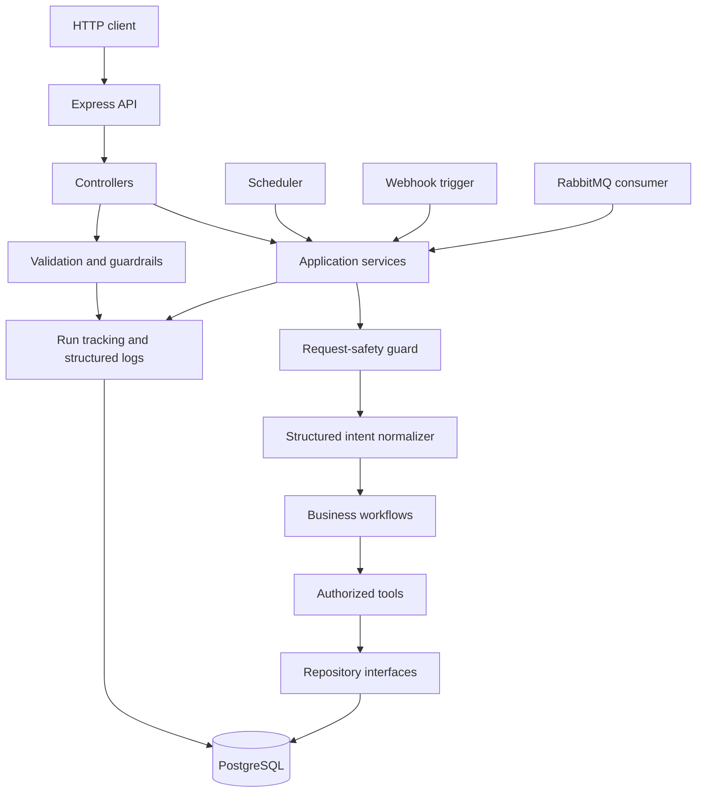
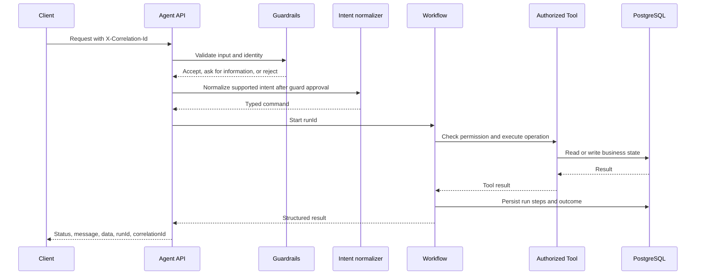
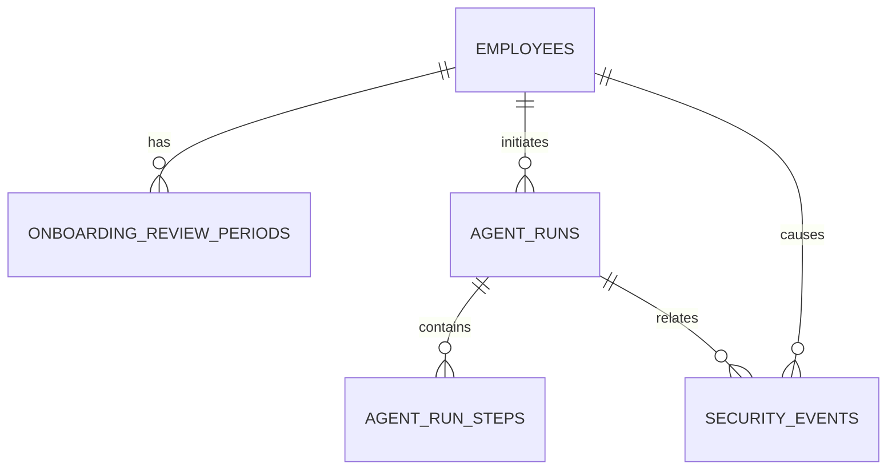

# HCM Agentic API

Backend-only Human Capital Management API built with Node.js, TypeScript, and Express. The project explores how an agent can interpret employee-related requests, select a controlled workflow, call authorized business tools, and return a traceable result.

The design keeps business decisions in application code. The language model may help understand a request, but it does not decide permissions, calculate leave, expose employee records, or invent side effects.

[](LICENSE)

## Project idea

HCM systems contain sensitive employee information and business rules. A useful agent must therefore do more than produce a fluent answer:

- It must understand what the user is asking for.
- It must identify missing information instead of guessing.
- It must allow only supported capabilities.
- It must authorize every business operation.
- It must keep decisions deterministic and traceable.
- It must avoid putting personal information into logs.

This repository builds that flow around two business areas:

1. **Employee onboarding review** — review the end date and status of an employee's initial review period.
2. **Leave requests** — check policy and balance before a leave request is created.

The second area and technical triggers are planned for Sprint 2. The current release contains the shared API and data foundation plus the first onboarding review workflow.

## Current implementation status

| Capability                                 | Status      | Notes                                                                                                               |
| ------------------------------------------ | ----------- | ------------------------------------------------------------------------------------------------------------------- |
| Node.js and TypeScript service             | Implemented | Strict TypeScript build with dependency-injected Express controllers                                                |
| PostgreSQL persistence                     | Implemented | Prisma schema, migration, and sample seed records                                                                   |
| Run and security persistence               | Implemented | Transactional agent runs, workflow steps, and redacted security events                                              |
| Structured invocation logging              | Implemented | Pino JSON events with correlation and run trace context, redacted at output                                         |
| RabbitMQ development service               | Implemented | Docker Compose service; application event handling is planned for Sprint 2                                          |
| Health and readiness endpoints             | Implemented | `/health` and `/ready`                                                                                              |
| Focused unit tests                         | Implemented | Jest tests for controllers, configuration, onboarding, and PII redaction                                            |
| Agent invocation endpoint                  | Implemented | `POST /api/v1/agent/invoke` with validation and correlation IDs                                                     |
| Employee onboarding review workflow        | Implemented | Deterministic review-period lookup and threshold evaluation                                                         |
| Authorization and guardrails               | In progress | Header identity, role checks, deterministic unsafe-request rejection, and safe unsupported/need-more-info responses |
| Structured intent normalization            | Implemented | OpenAI structured output normalizes onboarding intent; deterministic controls remain authoritative                  |
| Leave workflow                             | Planned     | Sprint 2                                                                                                            |
| Scheduled, webhook, and RabbitMQ workflows | Planned     | Sprint 2                                                                                                            |
| Integration and end-to-end tests           | Planned     | Added after the initial release                                                                                     |

## Architecture



### Layer responsibilities

| Layer                | Responsibility                                                                     |
| -------------------- | ---------------------------------------------------------------------------------- |
| API controllers      | Translate HTTP requests and responses; contain no business rules                   |
| Application services | Coordinate authorization, routing, workflow execution, and result handling         |
| Workflows            | Group decisions by business area, such as onboarding and leave                     |
| Tools                | Perform one controlled business operation, such as employee lookup or notification |
| Repositories         | Hide PostgreSQL details behind business-oriented interfaces                        |
| Security             | Validate input, reject unsafe requests, enforce access, and redact sensitive data  |
| Observability        | Record run IDs, correlation IDs, workflow steps, outcomes, and security events     |
| Triggers             | Adapt schedules, webhooks, and events into typed application commands              |

## Request flow



The rule for side effects is simple: **silence is not permission**. A request to review information does not automatically send a message or change a record.

## Supported workflows

### Employee onboarding review

The workflow reads an employee and their active onboarding review period, calculates the number of days remaining, and returns a structured result. A manager notification is a separate action that requires explicit intent or an explicitly configured scheduled policy.

### Leave requests

The planned leave workflow will retrieve the applicable leave policy and employee balance, validate the dates, and create a request only when the user is authorized and has explicitly requested creation.

## Security model

The security design uses several independent controls:

- Request schemas reject malformed or oversized input.
- A strict structured normalizer accepts only supported intents and extracts explicit request fields.
- Deterministic request safety checks reject instruction overrides, bulk employee-data requests, security-control bypass attempts, and system-prompt disclosure requests before employee lookup. Rejections are recorded without storing the raw query.
- Services and tools enforce authorization again after routing.
- Business rules are evaluated by TypeScript code, not generated text.
- Invocation logs record only an event name, correlation ID, optional run ID, status, code, and HTTP status. Raw queries, employee identifiers, names, email addresses, error messages, and stack traces are redacted before Pino writes JSON.
- Sample identities are for local development and are not production authentication.

## Run traceability

- `correlationId` follows one logical operation across HTTP, workflows, queues, retries, and downstream services.
- `runId` identifies one workflow execution attempt.
- `threadId` is optional and can group multiple runs in a future multi-turn conversation.

One scheduled operation may therefore have one correlation ID and several run IDs. The same run ID links the routing decision, tool calls, tool results, final response, and any security event.

The onboarding invocation persists this trace through a Prisma-backed recorder. Run summaries, workflow inputs and outputs, and security-event details are redacted before they are written to PostgreSQL. A recorder failure returns the same structured internal-error response shape used by other unexpected workflow failures.

The HTTP controller also emits `agent.invoke.started`, `agent.invoke.rejected`, `agent.invoke.completed`, and `agent.invoke.failed` events. Rejections use warning-level logging except an unavailable agent configuration, which is logged as an error because it produces a server failure. Completed calls use info-level logging; handled server failures and unexpected exceptions use error-level logging.

## Data model

Sprint 1 uses only the tables required by the implemented foundation:



See [docs/data-model.md](docs/data-model.md) for table purposes, relationships, PII classification, seed records, and future Sprint 2 tables.

See [docs/architecture.md](docs/architecture.md) for the reasoning behind the layers and [docs/usage-guide.md](docs/usage-guide.md) for migration and seed behavior.

## Repository structure

The current foundation and onboarding workflow contain the directories below. Observability persistence, leave, tools for side effects, and technical triggers will be added as their stories are implemented.

```text
src/
├── config/ Environment validation and application settings
├── controllers/ Express routes and HTTP request/response handling
├── contracts/ Request validation and result contracts
├── helpers/ Pure date and invocation-result helpers
├── observability/ Invocation log mapping and Pino adapter for redacted operational logs
├── security/ Authorization checks and PII redaction
├── repositories/ PostgreSQL employee data access
├── services/ Agent invocation and onboarding orchestration
├── types/ Shared TypeScript definitions, one exported type or interface per file
├── workflows/onboarding/ Deterministic onboarding review calculation
├── app.ts Express application factory
└── server.ts Runtime startup and graceful shutdown

prisma/ Schema, migrations, and seed data
tests/unit/ Focused tests for critical deterministic behavior
docs/ Architecture, data model, examples, and usage guidance
```

`server.ts` is the composition root: it constructs repositories, services, and controllers and supplies each dependency explicitly. Each controller owns its Express router and delegates business work to an injected service. `app.ts` only installs shared middleware and mounts the controller collection. This keeps the dependency direction clear:

```text
controller → service → workflow/repository
```

Future schedule, webhook, and RabbitMQ adapters can call the same services without depending on Express.

Shared onboarding definitions live under `src/types`, with one exported type per file. The OpenAI-backed intent normalizer is isolated behind a small dependency so workflows receive a schema-validated request. Date formatting and result-building functions live under `src/helpers`. This keeps the onboarding service focused on coordinating authorization, data access, and workflow execution.

## Getting started

### Prerequisites

- Node.js 22 or newer
- npm
- Docker Desktop with Docker Compose

### Install and configure

```bash
npm install
cp .env.example .env
npm run db:generate
```

Set `OPENAI_API_KEY` in `.env`. `OPENAI_MODEL` is fixed to `gpt-5.4-mini` for the structured intent normalizer.

### Start PostgreSQL and RabbitMQ

```bash
docker compose up -d postgres rabbitmq
```

The local PostgreSQL service uses port `55432` to avoid collisions with an existing local PostgreSQL installation. RabbitMQ uses ports `5672` and `15672`.

### Create and seed the database

```bash
npm run db:migrate
npm run db:seed
```

### Start the API

```bash
npm run dev
```

Check the service:

```bash
curl http://localhost:3000/health
curl http://localhost:3000/ready
```

When the API runs inside Docker Compose, use port `3300` instead: `curl http://localhost:3300/health`.

The complete local usage flow is documented in [docs/usage-guide.md](docs/usage-guide.md).

## Testing and quality checks

The initial release intentionally uses a small unit-test suite. It checks the highest-risk deterministic behavior without requiring a database, broker, or running server.

```bash
npm run typecheck
npm run lint
npm run format:check
npm test
npm run build
```

Current unit-test areas:

- Required configuration validation.
- Strict OpenAI intent normalization using fake model dependencies.
- Onboarding review threshold calculation.
- Review-only versus explicit notification behavior.
- Agent request validation and onboarding routing.
- Authorization denial and structured failure mapping.
- PII redaction.
- Trace recording with redacted run summaries, workflow steps, and authorization events.

Leave decisions, event idempotency, and broader operational dashboards remain future improvements. Integration and end-to-end tests are also future improvements.

## Roadmap and improvement opportunities

- Add production-grade authentication and identity mapping.
- Add leave policies, balances, and requests.
- Add scheduled, webhook, and RabbitMQ triggers.
- Add broader automated testing, including integration and end-to-end coverage.
- Add durable distributed tracing and operational dashboards.
- Add transactional event publishing and stronger retry handling.
- Add retrieval augmentation for approved HR policy documents.
- Add production deployment, scaling, and secret-management guidance.

The roadmap is intentionally separate from the implementation-status table so planned capabilities are not presented as completed behavior.

## Contributing

See [CONTRIBUTING.md](CONTRIBUTING.md) for branch, pull-request, testing, and documentation expectations. Security concerns should follow [SECURITY.md](SECURITY.md).

## License

This project is available under the [MIT License](LICENSE).
