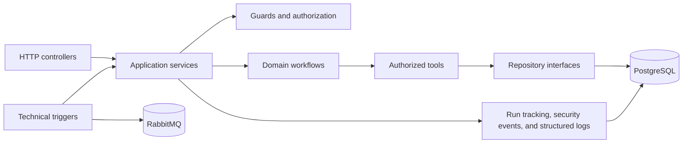
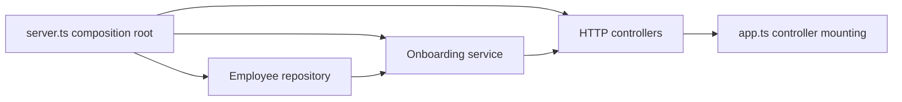

# Architecture guide

The service is organized around business workflows and stable interfaces between layers.

## Versioned knowledge retrieval

The knowledge path is isolated behind ingestion, embedding, repository, and grounded-answer interfaces. The HTTP boundary authorizes uploads against the canonical employee role and accepts only PDF, TXT, or Markdown files up to 5 MiB. Extraction has page, character, and chunk ceilings; binary upload memory is cleared after processing and is never persisted.

`knowledge_documents` owns the active index version and content hash. `knowledge_chunks` stores document/index version, embedding model, chunking version, page/chunk coordinates, extracted text, and a 1,536-dimensional vector. Reindexing writes a complete inactive version before a conditional update atomically activates it. Retrieval joins only the active version, optionally scopes to one document, and caps results at eight chunks.

External processing is disabled unless `RAG_EXTERNAL_PROCESSING_ENABLED=true`. Enabling it sends extracted chunks to the configured OpenAI embedding model and selected evidence to the configured OpenAI answer model. Retrieved text is labeled untrusted evidence; it cannot grant permissions or issue tool instructions. Application code accepts only citations to retrieved chunk IDs and constructs the final source list. Document text is excluded from operational logs and LangSmith traces.



## Design principles

- Controllers translate transport details; they do not own business decisions.
- Services coordinate application behavior and return stable result types.
- Workflows are grouped by business domain rather than by transport.
- Tools expose small operations with authorization at the boundary.
- Repositories hide the persistence implementation.
- Technical triggers create typed commands and reuse the same application services.
- Operational records are redacted before logging or persistence.

## Why the architecture is arranged this way

An employee request can arrive through HTTP today and through a schedule, webhook, or message later. Those transports should not each implement their own business rules. Controllers and trigger adapters therefore translate input into a typed application command, and the application service sends that command through the same guard, workflow, tool, and repository boundaries.

The workflow owns the business decision, such as whether an onboarding review is inside its threshold. A deterministic request-safety check runs before OpenAI-backed intent normalization and employee lookup, rejecting known unsafe patterns without retaining the raw query. The normalizer uses versioned prompt `hcm-intent-v1` and strict structured output for only `ONBOARDING_REVIEW` and `UNSUPPORTED`; it can extract fields but cannot authorize access, calculate outcomes, or cause side effects. A tool performs one controlled operation, such as reading an employee record. Authorization is checked at that boundary so normalization cannot bypass it. Repositories keep PostgreSQL details out of the workflow, while run and security records explain what happened without storing raw personal data.

## HTTP controller registration and dependency injection

HTTP endpoints are grouped in class-based controllers under `src/controllers`. Each controller declares a base path, owns an Express router, validates transport-specific input, and maps service results into HTTP responses. Business decisions remain in services and workflows.

`server.ts` is the composition root. It creates the PostgreSQL client, repository, application service, and controllers, then passes the controller collection to `app.ts`. Constructor injection makes dependencies visible and lets controller tests provide small fakes without starting PostgreSQL or an HTTP server.

The controller establishes three separate UUID v4 identifiers: `threadId` for a durable conversation, `runId` for one execution attempt, and `correlationId` for request tracing. It echoes the accepted or generated thread ID in `X-Thread-Id`. The onboarding service invokes one typed LangGraph runner for both JSON and SSE, using a PostgreSQL `PostgresSaver` initialized and closed by the composition root.

Before graph continuation, the service reads protected checkpoint metadata and rejects a thread whose canonical `ownerEmployeeCode` differs from `X-Employee-Id`. Checkpointed graph state contains only the owner and normalized continuation intent, including missing-field markers. Execution routing, run identifiers, raw queries, employee records, names, email addresses, secrets, and final employee results use untracked state or per-run execution context and are not checkpointed. SSE progress exposes only safe lifecycle metadata; its final response event carries the same structured result semantics as JSON.

`AgentController` receives a required `ApplicationLogger` dependency and reports invocation lifecycle events. The observability module owns the mapping from HTTP workflow results to completion, rejection, or failure log levels, keeping that operational policy out of the controller. The Pino adapter serializes those records as JSON and recursively redacts sensitive fields before writing. This preserves a link through `correlationId` and `runId` without placing the request query, employee identifiers, personal details, error messages, or stack traces in operational logs.



The dependency direction is `controller/trigger → service → workflow/repository`. Scheduled jobs, webhook handlers, and RabbitMQ consumers are separate trigger adapters that reuse the same typed onboarding command entry; they do not call the user-query controller or duplicate workflow rules.

Pino remains the operational HTTP logger and PostgreSQL remains the durable audit store. Optional LangSmith tracing is an invocation-level graph adapter and does not rely on global LangChain tracing; a shared guard rejects every recognized LangSmith/LangChain automatic-tracing alias in API, evaluation, and Studio entrypoints. Its completed run payload is built from an allowlist: safe UUIDs, numeric start/end times, the existing prompt version, configured model, normalized intent, ordered node/tool paths, authorization result, retry/model-call counts, latency, optional token/cost metrics, and stable failure codes.

Field-aware masking preserves only a recognition-safe shape: `0501234567` becomes `05********`, `EMP-201` becomes `EMP-***`, `samira@company.com` becomes `s*****@company.com`, and `Samira Noor` becomes `S***** N***`.

Shared TypeScript definitions are kept in `src/types`, with one exported type per file so callers do not depend on the service implementation. The onboarding graph depends on a typed normalizer interface; the concrete OpenAI normalizer is an outbound adapter under `src/adapters`, and `server.ts` supplies it during composition. The model only normalizes intent. Graph routing, authorization, review calculation, tool selection, and notification conditions are deterministic. Structured employee lookup, onboarding calculation, and manager notification tools re-check authorization using canonical roles and manager relationships loaded from PostgreSQL.

This gives the system one business path with several safe entry points:

```text
HTTP / schedule / webhook / RabbitMQ
                 ↓
       typed application command
                 ↓
      guard → intent normalizer → workflow → tool
                 ↓
          repository → PostgreSQL
```

## Technical trigger delivery

User requests enter the graph as typed `USER_QUERY` commands and retain the deterministic request guard plus OpenAI-backed intent normalization. Schedule, webhook, and RabbitMQ inputs enter as typed `ONBOARDING_REVIEW` commands, so they do not fabricate English or call OpenAI. The graph still performs canonical PostgreSQL identity/role lookup, authorization, deterministic review calculation, notification policy, and audit recording.

Webhook events use a strict versioned Zod contract and a bearer key. Both the presented and configured keys are hashed with SHA-256 before fixed-length `timingSafeEqual` comparison; neither the key nor raw body is logged or persisted. The development publisher route is composed only when `NODE_ENV=development`.

RabbitMQ uses durable topic and dead-letter exchanges, durable queues, publisher confirms, manual acknowledgements, and bounded prefetch/retries. A delivery is acknowledged only after successful idempotent processing or after a retry/dead-letter publish is confirmed. Shutdown stops the scheduler and HTTP listener, cancels the consumer, then closes the channel, connection, and PostgreSQL client.

`processed_events` atomically claims event IDs and stores only delivery metadata and a SHA-256 payload hash. A completed duplicate skips the graph and all side effects; reusing an ID with different content is a stable conflict.

## Current versus planned

The current release implements the application startup, configuration validation, dependency-injected HTTP controllers, health checks, PostgreSQL schema, migrations, seed data, the typed onboarding graph and tools, JSON and SSE invocation, deterministic development notifications, transactional run/step/security-event recording, redacted Pino invocation logs, schedule/webhook/RabbitMQ onboarding triggers, and focused unit tests. Leave workflows, external notification providers, and external log shipping are added in later stories.
