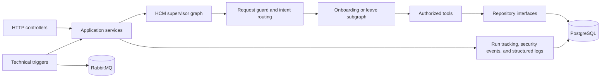
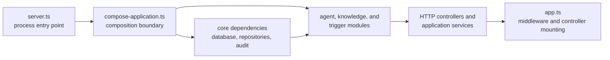

# Architecture guide

The service is organized around business workflows and stable interfaces between layers.

## Versioned knowledge retrieval

The knowledge path is isolated behind directory indexing, ingestion, embedding, repository, and grounded-answer interfaces. The explicit `npm run knowledge:index` command discovers repository-managed PDF files, applies existing size, page, and extraction ceilings, and never persists source files. PDF is the only accepted knowledge format, which keeps every source citation tied to a physical page and chunk.

`knowledge_documents` owns the active index version and content hash. `knowledge_chunks` stores document/index version, embedding model, chunking version, page/chunk coordinates, extracted text, and a 1,536-dimensional vector. Reindexing writes a complete inactive version before a conditional update atomically activates it. Retrieval joins only the active version and optionally scopes to one document inside a materialized candidate query. PostgreSQL orders a server-bounded candidate set by cosine distance, rejects candidates below the configured similarity threshold, and returns a separately bounded evidence set.

External processing defaults to enabled through `RAG_EXTERNAL_PROCESSING_ENABLED=true`, but adapter construction alone makes no network call. Explicit indexing sends extracted chunks to the configured OpenAI embedding model and selected evidence to the configured answer model. Before those boundaries, deterministic rules inspect every extracted chunk, the knowledge question, and every selected evidence chunk. Unsafe repository documents stop before embedding and activation; unsafe questions stop before query embedding; unsafe retrieved evidence produces `INSUFFICIENT_EVIDENCE` before answer generation.

The answer adapter uses a trusted `SystemMessage` for policy and a separate JSON `HumanMessage` for the question and evidence. Retrieved text is untrusted reference data; it cannot grant permissions, change roles, request tools, or issue commands. The model has no mutating RAG tool. A strict output schema returns an answer and cited chunk IDs; application code accepts only citations to retrieved chunks, constructs the source list, scans the answer, and rejects external URLs that are absent from cited evidence.

Detected RAG injection produces a standalone `PROMPT_INJECTION_DETECTED` security event linked by correlation ID and optional actor/document/chunk coordinates. Only the source, stable reason code, coordinates, and SHA-256 content hash are stored. Raw questions, chunks, answers, document text, and malicious URLs are excluded from PostgreSQL security details and operational logs. Explicit RAG tracing is the narrow LangSmith exception: it sends the raw question and generated answer, but never complete retrieved chunk text.

When `LANGSMITH_RAG_TRACING=true` and `LANGSMITH_API_KEY` is configured, `create-knowledge-module.ts` composes one direct LangSmith recorder into `KnowledgeQueryService`. RAG tracing defaults to enabled, but a missing key never blocks startup or queries: no recorder is created, one safe startup warning is emitted, and each valid query emits a safe skipped-trace warning without its raw question or employee identity. Explicitly disabled tracing leaves the service without a recorder or missing-key warnings. The same service receives a source-bearing security context from both the HTTP controller and MCP `search_knowledge_documents` tool, then builds one `hcm-rag-query` parent trace with reached child stages for query guard, embedding, vector retrieval, evidence guard, grounded answer, and output validation.

The parent records the trace/correlation/actor/source identifiers, raw question, nullable raw answer, requested document scope, candidate limit, minimum similarity, evidence limit, configured embedding/answer model names, returned document/chunk/page/score metadata, citations, result status, total start/end timing, and failure code. Each child records its own timestamps, status, failure code, and stage-specific bounded inputs/outputs. The recorder links children with `parent_run_id` equal to the trace UUID. Failures during delivery are caught after the business result is determined and emit only the safe `knowledge.trace.failed` log event.

## Read-only MCP boundary

The `/mcp` endpoint creates a fresh official TypeScript SDK `McpServer` and stateless Streamable HTTP transport for every POST. The HTTP adapter resolves a canonical employee through PostgreSQL before MCP dispatch and closes identity plus a safe correlation ID over the two handlers. `get_employee_onboarding_status` delegates to the existing authorized onboarding calculation tool; `search_knowledge_documents` delegates to the existing active-version knowledge search tool/service. Both are annotated read-only and only masked, bounded structured results cross the MCP boundary. No notification, leave, upload, reindex, or other mutating capability is registered.



## Design principles

- Controllers translate transport details; they do not own business decisions.
- Services coordinate application behavior and return stable result types.
- The root graph owns cross-domain flow; onboarding and leave subgraphs own their domain topology.
- Graph files contain wiring only. Nodes, state, routing, services, and runtime enums have separate owners.
- Tools expose small operations with authorization at the boundary.
- Repositories hide the persistence implementation.
- Technical triggers create typed commands and reuse the same application services.
- Operational records are redacted before logging or persistence.

## Why the architecture is arranged this way

An employee request can arrive through HTTP today and through a schedule, webhook, or message later. Those transports should not each implement their own business rules. Controllers and trigger adapters therefore translate input into a typed application command, and the application service sends that command through the same guard, workflow, tool, and repository boundaries.

The workflow owns business decisions, such as whether an onboarding review is inside its threshold or a leave proposal meets policy. A deterministic request-safety check runs before OpenAI-backed intent normalization and employee lookup, rejecting known unsafe patterns without retaining the raw query. The normalizer uses versioned prompt `hcm-intent-v3` and strict structured output for `ONBOARDING_REVIEW`, `LEAVE_REQUEST`, and `UNSUPPORTED`; it can extract fields but cannot authorize access, calculate outcomes, or cause side effects. An explicit first-person onboarding target is resolved deterministically to the authenticated employee after normalization; an ambiguous target still requires more information. A deterministic supervisor routes onboarding requests to the existing worker and leave requests to a dedicated leave worker. Authorization is checked at each tool boundary so normalization and routing cannot bypass it.

## HTTP controller registration and dependency injection

HTTP endpoints are grouped in class-based controllers under `src/controllers`. Each controller declares a base path, owns an Express router, validates transport-specific input, and maps service results into HTTP responses. Business decisions remain in deterministic services and graph nodes.

`server.ts` is the process entry point. It delegates dependency composition to `compose-application.ts`, which creates the core, knowledge, agent, and trigger modules before passing controllers to `app.ts`. Bootstrap modules contain composition and lifecycle only, never business rules. `app.ts` mounts shared middleware and controllers, then installs a final JSON error boundary so malformed JSON, oversized payloads, and uncaught failures cannot expose Express HTML, stack traces, or local paths.

The controller establishes three separate UUID v4 identifiers: `threadId` for a durable conversation, `runId` for one execution attempt, and `correlationId` for request tracing. It echoes the accepted or generated thread ID in `X-Thread-Id`. The application service invokes one typed supervisor graph for both JSON and SSE, using a PostgreSQL `PostgresSaver` initialized and closed by the composition root.

Before graph continuation, the service resolves `X-Employee-Id` against PostgreSQL. An unknown identity is rejected before checkpoint reads, model calls, employee tools, or leave-approval lookups. A known identity is then compared with protected checkpoint metadata, and a thread whose canonical owner differs is rejected. Checkpointed graph state contains only the owner and normalized continuation intent, including missing-field markers. Execution routing, run identifiers, raw queries, employee records, names, email addresses, secrets, and final employee results use untracked state or per-run execution context and are not checkpointed. SSE progress exposes only safe lifecycle metadata; its final response event carries the same structured result semantics as JSON.

`AgentController` receives a required `ApplicationLogger` dependency and reports invocation lifecycle events. The observability module owns the mapping from HTTP workflow results to completion, rejection, or failure log levels, keeping that operational policy out of the controller. The Pino adapter serializes those records as JSON and recursively redacts sensitive fields before writing. This preserves a link through `correlationId` and `runId` without placing the request query, employee identifiers, personal details, error messages, or stack traces in operational logs.



The bootstrap dependency direction is `server.ts → compose-application.ts → core, knowledge, agent, and trigger factories → controllers and application services`. Startup order is `checkpointer setup → RabbitMQ → scheduler → HTTP listener`; shutdown order is `scheduler stop → HTTP listener close → RabbitMQ close → checkpointer end and Prisma disconnect`.

The application dependency direction is `controller/trigger → service → HCM graph → domain subgraph → tool → repository`.
`src/graphs` contains only graph construction, edges, compilation, and exports. `src/graph-nodes` contains executable handlers; `src/graph-state` contains checkpoint schemas; `src/graph-routing` contains pure conditional decisions; and `src/enums` contains stable runtime vocabulary. Scheduled jobs, webhook handlers, and RabbitMQ consumers reuse the same typed command entry and never duplicate workflow rules.

Pino remains the operational HTTP logger and PostgreSQL remains the durable audit store. Optional agent tracing is an invocation-level graph adapter, and optional RAG tracing is a direct completed-run recorder; neither relies on global LangChain tracing. A shared guard rejects every recognized LangSmith/LangChain automatic-tracing alias in API, evaluation, and Studio entrypoints. Each LangSmith agent trace intentionally includes the exact raw user query in its inputs, together with identifiers and trace metadata; its outputs include the request-guard reason code and whether the guard blocked execution before a model call. PostgreSQL audit records, Pino operational logs, and SSE progress events continue to exclude raw user queries.

LangGraph Studio loads graph factories rather than a service-level wrapper. `hcm_agent` returns the same compiled root topology used by `HcmAgentService`; it statically registers onboarding and leave subgraphs so Studio can expand their internal nodes and checkpoint namespaces. `onboarding` and `leave` expose those same production subgraph builders independently for focused inspection. Every factory creates a fresh mock execution context, and the local Agent Server owns Studio checkpointing while production continues using PostgreSQL. No Studio-only graph topology or business logic is duplicated.

Field-aware masking preserves only a recognition-safe shape: `0501234567` becomes `05********`, `EMP-201` becomes `EMP-***`, `samira@company.com` becomes `s*****@company.com`, and `Samira Noor` becomes `S***** N***`.

Shared TypeScript definitions are kept in `src/types`, with one exported type per file so callers do not depend on the service implementation. The onboarding graph depends on a typed normalizer interface; the concrete OpenAI normalizer is an outbound adapter under `src/adapters`, and the bootstrap composition supplies it. The model only normalizes intent. Graph routing, authorization, review calculation, tool selection, and notification conditions are deterministic. Structured employee lookup, onboarding calculation, and manager notification tools re-check authorization using canonical roles and manager relationships loaded from PostgreSQL.

This gives the system one business path with several safe entry points:

```text
HTTP / schedule / webhook / RabbitMQ
                 ↓
       typed application command
                 ↓
      guard → intent normalizer → workflow → tool
                 ↓
          repository → PostgreSQL
```

## Technical trigger delivery

User requests enter the graph as typed `USER_QUERY` commands and retain the deterministic request guard plus OpenAI-backed intent normalization. Schedule, webhook, and RabbitMQ inputs enter as typed `ONBOARDING_REVIEW` commands, so they do not fabricate English or call OpenAI. The graph still performs canonical PostgreSQL identity/role lookup, authorization, deterministic review calculation, notification policy, and audit recording.

Webhook events use a strict versioned Zod contract and a bearer key. Both the presented and configured keys are hashed with SHA-256 before fixed-length `timingSafeEqual` comparison; neither the key nor raw body is logged or persisted. The development publisher route is composed only when `NODE_ENV=development`.

RabbitMQ uses durable topic and dead-letter exchanges, durable queues, publisher confirms, manual acknowledgements, and bounded prefetch/retries. A delivery is acknowledged only after successful idempotent processing or after a retry/dead-letter publish is confirmed. Shutdown stops the scheduler and HTTP listener, cancels the consumer, then closes the channel, connection, and PostgreSQL client.

`processed_events` atomically claims event IDs and stores only delivery metadata and a SHA-256 payload hash. A completed duplicate skips the graph and all side effects; reusing an ID with different content is a stable conflict.

## Current versus planned

The current release implements typed onboarding and leave graphs, durable human approval, JSON and SSE invocation, deterministic leave PDFs, transactional run/step/security-event recording, redacted Pino logs, schedule/webhook/RabbitMQ onboarding triggers, and focused unit tests. External notification providers and external log shipping are later stories.

The leave worker starts independently authorized annual-policy and balance tools together, calculates eligibility, and reaches a LangGraph interrupt before any write. Resume requires the thread owner. `REJECT` ends without a row; `APPROVE` reruns both tools and the deterministic calculation, then upserts one `SUBMITTED` request by approval thread. A deterministic PDF containing only request ID, employee code, leave type, approved dates, working days, and status is stored on that row. The document endpoint re-authorizes the actor and responds with `Cache-Control: no-store`.
