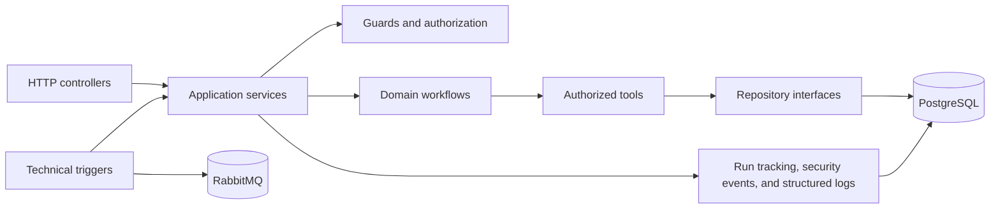
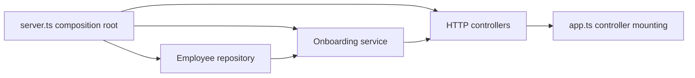

# Architecture guide

The service is organized around business workflows and stable interfaces between layers.



## Design principles

- Controllers translate transport details; they do not own business decisions.
- Services coordinate application behavior and return stable result types.
- Workflows are grouped by business domain rather than by transport.
- Tools expose small operations with authorization at the boundary.
- Repositories hide the persistence implementation.
- Technical triggers create typed commands and reuse the same application services.
- Operational records are redacted before logging or persistence.

## Why the architecture is arranged this way

An employee request can arrive through HTTP today and through a schedule, webhook, or message later. Those transports should not each implement their own business rules. Controllers and trigger adapters therefore translate input into a typed application command, and the application service sends that command through the same guard, workflow, tool, and repository boundaries.

The workflow owns the business decision, such as whether an onboarding review is inside its threshold. A deterministic request-safety check runs before OpenAI-backed intent normalization and employee lookup, rejecting known unsafe patterns without retaining the raw query. The normalizer uses versioned prompt `hcm-intent-v1` and strict structured output for only `ONBOARDING_REVIEW` and `UNSUPPORTED`; it can extract fields but cannot authorize access, calculate outcomes, or cause side effects. A tool performs one controlled operation, such as reading an employee record. Authorization is checked at that boundary so normalization cannot bypass it. Repositories keep PostgreSQL details out of the workflow, while run and security records explain what happened without storing raw personal data.

## HTTP controller registration and dependency injection

HTTP endpoints are grouped in class-based controllers under `src/controllers`. Each controller declares a base path, owns an Express router, validates transport-specific input, and maps service results into HTTP responses. Business decisions remain in services and workflows.

`server.ts` is the composition root. It creates the PostgreSQL client, repository, application service, and controllers, then passes the controller collection to `app.ts`. Constructor injection makes dependencies visible and lets controller tests provide small fakes without starting PostgreSQL or an HTTP server.

The onboarding service generates its own per-invocation run ID. Its business clock is supplied explicitly by the composition root, so production uses the system date while unit tests can use a fixed date without changing the service's production behavior.

`AgentController` receives a required `ApplicationLogger` dependency and reports invocation lifecycle events. The observability module owns the mapping from HTTP workflow results to completion, rejection, or failure log levels, keeping that operational policy out of the controller. The Pino adapter serializes those records as JSON and recursively redacts sensitive fields before writing. This preserves a link through `correlationId` and `runId` without placing the request query, employee identifiers, personal details, error messages, or stack traces in operational logs.



The dependency direction is `controller → service → workflow/repository`. Scheduled jobs, webhook handlers, and RabbitMQ consumers will be separate trigger adapters that reuse the same services; they will not call HTTP controllers or duplicate workflow rules.

Shared TypeScript definitions are kept in `src/types`, with one exported type per file so callers do not depend on the service implementation. The prompt, strict Zod contract, and OpenAI normalizer are isolated from the onboarding service through a typed normalizer interface. Date formatting and invocation-result construction live in `src/helpers/onboarding-agent.helpers.ts`. The application service therefore focuses on orchestration: invoking the normalizer after the request guard, retrieving data, enforcing authorization and state rules, calling the deterministic workflow, and returning its result.

This gives the system one business path with several safe entry points:

```text
HTTP / schedule / webhook / RabbitMQ
                 ↓
       typed application command
                 ↓
      guard → intent normalizer → workflow → tool
                 ↓
          repository → PostgreSQL
```

## Current versus planned

The current release implements the application startup, configuration validation, dependency-injected HTTP controllers, health checks, PostgreSQL schema, migrations, seed data, the onboarding invocation endpoint, deterministic onboarding review, transactional run/step/security-event recording, redacted Pino invocation logs, and focused unit tests. Leave workflows, side-effect tools, external log shipping, and technical trigger adapters are added in later stories.
