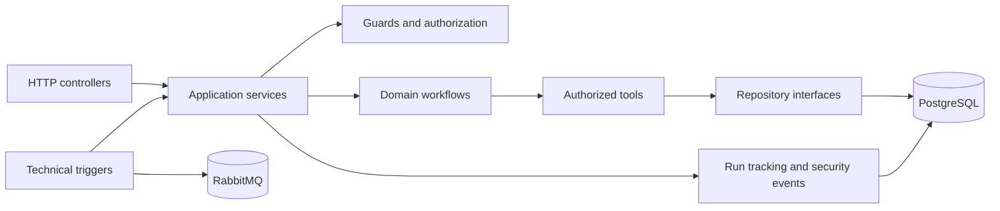

# Architecture guide

The service is organized around business workflows and stable interfaces between layers.



## Design principles

- Controllers translate transport details; they do not own business decisions.
- Services coordinate application behavior and return stable result types.
- Workflows are grouped by business domain rather than by transport.
- Tools expose small operations with authorization at the boundary.
- Repositories hide the persistence implementation.
- Technical triggers create typed commands and reuse the same application services.
- Operational records are redacted before logging or persistence.

## Why the architecture is arranged this way

An employee request can arrive through HTTP today and through a schedule, webhook, or message later. Those transports should not each implement their own business rules. Controllers and trigger adapters therefore translate input into a typed application command, and the application service sends that command through the same guard, workflow, tool, and repository boundaries.

The workflow owns the business decision, such as whether an onboarding review is inside its threshold. A tool performs one controlled operation, such as reading an employee record. Authorization is checked at that boundary so a future router or language model cannot bypass it. Repositories keep PostgreSQL details out of the workflow, while run and security records explain what happened without storing raw personal data.

This gives the system one business path with several safe entry points:

```text
HTTP / schedule / webhook / RabbitMQ
                 ↓
       typed application command
                 ↓
      guard → workflow → tool
                 ↓
          repository → PostgreSQL
```

## Current versus planned

The current release implements the application startup, configuration validation, health checks, PostgreSQL schema, migrations, seed data, and focused unit tests. The onboarding workflow, leave workflow, and technical trigger adapters are added in later stories.
