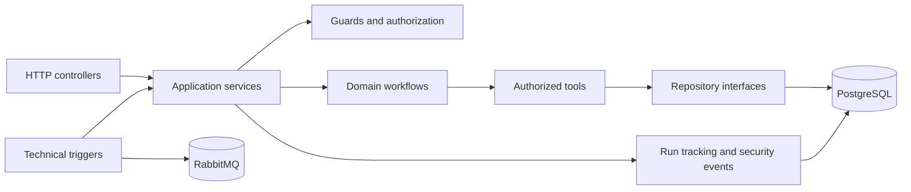

# Architecture guide

The service is organized around business workflows and stable interfaces between layers.

## Design principles

- Controllers translate transport details; they do not own business decisions.
- Services coordinate application behavior and return stable result types.
- Workflows are grouped by business domain rather than by transport.
- Tools expose small operations with authorization at the boundary.
- Repositories hide the persistence implementation.
- Technical triggers create typed commands and reuse the same application services.
- Operational records are redacted before logging or persistence.

## Current versus planned

The current release implements the application startup, configuration validation, health checks, PostgreSQL schema, migrations, seed data, and focused unit tests. The onboarding workflow, leave workflow, and technical trigger adapters are added in later stories.
