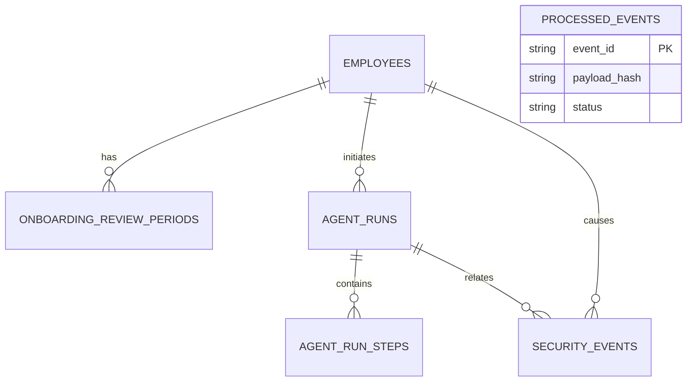

# Data model

This document explains why each table exists and how it fits into the application. Tables are added only when a released workflow needs them.

## Sprint 1 model



| Table                       | Purpose                                                                           | Used by                | Sensitive data                  |
| --------------------------- | --------------------------------------------------------------------------------- | ---------------------- | ------------------------------- |
| `employees`                 | Employee directory, manager relationships, and development access roles           | All employee workflows | Name, email, job details        |
| `onboarding_review_periods` | Start date, end date, and status of an employee's initial review period           | Onboarding review      | Employee relationship and dates |
| `agent_runs`                | One record for each workflow execution, including run and correlation identifiers | All agent workflows    | Actor and redacted summaries    |
| `agent_run_steps`           | Routing decisions, tool calls, outcomes, and errors inside one run                | All agent workflows    | Redacted inputs and outputs     |
| `security_events`           | Rejected requests, authorization failures, and other security signals             | Security controls      | Actor and event metadata        |
| `processed_events`          | Idempotency and delivery metadata for technical onboarding triggers               | Technical triggers     | Opaque event and trace metadata |

## Sprint 2 additions

| Table            | Purpose                                                          | Used by        | Sensitive data                            |
| ---------------- | ---------------------------------------------------------------- | -------------- | ----------------------------------------- |
| `leave_policies` | Rules for supported leave types                                  | Leave workflow | Policy details, usually not personal      |
| `leave_balances` | Allocated, used, pending, and available leave per employee       | Leave workflow | Employee relationship and balances        |
| `leave_requests` | Requested dates, leave type, requested days, and decision status | Leave workflow | Employee relationship and request details |

## Seed records

The seed command creates fictional records:

- `EMP-100`: HR partner.
- `EMP-200`: Engineering manager.
- `EMP-201`: active onboarding review ending in 14 days.
- `EMP-202`: active onboarding review ending in 45 days.
- `EMP-300`: completed onboarding review.

The dates are calculated relative to the seed date so the examples remain useful after the repository is cloned.

### Seeded reporting story

The sample hierarchy deliberately uses one top-level HR record and one engineering management chain:

```text
Nadia Rahman (EMP-100, HR partner)
├── Omar Malik (EMP-200, engineering manager)
│   ├── Samira Noor (EMP-201, software engineer)
│   └── Yousef Haddad (EMP-202, QA engineer)
└── Lina Faris (EMP-300, accountant)
```

`manager_id` is nullable because the top-level record has no manager inside this small sample organization. Nadia still participates in authorization and workflow examples through her HR role, while Omar demonstrates manager access to his direct reports. Adding an executive would simply assign that employee's ID to Nadia without changing the table design.

The table story follows the business lifecycle: `employees` identifies people and reporting relationships; `onboarding_review_periods` records the business period being evaluated; `agent_runs` records one workflow attempt; `agent_run_steps` records the decisions and tool operations inside that attempt; and `security_events` records rejected or suspicious activity related to it. No separate `users` table is needed in this release because development actors are represented by employee records and production authentication is a planned boundary.

The onboarding service writes run records through the Prisma-backed agent-run repository in one transaction. The run stores the final status and redacted summaries, the step rows store the key decisions, and authorization failures create linked security-event rows. Technical triggers use `processed_events` to claim an event atomically, suppress completed duplicates, allow failed delivery retries, and link the final run/thread IDs. It stores only event ID, type, SHA-256 payload hash, status, attempt, correlation, timestamps, optional trace IDs, and a stable error code—never the raw event payload. Database failures are mapped to stable errors and do not expose database details to the caller.

### Migration and seed behavior

`npm run db:migrate` runs Prisma's deployment command. It applies each migration that is not already recorded in PostgreSQL's `_prisma_migrations` table and does nothing when the database is current. It is safe to run repeatedly, but it does not undo or repair a changed migration.

`npm run db:seed` is idempotent in its final result for the current Sprint 1 schema: it resets the seeded employee, onboarding, run, and security-event records and recreates the same fictional sample set relative to today's date. It is intentionally a development reset, so it must not be run against a database containing data that should be preserved.

## Identifiers and traceability

- `employeeCode` is the human-readable employee reference used in examples.
- `threadId` identifies one durable multi-turn conversation and is recorded on every agent run.
- `runId` identifies one workflow attempt; a resumed thread receives a new run ID.
- `correlationId` connects one request across HTTP, workflows, audit records, events, and downstream work.
- `eventId` identifies one versioned technical event; reusing it with a different payload hash is rejected.

LangGraph's `PostgresSaver` owns its technical checkpoint tables and applies its own idempotent setup migrations during application startup. The domain model deliberately has no `agent_threads` table: checkpointed owner metadata binds the thread identity, while `agent_runs`, `agent_run_steps`, and `security_events` remain the audit trail and carry `threadId` through their parent run.

Raw prompts and unredacted tool payloads are not stored in operational records.
