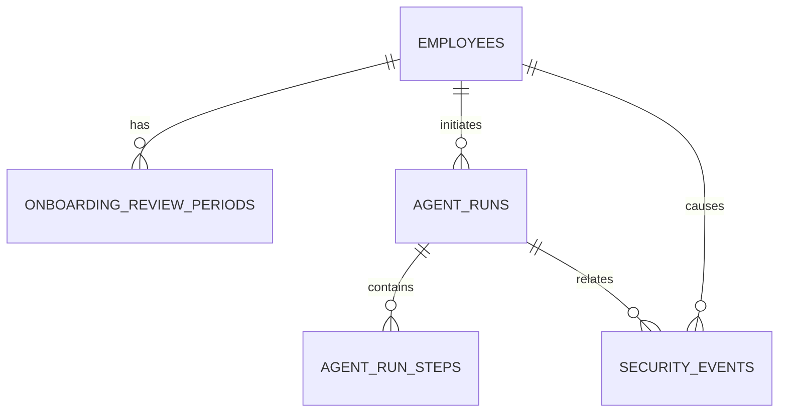

# Data model

This document explains why each table exists and how it fits into the application. Tables are added only when a released workflow needs them.

## Sprint 1 model

| Table                       | Purpose                                                                           | Used by                | Sensitive data                  |
| --------------------------- | --------------------------------------------------------------------------------- | ---------------------- | ------------------------------- |
| `employees`                 | Employee directory, manager relationships, and development access roles           | All employee workflows | Name, email, job details        |
| `onboarding_review_periods` | Start date, end date, and status of an employee's initial review period           | Onboarding review      | Employee relationship and dates |
| `agent_runs`                | One record for each workflow execution, including run and correlation identifiers | All agent workflows    | Actor and redacted summaries    |
| `agent_run_steps`           | Routing decisions, tool calls, outcomes, and errors inside one run                | All agent workflows    | Redacted inputs and outputs     |
| `security_events`           | Rejected requests, authorization failures, and other security signals             | Security controls      | Actor and event metadata        |

## Sprint 2 additions

| Table              | Purpose                                                          | Used by            | Sensitive data                            |
| ------------------ | ---------------------------------------------------------------- | ------------------ | ----------------------------------------- |
| `leave_policies`   | Rules for supported leave types                                  | Leave workflow     | Policy details, usually not personal      |
| `leave_balances`   | Allocated, used, pending, and available leave per employee       | Leave workflow     | Employee relationship and balances        |
| `leave_requests`   | Requested dates, leave type, requested days, and decision status | Leave workflow     | Employee relationship and request details |
| `processed_events` | Event IDs already handled so retries do not repeat side effects  | RabbitMQ consumers | Event identifiers and status              |

## Seed records

The seed command creates fictional records:

- `EMP-100`: HR partner.
- `EMP-200`: Engineering manager.
- `EMP-201`: active onboarding review ending in 14 days.
- `EMP-202`: active onboarding review ending in 45 days.
- `EMP-300`: completed onboarding review.

The dates are calculated relative to the seed date so the examples remain useful after the repository is cloned.

## Identifiers and traceability

- `employeeCode` is the human-readable employee reference used in examples.
- `runId` identifies one workflow attempt.
- `correlationId` connects related work across HTTP, workflows, and events.
- `threadId` is optional and reserved for future multi-turn conversations.

Raw prompts and unredacted tool payloads are not stored in operational records.
