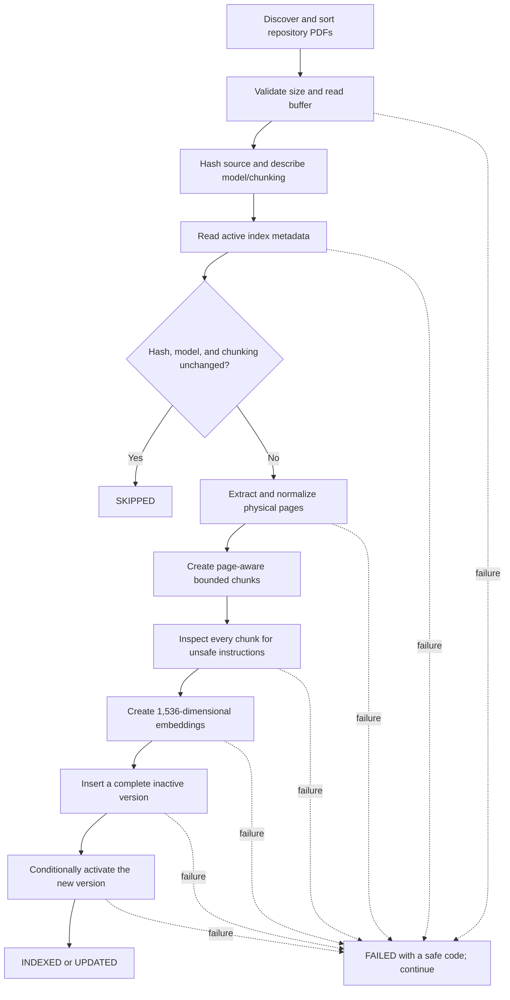

# Repository knowledge indexing

The knowledge index turns repository-managed HR policy PDFs into searchable PostgreSQL/pgvector records. Queries search only active database versions; they never scan the source directory at request time.

Use [RAG testing and troubleshooting](rag-testing-and-troubleshooting.md) after indexing for complete query curls, expected responses, MCP checks, retrieval settings, LangSmith inspection, and database diagnostics.

Source files remain under `knowledge-documents/`. The database stores document metadata, extracted chunks, page/chunk coordinates, index-version metadata, and embeddings—not copies of the original PDF files.

## Run the indexer

For a local Node.js process, run from the repository root with a reachable `DATABASE_URL`:

```bash
# Index new or changed repository policies
npm run knowledge:index

# Optional: verify that unchanged documents are skipped
npm run knowledge:index
```

For the Docker Compose API service:

```bash
# Index inside an ephemeral container that owns the full tooling configuration
docker compose run --rm tooling npm run knowledge:index

# Optional: verify that unchanged documents are skipped
docker compose run --rm tooling npm run knowledge:index
```

The second run is intentionally optional. It demonstrates idempotency: an unchanged content hash, embedding model, and chunking version produces `SKIPPED` rather than another index version.

## Indexing lifecycle



The directory walker discovers `.pdf` files recursively and processes their repository-relative paths in stable lexical order. Other file types are ignored by directory discovery; they do not produce `KNOWLEDGE_FILE_TYPE_UNSUPPORTED` results from `npm run knowledge:index`.

## Enforced limits

| Boundary             | Enforced limit                                               |
| -------------------- | ------------------------------------------------------------ |
| Source type          | PDF only                                                     |
| File size            | Non-empty and no larger than 5 MiB                           |
| Physical pages       | At most 250                                                  |
| Normalized text      | At most 500,000 extracted characters                         |
| Chunking             | Page-aware 1,600-character chunks with 200-character overlap |
| Chunks per document  | At most 200                                                  |
| Embedding dimensions | Exactly 1,536 finite values per chunk                        |
| Derived title        | Non-empty and no longer than 200 characters                  |

The source is hashed before extraction. A changed source or indexing configuration passes through extraction, normalization, chunking, deterministic safety inspection, and embedding before publication. Unsafe instructions stop that file before its text is sent for embedding.

## Safe version publication

Replacement chunks are inserted as a new inactive version inside a database transaction. The indexer activates the version only after every chunk insert succeeds. The prior active version therefore remains queryable if extraction, safety inspection, embedding, insertion, or activation fails.

Activation uses the active version observed before insertion. If another writer activates a newer version first, the conditional update fails with `KNOWLEDGE_VERSION_ACTIVATION_CONFLICT` instead of overwriting it. A later controlled run can index the source again.

Removing a source PDF does not prune its database record automatically. Renaming a PDF creates a new repository-relative source identity.

## Output contract

Every successfully discovered PDF produces one bounded JSON line:

| Status    | Meaning                                                                     |
| --------- | --------------------------------------------------------------------------- |
| `INDEXED` | A new document and active index version were created.                       |
| `UPDATED` | A changed source or configuration produced a new active version.            |
| `SKIPPED` | The active content hash, embedding model, and chunking version were equal.  |
| `FAILED`  | That file failed with a stable code; later discovered files still continue. |

The command finishes with a `SUMMARY` line. Any per-file `FAILED` result makes the process exit non-zero.

Representative first run:

```jsonl
{"sourcePath":"knowledge-documents/mock-employee-policy.pdf","status":"INDEXED","documentId":"<employee-policy-document-id>","activeIndexVersion":1,"chunkCount":5}
{"sourcePath":"knowledge-documents/mock-home-office-policy.pdf","status":"INDEXED","documentId":"<home-office-policy-document-id>","activeIndexVersion":1,"chunkCount":3}
{"status":"SUMMARY","INDEXED":2}
```

Representative unchanged run:

```jsonl
{"sourcePath":"knowledge-documents/mock-employee-policy.pdf","status":"SKIPPED","documentId":"<employee-policy-document-id>"}
{"sourcePath":"knowledge-documents/mock-home-office-policy.pdf","status":"SKIPPED","documentId":"<home-office-policy-document-id>"}
{"status":"SUMMARY","SKIPPED":2}
```

Failure output contains only a stable code. It does not print document text, provider responses, database URLs, credentials, secrets, or stack traces.

## Troubleshooting stable failure codes

The following codes can be emitted by the repository index command or its ingestion/persistence path:

| Code                                    | Meaning and safe operator action                                                                                                        |
| --------------------------------------- | --------------------------------------------------------------------------------------------------------------------------------------- |
| `RAG_EXTERNAL_PROCESSING_DISABLED`      | Indexing is disabled. Enable it only in an environment approved for external model processing.                                          |
| `KNOWLEDGE_FILE_SIZE_INVALID`           | The PDF is empty or larger than 5 MiB. Replace it with a non-empty PDF within the limit.                                                |
| `KNOWLEDGE_FILE_READ_FAILED`            | The source could not be read. Check that it is a regular readable file and that runtime permissions allow access.                       |
| `KNOWLEDGE_TITLE_INVALID`               | The derived title exceeds 200 characters. Rename the source file to produce a shorter title.                                            |
| `KNOWLEDGE_TEXT_EMPTY`                  | No usable text was extracted. Replace an empty or image-only PDF with a text-searchable PDF.                                            |
| `KNOWLEDGE_EXTRACTION_LIMIT_EXCEEDED`   | The PDF exceeded 250 pages, 500,000 normalized characters, or 200 chunks. Split it into smaller policy PDFs.                            |
| `KNOWLEDGE_DOCUMENT_UNSAFE`             | A chunk matched deterministic unsafe-instruction rules. Review the source offline and do not copy its text into application logs.       |
| `KNOWLEDGE_EMBEDDING_FAILED`            | Embedding failed. Verify credentials, model access, provider availability, and outbound connectivity.                                   |
| `EMBEDDING_COUNT_MISMATCH`              | The provider returned a different number of vectors than requested chunks. Retry after confirming provider behavior.                    |
| `EMBEDDING_DIMENSION_MISMATCH`          | At least one vector did not contain exactly 1,536 finite values. Confirm the configured embedding model and provider response.          |
| `KNOWLEDGE_DATABASE_READ_FAILED`        | Active-index metadata could not be read. Check PostgreSQL health, migrations, and connectivity without printing the connection string.  |
| `KNOWLEDGE_DATABASE_WRITE_FAILED`       | The new version could not be published. Check PostgreSQL health, capacity, pgvector, and migrations; the old version remains active.    |
| `KNOWLEDGE_VERSION_ACTIVATION_CONFLICT` | Another writer activated a version first. Inspect concurrent index jobs, then rerun with only one active writer.                        |
| `KNOWLEDGE_INDEX_FAILED`                | An unexpected outer indexing boundary failed. Use controlled diagnostics and operational telemetry without exposing content or secrets. |

`KNOWLEDGE_FILE_TYPE_UNSUPPORTED` is a lower-level ingestion validation error. The repository directory command discovers PDFs only and silently ignores other extensions, so operators should not expect that code for a non-PDF file placed in `knowledge-documents/`.

## Included mock corpus

| Source PDF                    | Pages | Main topics                                                               |
| ----------------------------- | ----: | ------------------------------------------------------------------------- |
| `mock-employee-policy.pdf`    |     4 | Contracts, flexible work, leave, development support, and business travel |
| `mock-home-office-policy.pdf` |     3 | Home-office allowance, remote-work security, reimbursement, and assets    |

The corpus contains synthetic Mock policy documents intended for local development and demonstrations. Run the indexer again after adding, changing, or renaming a PDF, and after `npm run db:seed` because the seed resets indexed knowledge rows.

## Implementation locations

- `src/commands/index-knowledge.ts` owns command output and exit status.
- `src/services/knowledge-directory-indexer.service.ts` owns discovery, ordering, skip detection, and per-file continuation.
- `src/services/knowledge-ingestion.service.ts` owns extraction, limits, chunking, safety inspection, and embedding.
- `src/repositories/knowledge.repository.ts` owns version insertion, activation, and pgvector search.
- `src/helpers/knowledge-error.helpers.ts` converts unexpected failures to stable error codes.
