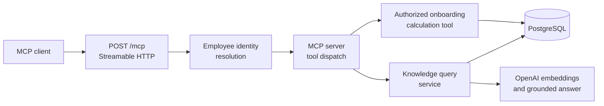
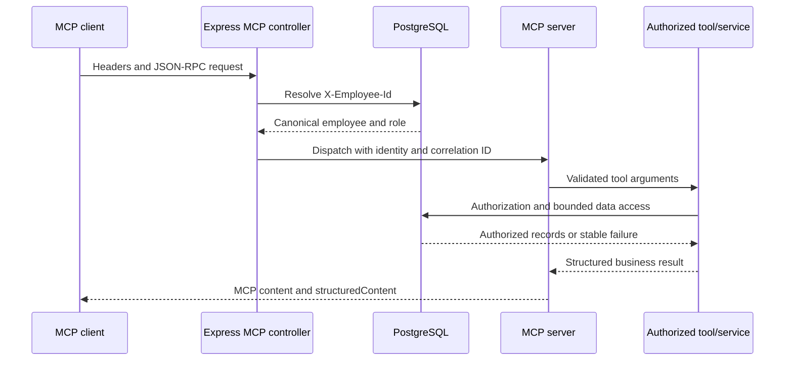

# Model Context Protocol guide

This guide explains how the project exposes two existing read-only application capabilities through Model Context Protocol (MCP). It is written for developers studying the architecture and for MCP client integrators connecting to the service.

MCP gives clients a standard way to discover and call tools. In this project it is an additional interface into existing authorized tools and services, not a second implementation of onboarding or policy-search business logic.

Exactly two read-only tools are registered. The MCP endpoint exposes no mutation capability.

> The current endpoint uses a development employee-identity header. It is not production authentication.

## Contents

- [MCP in this project](#mcp-in-this-project)
- [Architecture](#architecture)
- [Request flow](#request-flow)
- [Endpoint and connection model](#endpoint-and-connection-model)
- [Development identity and authorization](#development-identity-and-authorization)
- [Information exchanged](#information-exchanged)
- [Tool reference](#tool-reference)
- [Supported and unsupported operations](#supported-and-unsupported-operations)
- [Errors and observability](#errors-and-observability)
- [Connect and test](#connect-and-test)
- [Production considerations](#production-considerations)

## MCP in this project

MCP clients can discover and call:

- `get_employee_onboarding_status` for an authorized onboarding-review calculation;
- `search_knowledge_documents` for a grounded query over active indexed HR documents.

The MCP server delegates to the same application tools, authorization rules, repositories, and RAG service used by the other interfaces. Adding MCP therefore does not create a separate source of business rules.

The interface is deliberately read-only. It cannot notify a manager, create or approve leave, generate a leave document, publish an event, index a knowledge document, or change the database.

## Architecture

The MCP boundary is divided across focused implementation files:

- [`src/controllers/mcp.controller.ts`](../src/controllers/mcp.controller.ts) owns the Express route, development identity resolution, correlation ID, transport lifecycle, HTTP method handling, and operational logs.
- [`src/mcp/read-only-mcp.server.ts`](../src/mcp/read-only-mcp.server.ts) creates the SDK server, registers the two tools, and maps tool failures into bounded MCP results.
- [`src/tools/onboarding.tools.ts`](../src/tools/onboarding.tools.ts) performs PostgreSQL-backed employee authorization and deterministic onboarding calculation.
- [`src/tools/knowledge.tools.ts`](../src/tools/knowledge.tools.ts) exposes the existing knowledge query service as a typed read-only tool.
- [`src/services/knowledge-query.service.ts`](../src/services/knowledge-query.service.ts) owns the guarded RAG query sequence and grounded result.



The Express controller is an inbound adapter. The SDK server dispatches validated calls, while the existing tools and services remain responsible for authorization and business behavior. PostgreSQL is authoritative for employee identity, roles, reporting relationships, onboarding data, and active knowledge indexes.

## Request flow



The complete dependency flow is:

```text
MCP client
→ Streamable HTTP POST /mcp
→ Express MCP controller
→ employee identity resolution
→ official TypeScript MCP server and transport
→ authorized application tool or service
→ repository/PostgreSQL or RAG services
→ structured MCP response
```

Identity is resolved before JSON-RPC dispatch. A rejected development identity therefore never reaches either registered tool. A valid identity is captured with a safe correlation ID when the per-request MCP server is created.

## Endpoint and connection model

| Concern                | Implemented behavior                                                                  |
| ---------------------- | ------------------------------------------------------------------------------------- |
| Endpoint               | `POST /mcp`                                                                           |
| Transport              | Stateless Streamable HTTP                                                             |
| Protocol body          | MCP JSON-RPC requests                                                                 |
| Response mode          | JSON                                                                                  |
| Server lifecycle       | A fresh SDK `McpServer` and transport are created for every POST and closed afterward |
| Session                | No MCP session ID is generated                                                        |
| Unsupported methods    | `GET /mcp` and `DELETE /mcp` return HTTP `405` with `Allow: POST`                     |
| Local default          | `http://localhost:3000/mcp`                                                           |
| Docker Compose default | `http://localhost:3300/mcp`                                                           |

The controller constructs `StreamableHTTPServerTransport` with `sessionIdGenerator: undefined` and `enableJsonResponse: true`. It does not maintain an MCP session between requests. Each discovery or tool-call POST must therefore include the required development identity header.

When the API runs locally, changing `PORT` changes the MCP URL. Docker Compose maps `API_PORT`, which defaults to `3300`, to port `3000` inside the API container.

MCP clients normally supply `Content-Type: application/json` and the protocol headers required by their SDK or Inspector version. Use the client rather than constructing JSON-RPC envelopes manually unless you are diagnosing the protocol boundary.

## Development identity and authorization

Authentication and authorization are separate concerns. The current implementation intentionally uses only a simple development identity mechanism.

### Development identity resolution

Every MCP POST requires:

```http
X-Employee-Id: EMP-201
```

The controller:

1. trims the value;
2. normalizes it to uppercase;
3. requires it to match `EMP-\d+`; and
4. resolves the employee through PostgreSQL.

Missing, malformed, or unknown identities return HTTP `401` with a generic JSON-RPC error. Database failure during identity resolution returns a generic HTTP `500`. Neither response exposes employee records or internal failure details.

`X-Employee-Id` is not a password, token, signed assertion, or verified production credential. It must not be treated as secure authentication.

### Tool authorization

After identity resolution, application tools load canonical employee records from PostgreSQL. Authorization uses the stored role, employee ownership, and manager relationship. The client cannot grant itself access by sending a role header or placing a role in tool arguments.

For onboarding status, the existing rules permit:

- an active employee reading their own status;
- HR reading an employee status; and
- a manager reading the status of a direct report.

The onboarding tool rechecks authorization at the tool boundary before returning protected information.

### Correlation ID

Clients may provide a UUID v4:

```http
X-Correlation-Id: 1b2f07f8-3245-41a8-a09d-7e8917c8c72a
```

The controller accepts a valid value or generates a safe UUID when the header is absent or invalid. It returns the resolved ID in the `X-Correlation-Id` response header and includes it in structured tool results.

The current MCP endpoint does not implement:

- OAuth;
- JWT validation;
- SSO;
- API-key authentication;
- MCP authorization discovery; or
- production MCP client identity.

## Information exchanged

| Boundary          | Information                                                                                                                    |
| ----------------- | ------------------------------------------------------------------------------------------------------------------------------ |
| HTTP headers      | `Content-Type`, `X-Employee-Id`, optional `X-Correlation-Id`, and MCP protocol headers supplied by the client where applicable |
| JSON-RPC request  | MCP method, tool name, and tool arguments                                                                                      |
| MCP tool dispatch | Canonical actor employee code, safe correlation ID, and Zod-validated arguments                                                |
| MCP result        | Content blocks, `structuredContent`, `isError`, business status, safe error code/message where applicable, and correlation ID  |

Each tool returns one text content block containing the JSON representation and the same object as `structuredContent`. `isError` is `true` for stable tool failures.

Results are deliberately bounded. The onboarding result masks its employee code, and RAG sources contain document, chunk, and page coordinates without returning complete stored document text. Generic failures do not expose protected employee data, raw database errors, stack traces, or credentials.

## Tool reference

### `get_employee_onboarding_status`

| Item                 | Contract                                                                             |
| -------------------- | ------------------------------------------------------------------------------------ |
| Purpose              | Read an authorized employee onboarding-review status                                 |
| `targetEmployeeCode` | Required employee code matching `EMP-\d+`                                            |
| `thresholdDays`      | Optional integer from `0` through `365`; default `30`                                |
| Authorization        | Self, HR, or manager reading a direct report under existing database-backed rules    |
| Annotations          | Read-only, non-destructive, idempotent, and closed-world                             |
| Side effects         | None; no notification or other mutation is performed                                 |
| Output               | `status`, masked `employeeCode`, `daysRemaining`, `withinThreshold`, `correlationId` |

Representative tool arguments using the default threshold:

```json
{
  "targetEmployeeCode": "EMP-201"
}
```

Representative tool arguments using a 45-day threshold:

```json
{
  "targetEmployeeCode": "EMP-201",
  "thresholdDays": 45
}
```

A successful `structuredContent` value resembles:

```json
{
  "status": "COMPLETED",
  "employeeCode": "EMP-***",
  "daysRemaining": 14,
  "withinThreshold": true,
  "correlationId": "1b2f07f8-3245-41a8-a09d-7e8917c8c72a"
}
```

Conceptually, these calls mean “read EMP-201's onboarding status using the default 30-day threshold” and “check whether EMP-201 is inside a 45-day threshold.” Those sentences are explanations for people; this MCP tool accepts the structured arguments above and does not invoke arbitrary conversational-agent routing.

### `search_knowledge_documents`

| Item          | Contract                                                                                                                       |
| ------------- | ------------------------------------------------------------------------------------------------------------------------------ |
| Purpose       | Ask a grounded question about active indexed HR documents                                                                      |
| `query`       | Required trimmed string from `1` through `2,000` characters                                                                    |
| `documentId`  | Optional UUID restricting retrieval to one active document                                                                     |
| Authorization | Available only after canonical employee identity resolution                                                                    |
| Annotations   | Read-only, non-destructive, idempotent, and open-world                                                                         |
| Retrieval     | Query safety, embedding, vector retrieval, evidence safety, grounded answer generation, citation validation, and output safety |
| Output        | `status`, `answer`, `sources`, `correlationId`                                                                                 |

Cross-document query arguments:

```json
{
  "query": "How many remote-working days are allowed each week?"
}
```

Document-scoped query arguments:

```json
{
  "query": "What is the annual leave allowance?",
  "documentId": "fb53f1e6-2c70-4703-9261-eaf88d9b369b"
}
```

A successful `structuredContent` value resembles:

```json
{
  "status": "ANSWERED",
  "answer": "Eligible employees may work remotely up to two days each week after manager approval.",
  "sources": [
    {
      "documentId": "fb53f1e6-2c70-4703-9261-eaf88d9b369b",
      "documentTitle": "<indexed-document-title>",
      "chunkId": "78326ec4-4c2f-4588-ae1e-9b555dadda2b",
      "chunkIndex": 1,
      "pageNumber": 2
    }
  ],
  "correlationId": "1b2f07f8-3245-41a8-a09d-7e8917c8c72a"
}
```

Model wording and UUIDs can vary. The answer must remain grounded in the returned sources. If no safe evidence reaches the server-configured similarity threshold, the business result is `INSUFFICIENT_EVIDENCE` with an empty source list. Invalid or unsafe requests return `FAILED` tool results.

Retrieval limits are server-controlled through configuration and are not accepted from MCP callers. Retrieved text is untrusted evidence: it cannot grant permissions, change roles, issue commands, or request tool execution.

## Supported and unsupported operations

The endpoint currently supports:

- reading an authorized employee onboarding-review status;
- asking a grounded question across active indexed HR policy documents; and
- optionally restricting a knowledge query to one active document.

The endpoint does not expose:

- employee record export;
- notifications;
- leave creation or approval;
- PDF generation;
- document upload;
- document indexing or reindexing;
- webhook or RabbitMQ publishing;
- arbitrary conversational-agent routing; or
- database mutation.

Read-only annotations describe the registered tools to MCP clients, but application authorization remains the enforcement boundary.

## Errors and observability

### Transport and identity errors

| Condition                                                  | HTTP behavior                                             |
| ---------------------------------------------------------- | --------------------------------------------------------- |
| Missing, malformed, or unknown `X-Employee-Id`             | HTTP `401` JSON-RPC error with a generic identity message |
| Employee repository unavailable during identity resolution | HTTP `500` JSON-RPC internal error                        |
| `GET /mcp` or `DELETE /mcp`                                | HTTP `405` JSON-RPC error with `Allow: POST`              |
| Unexpected MCP transport or dispatch failure               | HTTP `500` when headers have not already been sent        |

### Tool errors

Known application failures are returned as structured MCP tool results with `status: FAILED`, a stable code, a safe message, the correlation ID, and `isError: true`.

Representative codes include:

| Code                               | Meaning                                                            |
| ---------------------------------- | ------------------------------------------------------------------ |
| `AUTHENTICATION_REQUIRED`          | The canonical actor cannot be established inside the tool boundary |
| `AUTHORIZATION_DENIED`             | The actor may not read the requested employee status               |
| `EMPLOYEE_NOT_FOUND`               | The target employee does not exist                                 |
| `EMPLOYEE_INACTIVE`                | The target employee is inactive                                    |
| `ONBOARDING_REVIEW_NOT_FOUND`      | No active onboarding review is available                           |
| `RAG_EXTERNAL_PROCESSING_DISABLED` | Knowledge processing is disabled by configuration                  |
| `KNOWLEDGE_QUERY_INVALID`          | The knowledge question does not satisfy the service contract       |
| `UNSAFE_KNOWLEDGE_QUERY`           | The knowledge question contains recognized unsafe instructions     |
| `INTERNAL_ERROR`                   | An unexpected tool failure was mapped to a generic response        |

Raw protected employee data and internal exceptions are not inserted into generic MCP errors.

### Lifecycle logs

The Express controller emits safe structured lifecycle events:

- `mcp.request.started` after canonical identity resolution;
- `mcp.request.rejected` for invalid development identity;
- `mcp.request.completed` after transport handling completes; and
- `mcp.request.failed` for identity-repository or MCP transport failures.

The correlation ID connects the client response with these operational logs. For `search_knowledge_documents`, the same correlation ID also reaches RAG security recording and optional LangSmith RAG tracing. Generic lifecycle logs do not contain complete employee records or tool arguments.

## Connect and test

Use [Verify MCP with Inspector](usage-guide.md#verify-mcp-with-inspector) for graphical and CLI connection, discovery, and invocation instructions. That section is the canonical operational walkthrough and is not repeated here.

For RAG-specific indexing prerequisites, expected knowledge results, LangSmith inspection, and troubleshooting, see [RAG testing and troubleshooting](rag-testing-and-troubleshooting.md#6-test-the-mcp-knowledge-tool).

## Production considerations

The current MCP endpoint is intended for development and learning with fictional seeded employee data. `X-Employee-Id` must not be deployed as production authentication.

A production design would require decisions and implementation for:

- TLS termination and secure transport throughout the trusted network path;
- OAuth 2.1 or another organization-approved client authentication mechanism;
- JWT or other token validation where appropriate;
- MCP client authorization, scopes, and tool-level permissions;
- trusted identity-to-employee mapping;
- managed secret storage and rotation;
- request rate limiting and abuse protection;
- ingress and egress network restrictions;
- security monitoring and alerting;
- audit access, retention, and deletion policies; and
- CORS or origin controls where browser-based clients make them applicable.

These are production requirements, not capabilities implemented by the current endpoint.
