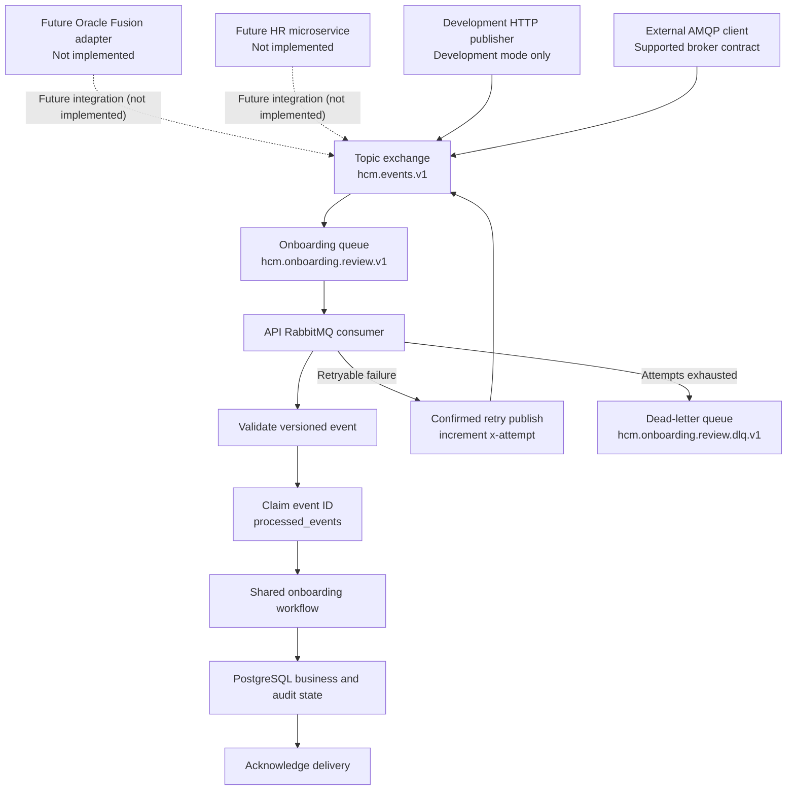

# RabbitMQ architecture and operations

RabbitMQ decouples event publication from asynchronous onboarding-workflow execution. A broker response of `{ "routed": true }` confirms only that RabbitMQ routed the publication; it is not business completion. Completion is established later by the consumer, workflow, and durable records.

## Implemented boundary

| Boundary                                                                                                                                                 | Status                                       |
| -------------------------------------------------------------------------------------------------------------------------------------------------------- | -------------------------------------------- |
| Durable topology, typed onboarding contract, application consumer, publisher confirms, manual acknowledgement, idempotency, retry, and dead-letter queue | Implemented                                  |
| Development HTTP publisher                                                                                                                               | Implemented only when `NODE_ENV=development` |
| Direct publication by a compatible AMQP client                                                                                                           | Supported by the implemented broker contract |
| Oracle Fusion adapter, another HR microservice, integration platform, or governed batch producer                                                         | Extension points only                        |
| Concrete external producer, DLQ consumer/replay, delayed retries, production identities/TLS/vhosts, monitoring, or alerts                                | Not implemented                              |

## Topology

| Element                  | Value                          |
| ------------------------ | ------------------------------ |
| Topic exchange           | `hcm.events.v1`                |
| Routing key              | `onboarding.review.requested`  |
| Consumer queue           | `hcm.onboarding.review.v1`     |
| Dead-letter exchange     | `hcm.events.dlx.v1`            |
| Dead-letter routing key  | `onboarding.review.dead`       |
| DLQ                      | `hcm.onboarding.review.dlq.v1` |
| Attempt header           | `x-attempt`                    |
| Default maximum attempts | `3`                            |



Dashed edges are future integration boundaries, not shipped adapters. The development endpoint and compatible external AMQP clients are the implemented publication paths shown with solid edges.

## Event contract and validation

The consumer accepts one strict, versioned onboarding-review event. This is a valid example:

```json
{
  "version": "1",
  "eventId": "event-onboarding-manual-001",
  "type": "onboarding.review.requested",
  "occurredAt": "2026-08-18T05:00:00.000Z",
  "correlationId": "4a6eb0ac-2fa1-4296-bbea-ff1985bf8df0",
  "data": {
    "employeeCode": "EMP-201",
    "thresholdDays": 30,
    "action": "REVIEW_ONLY"
  }
}
```

`version` must be `"1"`; `type` must be `"onboarding.review.requested"`; and the object rejects unknown fields. `eventId` is 1–128 characters and uses only a safe identifier beginning with an alphanumeric character (`A-Za-z0-9._:-` thereafter). `occurredAt` must be an offset ISO datetime. `correlationId` is optional, but when present must be a UUID v4. `data.employeeCode` matches `EMP-<digits>`, `thresholdDays` is an integer from `0` through `365` (default `30`), and the only allowed `action` values are `REVIEW_ONLY` and `NOTIFY_MANAGER` (default `REVIEW_ONLY`). `data.threadId` is optional and, when present, must be UUID v4.

RabbitMQ routes based on exchange and routing key, not JSON semantics. Consequently, an externally published message with a non-UUID `correlationId` can return `{ "routed": true }`, then fail application validation with `RABBITMQ_EVENT_VALIDATION_FAILED` before `processed_events` is claimed.

## Delivery, retry, and persistence

The consumer uses manual acknowledgement. Missing, invalid, or less-than-one `x-attempt` values become attempt `1`. Before the configured maximum, a failure republishes the unchanged content with `x-attempt + 1`, waits for publisher confirmation, and only then acknowledges the original delivery. On the final failure, it publishes to the dead-letter exchange with `x-error-code`, waits for confirmation, and then acknowledges the original. A failed confirmation leaves the original delivery unacknowledged for redelivery.

`processed_events.attempt` is the audit/latest-claim state for an event, not the retry decision source; `x-attempt` makes that decision. The table atomically records the event ID, type, SHA-256 payload hash, status, attempt, correlation ID, optional run/thread IDs, and optional error code. A completed duplicate avoids repeated workflow side effects; reuse of an event ID with different content is a conflict.

The DLQ is a RabbitMQ queue, not a PostgreSQL table. Docker Compose persists broker data in the named RabbitMQ volume mounted at `/var/lib/rabbitmq`; normal restarts retain it, while explicit deletion of that volume does not. There is no automated DLQ consumer, replay, or redrive implementation.

## Observability and durable evidence

Pino is application-side processing evidence. RabbitMQ Management UI is broker evidence: queue depth, consumer count, routing, and DLQ inspection. PostgreSQL is durable business, idempotency, and audit state.

| Pino event                         | Safe fields                                                                            |
| ---------------------------------- | -------------------------------------------------------------------------------------- |
| `rabbitmq.event.publish_confirmed` | `correlationId`, `messageId`, `attempt`, `routingKey`, `status`                        |
| `rabbitmq.event.received`          | `correlationId`, `messageId`, `attempt`, `routingKey`, `status`                        |
| `rabbitmq.event.completed`         | `correlationId`, `messageId`, `attempt`, `routingKey`, `status`, `runId`               |
| `rabbitmq.event.duplicate`         | `correlationId`, `messageId`, `attempt`, `routingKey`, `status`                        |
| `rabbitmq.event.conflict`          | `correlationId`, `messageId`, `attempt`, `routingKey`, `status`, `code`                |
| `rabbitmq.event.validation_failed` | `correlationId`, `messageId`, `attempt`, `routingKey`, `status`, `code`                |
| `rabbitmq.event.retry_published`   | `correlationId`, `messageId`, `attempt`, `nextAttempt`, `routingKey`, `status`, `code` |
| `rabbitmq.event.dead_lettered`     | `correlationId`, `messageId`, `attempt`, `routingKey`, `status`, `code`                |

Raw payloads, employee details, credentials, exception messages, and stack traces are not lifecycle-log fields. Direct Management API publication can yield `{ "routed": true }` at the broker but has no API-side publisher log because the API did not publish it. The first application record for external publication is `rabbitmq.event.received`. The development endpoint emits `rabbitmq.event.publish_confirmed` because the API owns that publish.

## Limitations and production direction

| Current limitation                                | Production direction                                                                  |
| ------------------------------------------------- | ------------------------------------------------------------------------------------- |
| No concrete Oracle Fusion or external HR producer | Add an authenticated, versioned integration adapter                                   |
| Development broker uses `guest` credentials       | Add service identities, rotated secrets, TLS, vhosts, and least-privilege permissions |
| Only onboarding-review events are supported       | Add versioned contracts only for required business domains                            |
| Retries are immediate                             | Add delayed retry queues or scheduled exponential backoff where required              |
| No automated DLQ consumer or replay               | Add authorized, audited redrive tooling with correction controls                      |
| No DLQ monitoring or alerting                     | Add broker metrics, ownership, dashboards, thresholds, and alerts                     |
| No transactional outbox                           | Add one where a database change and event publication must be atomic                  |

These are production directions, not implemented or scheduled work.

## Manual verification

The canonical [manual testing guide](manual-testing.md#rabbitmq) currently provides the broker-test summary. Task 4 reserves exactly two forthcoming detailed procedures: successful asynchronous delivery, and invalid-payload retry/DLQ verification. They are not yet present; neither procedure will claim a DLQ replay implementation.
