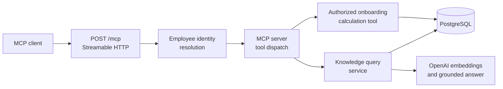
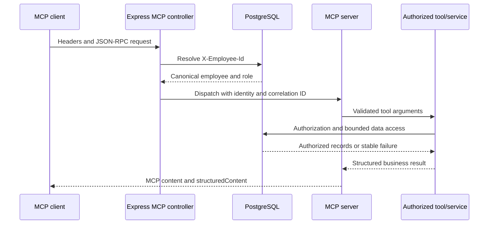

# Comprehensive MCP Documentation Implementation Plan

> **For agentic workers:** REQUIRED SUB-SKILL: Use superpowers:subagent-driven-development (recommended) or superpowers:executing-plans to implement this plan task-by-task. Steps use checkbox (`- [ ]`) syntax for tracking.

**Goal:** Add one canonical MCP guide and connect the existing repository documentation to it without changing runtime behavior or duplicating the Inspector walkthrough.

**Architecture:** `docs/mcp.md` owns MCP concepts, architecture, contracts, security boundaries, tools, errors, observability, and production considerations. The README and architecture guide provide concise entry points, while the usage guide remains the canonical operational Inspector walkthrough and the RAG guide remains focused on RAG-specific MCP testing.

**Tech Stack:** GitHub-flavored Markdown, Mermaid, Model Context Protocol JSON-RPC terminology, official TypeScript MCP SDK implementation already present in the repository, Prettier.

## Global Constraints

- Documentation changes only; do not modify runtime code, dependencies, configuration, tests, migrations, or generated files.
- Use `src/controllers/mcp.controller.ts` and `src/mcp/read-only-mcp.server.ts` as the source of truth.
- Document exactly two registered tools: `get_employee_onboarding_status` and `search_knowledge_documents`.
- Describe `X-Employee-Id` only as a development identity mechanism, never as production authentication.
- Do not claim OAuth, JWT, SSO, API-key authentication, MCP authorization discovery, MCP sessions, production client identity, or mutating MCP tools are implemented.
- Do not duplicate the complete MCP Inspector walkthrough from `docs/usage-guide.md#verify-mcp-with-inspector`.
- Preserve the existing uncommitted link in `docs/rag-testing-and-troubleshooting.md`.
- Keep Mermaid diagrams small, GitHub-compatible, and free of implementation claims not supported by the source.
- Do not add employment-application wording, generated-author attribution, or assistant/model branding.
- Stage and commit only the Markdown files explicitly listed by each task.

---

## File map

| File                                      | Responsibility in this change                                                                 |
| ----------------------------------------- | --------------------------------------------------------------------------------------------- |
| `docs/mcp.md`                             | New canonical MCP architecture and integration reference                                      |
| `README.md`                               | Add the MCP guide to the existing documentation table                                         |
| `docs/architecture.md`                    | Link the concise read-only MCP boundary to the canonical guide                                |
| `docs/usage-guide.md`                     | Link the Inspector walkthrough back to the canonical conceptual guide                         |
| `docs/rag-testing-and-troubleshooting.md` | Preserve the existing link to the Inspector walkthrough; do not otherwise expand MCP material |

### Task 1: Create the canonical MCP guide

**Files:**

- Create: `docs/mcp.md`
- Reference only: `src/controllers/mcp.controller.ts`
- Reference only: `src/mcp/read-only-mcp.server.ts`
- Reference only: `src/tools/onboarding.tools.ts`
- Reference only: `src/tools/knowledge.tools.ts`
- Reference only: `src/services/knowledge-query.service.ts`

**Interfaces:**

- Consumes: the existing `POST /mcp` controller behavior and the two registered MCP tool schemas.
- Produces: the canonical relative link target `mcp.md` for other files under `docs/` and `docs/mcp.md` from the root README.

- [ ] **Step 1: Reconfirm the endpoint and transport contract**

Read `src/controllers/mcp.controller.ts` and record these implemented facts before writing:

```text
basePath = /mcp
POST /mcp = supported
GET /mcp = HTTP 405
DELETE /mcp = HTTP 405
Allow = POST
sessionIdGenerator = undefined
enableJsonResponse = true
required development identity header = X-Employee-Id
optional trace header = X-Correlation-Id
```

Confirm that a fresh `McpServer` and `StreamableHTTPServerTransport` are created inside every POST handler invocation.

- [ ] **Step 2: Reconfirm the registered tool contracts**

Read `src/mcp/read-only-mcp.server.ts` and record the schemas exactly:

```text
get_employee_onboarding_status
  targetEmployeeCode: required EMP-\d+
  thresholdDays: optional integer 0..365, default 30

search_knowledge_documents
  query: required trimmed string 1..2000 characters
  documentId: optional UUID
```

Confirm both registrations are annotated `readOnlyHint: true`, `destructiveHint: false`, and `idempotentHint: true`. Confirm that only the knowledge tool has `openWorldHint: true`.

- [ ] **Step 3: Create the guide heading, purpose, and navigation**

Create `docs/mcp.md` with this top-level structure:

```markdown
# Model Context Protocol guide

This guide explains how the project exposes two existing read-only application capabilities through Model Context Protocol (MCP). It is written for developers studying the architecture and for MCP client integrators connecting to the service.

MCP is an additional interface into existing authorized tools and services. It does not contain a second implementation of onboarding or policy-search business logic.

> The current endpoint uses a development employee-identity header. It is not production authentication.

## Contents

- [MCP in this project](#mcp-in-this-project)
- [Architecture](#architecture)
- [Request flow](#request-flow)
- [Endpoint and connection model](#endpoint-and-connection-model)
- [Development identity and authorization](#development-identity-and-authorization)
- [Information exchanged](#information-exchanged)
- [Tool reference](#tool-reference)
- [Supported and unsupported operations](#supported-and-unsupported-operations)
- [Errors and observability](#errors-and-observability)
- [Connect and test](#connect-and-test)
- [Production considerations](#production-considerations)
```

State near the top that exactly two read-only tools are registered and no mutation capability is exposed.

- [ ] **Step 4: Add the component architecture diagram**

Under `## Architecture`, explain the source-file ownership and include links to:

```markdown
- [`src/controllers/mcp.controller.ts`](../src/controllers/mcp.controller.ts)
- [`src/mcp/read-only-mcp.server.ts`](../src/mcp/read-only-mcp.server.ts)
- [`src/tools/onboarding.tools.ts`](../src/tools/onboarding.tools.ts)
- [`src/tools/knowledge.tools.ts`](../src/tools/knowledge.tools.ts)
- [`src/services/knowledge-query.service.ts`](../src/services/knowledge-query.service.ts)
```

Add this compact Mermaid diagram:



Explain that MCP reuses application services and tools rather than duplicating business logic.

- [ ] **Step 5: Add the request sequence and boundary information**

Under `## Request flow`, add this Mermaid sequence diagram:



Immediately below it, show the dependency flow as text:

```text
MCP client
→ Streamable HTTP POST /mcp
→ Express MCP controller
→ employee identity resolution
→ official TypeScript MCP server and transport
→ authorized application tool or service
→ repository/PostgreSQL or RAG services
→ structured MCP response
```

- [ ] **Step 6: Document the endpoint and development identity contracts**

Under `## Endpoint and connection model`, document:

| Concern                | Implemented behavior                                    |
| ---------------------- | ------------------------------------------------------- |
| Endpoint               | `POST /mcp`                                             |
| Transport              | Stateless Streamable HTTP                               |
| Protocol body          | MCP JSON-RPC                                            |
| Response mode          | JSON                                                    |
| Session                | No MCP session ID is generated                          |
| Unsupported methods    | `GET` and `DELETE` return HTTP `405` with `Allow: POST` |
| Local default          | `http://localhost:3000/mcp`                             |
| Docker Compose default | `http://localhost:3300/mcp`                             |

Explain that a custom local `PORT` changes the local URL.

Under `## Development identity and authorization`, distinguish the two concepts:

```markdown
**Development identity resolution** establishes which seeded employee is making the request. The required `X-Employee-Id` value is trimmed, normalized to uppercase, checked against `EMP-\d+`, and resolved through PostgreSQL. Missing, malformed, or unknown identities return HTTP `401`.

**Authorization** happens after identity resolution. Tools use the canonical PostgreSQL employee role, ownership, and manager relationship. A role supplied by a client is never accepted as authority.
```

Document `X-Correlation-Id` as optional: the controller accepts a safe correlation ID or generates one, returns it through the HTTP response header, and includes it in tool results.

Add an explicit non-capability list: OAuth, JWT, SSO, API-key authentication, MCP authorization discovery, and production client identity are not implemented.

- [ ] **Step 7: Document the information exchanged**

Use one table:

| Boundary         | Information                                                                                                                    |
| ---------------- | ------------------------------------------------------------------------------------------------------------------------------ |
| HTTP headers     | `Content-Type`, `X-Employee-Id`, optional `X-Correlation-Id`, and MCP protocol headers supplied by the client where applicable |
| JSON-RPC request | MCP method, tool name, and validated tool arguments                                                                            |
| MCP result       | Content blocks, `structuredContent`, `isError`, business status, safe code/message where applicable, and correlation ID        |

Explain that results are bounded and structured, employee codes are masked where implemented, protected employee data is not exposed unnecessarily, and unexpected failures become stable generic MCP errors.

- [ ] **Step 8: Add the onboarding tool reference**

Document `get_employee_onboarding_status` with a compact contract table:

| Item                 | Contract                                                                             |
| -------------------- | ------------------------------------------------------------------------------------ |
| Purpose              | Read an authorized employee onboarding-review status                                 |
| `targetEmployeeCode` | Required employee code matching `EMP-\d+`                                            |
| `thresholdDays`      | Optional integer `0` through `365`; default `30`                                     |
| Authorization        | Self, HR, or manager reading a direct report under existing database-backed rules    |
| Side effects         | None; no notification is sent                                                        |
| Output               | `status`, masked `employeeCode`, `daysRemaining`, `withinThreshold`, `correlationId` |

Include representative intent examples such as:

```text
Read EMP-201's onboarding status using the default 30-day threshold.
Check whether EMP-201 is within a 45-day onboarding threshold.
```

Clarify that these examples describe tool use; MCP does not send them through arbitrary conversational routing.

- [ ] **Step 9: Add the knowledge tool reference**

Document `search_knowledge_documents` with this contract table:

| Item          | Contract                                                                                                            |
| ------------- | ------------------------------------------------------------------------------------------------------------------- |
| Purpose       | Ask a grounded question about active indexed HR documents                                                           |
| `query`       | Required trimmed string from `1` through `2,000` characters                                                         |
| `documentId`  | Optional UUID restricting retrieval to one active document                                                          |
| Authorization | Available only after canonical employee identity resolution                                                         |
| Retrieval     | Query safety, embedding, vector retrieval, evidence safety, grounded answer, citation validation, and output safety |
| Output        | `status`, `answer`, `sources`, `correlationId`                                                                      |

State that retrieval limits are configured by the server and are not accepted from MCP callers. State that retrieved content is untrusted evidence and cannot grant permissions or issue tool instructions.

Use representative questions such as:

```text
How many remote-working days are allowed each week?
What is the annual leave allowance in this document?
```

Document representative statuses: `ANSWERED`, `INSUFFICIENT_EVIDENCE`, and `FAILED`. Include `COMPLETED` for the onboarding tool.

- [ ] **Step 10: Add capability, error, observability, testing, and production sections**

Under `## Supported and unsupported operations`, list supported reads and explicitly exclude:

```text
employee record export
notifications
leave creation or approval
PDF generation
document upload
document indexing or reindexing
webhook or RabbitMQ publishing
arbitrary conversational-agent routing
database mutation
```

Under `## Errors and observability`, document HTTP `401`, HTTP `405`, stable MCP tool errors, generic unexpected failures, and these lifecycle events:

```text
mcp.request.started
mcp.request.rejected
mcp.request.completed
mcp.request.failed
```

Explain that the correlation ID links client results to operational logs and RAG tracing/security activity. Do not claim that full protected employee records are logged.

Under `## Connect and test`, link without duplicating commands:

```markdown
Use [Verify MCP with Inspector](usage-guide.md#verify-mcp-with-inspector) for graphical and CLI connection, discovery, and invocation instructions. For RAG-specific MCP behavior, see [RAG testing and troubleshooting](rag-testing-and-troubleshooting.md#6-test-the-mcp-knowledge-tool).
```

Under `## Production considerations`, label the endpoint as development/learning and list TLS, approved authentication such as OAuth 2.1, appropriate token validation, MCP client scopes, identity-to-employee mapping, secret management, rate limiting, network restrictions, monitoring, audit/retention policies, and applicable CORS/origin controls. State explicitly that none of these should be inferred from `X-Employee-Id`.

- [ ] **Step 11: Format and review the new guide**

Run:

```bash
npx prettier --write docs/mcp.md
npx prettier --check docs/mcp.md
git diff --check -- docs/mcp.md
```

Expected: Prettier reports the file follows its style and `git diff --check` prints no errors.

Read the entire guide and confirm that every endpoint, method, schema, status, log event, and non-capability is supported by the referenced source files.

- [ ] **Step 12: Commit the canonical guide**

```bash
git add docs/mcp.md
git commit -m "docs: add comprehensive MCP guide"
```

Expected: only `docs/mcp.md` is included in this commit.

### Task 2: Connect the existing documentation to the MCP guide

**Files:**

- Modify: `README.md` in `## Further documentation`
- Modify: `docs/architecture.md` in `## Read-only MCP boundary`
- Modify: `docs/usage-guide.md` in `## Verify MCP with Inspector`
- Preserve and include: `docs/rag-testing-and-troubleshooting.md` in `## 6. Test the MCP knowledge tool`

**Interfaces:**

- Consumes: the canonical `docs/mcp.md` guide from Task 1.
- Produces: bidirectional navigation among the repository overview, architecture explanation, conceptual MCP guide, operational Inspector guide, and RAG-specific test guide.

- [ ] **Step 1: Add the README documentation-table entry**

In `README.md` under `## Further documentation`, add this row near the usage and architecture guides:

```markdown
| [MCP guide](docs/mcp.md) | Architecture, tools, identity, authorization, errors, and production considerations |
```

Keep the table formatting aligned through Prettier. Do not expand the existing `### HTTP and MCP` section into a second MCP guide.

- [ ] **Step 2: Link the architecture boundary to the canonical guide**

At the end of the first paragraph under `## Read-only MCP boundary` in `docs/architecture.md`, add:

```markdown
See the [MCP guide](mcp.md) for the complete endpoint, tool, identity, error, and production-boundary reference.
```

Keep the existing concise architectural explanation and diagram unchanged unless Prettier adjusts wrapping.

- [ ] **Step 3: Link the Inspector walkthrough back to the conceptual guide**

Immediately below `## Verify MCP with Inspector` in `docs/usage-guide.md`, add:

```markdown
For the endpoint architecture, development identity model, authorization rules, tool schemas, error behavior, and production considerations, read the [MCP guide](mcp.md). This section remains the canonical connection and invocation walkthrough.
```

Do not move or duplicate the existing Inspector commands.

- [ ] **Step 4: Preserve the existing RAG-guide change**

Confirm `docs/rag-testing-and-troubleshooting.md` still contains:

```markdown
For Inspector connection configuration, tool discovery, and invocation examples, see
[Verify MCP with Inspector](usage-guide.md#verify-mcp-with-inspector).
```

Do not add a second Inspector walkthrough or unrelated RAG edits.

- [ ] **Step 5: Format all changed navigation documents**

Run:

```bash
npx prettier --write README.md docs/architecture.md docs/usage-guide.md docs/rag-testing-and-troubleshooting.md
npx prettier --check README.md docs/architecture.md docs/usage-guide.md docs/rag-testing-and-troubleshooting.md
git diff --check
```

Expected: all four files follow Prettier style and `git diff --check` prints no errors.

- [ ] **Step 6: Commit the documentation navigation**

```bash
git add README.md docs/architecture.md docs/usage-guide.md docs/rag-testing-and-troubleshooting.md
git commit -m "docs: connect MCP reference across guides"
```

Expected: this commit includes the three new cross-references and the preserved RAG Inspector link.

### Task 3: Verify schemas, links, anchors, and documentation-only scope

**Files:**

- Verify: `docs/mcp.md`
- Verify: `README.md`
- Verify: `docs/architecture.md`
- Verify: `docs/usage-guide.md`
- Verify: `docs/rag-testing-and-troubleshooting.md`
- Reference only: `src/controllers/mcp.controller.ts`
- Reference only: `src/mcp/read-only-mcp.server.ts`

**Interfaces:**

- Consumes: the complete documentation changes from Tasks 1 and 2.
- Produces: verification evidence that documentation matches the implementation and all navigation targets resolve.

- [ ] **Step 1: Compare the tool names and schemas with the server**

Run:

```bash
rg -n "registerTool|targetEmployeeCode|thresholdDays|query:|documentId" src/mcp/read-only-mcp.server.ts
rg -n "get_employee_onboarding_status|search_knowledge_documents|targetEmployeeCode|thresholdDays|documentId|2,000" docs/mcp.md
```

Confirm exact agreement on both tool names, required/optional arguments, numeric limits, string limits, UUID scope, and the default threshold.

- [ ] **Step 2: Compare the controller lifecycle with the endpoint documentation**

Run:

```bash
rg -n "basePath|router\.(post|get|delete)|sessionIdGenerator|enableJsonResponse|X-Employee-Id|X-Correlation-Id|mcp\.request" src/controllers/mcp.controller.ts
rg -n "POST /mcp|GET /mcp|DELETE /mcp|session|JSON|X-Employee-Id|X-Correlation-Id|mcp\.request" docs/mcp.md
```

Confirm endpoint, methods, stateless transport, response mode, identity behavior, correlation behavior, and four lifecycle events match.

- [ ] **Step 3: Verify relative file links**

From the repository root, run:

```bash
node -e "const fs=require('fs'),p=require('path');const files=['README.md','docs/mcp.md','docs/architecture.md','docs/usage-guide.md','docs/rag-testing-and-troubleshooting.md'];let bad=[];for(const file of files){const text=fs.readFileSync(file,'utf8');for(const m of text.matchAll(/\[[^\]]+\]\(([^)#]+)(?:#[^)]+)?\)/g)){const href=m[1];if(/^(?:https?:|mailto:)/.test(href))continue;const target=p.resolve(p.dirname(file),href);if(!fs.existsSync(target))bad.push(file+' -> '+href)}}if(bad.length){console.error(bad.join('\n'));process.exit(1)}console.log('Relative file links resolve.')"
```

Expected output:

```text
Relative file links resolve.
```

- [ ] **Step 4: Verify required Markdown anchors**

Run:

```bash
rg -n "^## Verify MCP with Inspector$" docs/usage-guide.md
rg -n "^## 6\. Test the MCP knowledge tool$" docs/rag-testing-and-troubleshooting.md
rg -n "usage-guide\.md#verify-mcp-with-inspector|rag-testing-and-troubleshooting\.md#6-test-the-mcp-knowledge-tool" docs/mcp.md docs/rag-testing-and-troubleshooting.md
```

Expected: each heading and inbound anchor reference appears once in its canonical location.

- [ ] **Step 5: Run final Markdown and diff verification**

Run:

```bash
npx prettier --check README.md docs/mcp.md docs/architecture.md docs/usage-guide.md docs/rag-testing-and-troubleshooting.md docs/superpowers/specs/2026-08-17-mcp-documentation-design.md docs/superpowers/plans/2026-08-17-comprehensive-mcp-documentation.md
git diff --check
git status --short
git diff main...HEAD --stat
git diff main...HEAD --name-only
```

Expected:

- Prettier reports all listed Markdown files follow its style.
- `git diff --check` prints no errors.
- The branch diff contains only Markdown documentation.
- Runtime source, dependencies, tests, configuration, migrations, generated files, and binaries are absent.

- [ ] **Step 6: Inspect the complete branch diff**

Run:

```bash
git diff main...HEAD -- README.md docs/mcp.md docs/architecture.md docs/usage-guide.md docs/rag-testing-and-troubleshooting.md docs/superpowers/specs/2026-08-17-mcp-documentation-design.md docs/superpowers/plans/2026-08-17-comprehensive-mcp-documentation.md
```

Read the result end to end. Confirm:

- exactly two MCP tools are documented;
- the Inspector walkthrough exists only in the usage guide;
- authentication and authorization are distinguished;
- unsupported and production-only capabilities are not presented as implemented;
- both Mermaid diagrams are concise and syntactically balanced; and
- the preserved RAG-guide link is included without unrelated user changes.

- [ ] **Step 7: Record the verification result without an empty commit**

If verification finds no content issue, do not create an empty commit. Use the two content commits as the branch history and report the executed commands and results in the pull-request description or handoff summary.

If verification requires a documentation correction, edit only the affected Markdown file, rerun Steps 1 through 6, and commit the correction with:

```bash
git add <affected-markdown-files>
git commit -m "docs: correct MCP guide verification findings"
```
