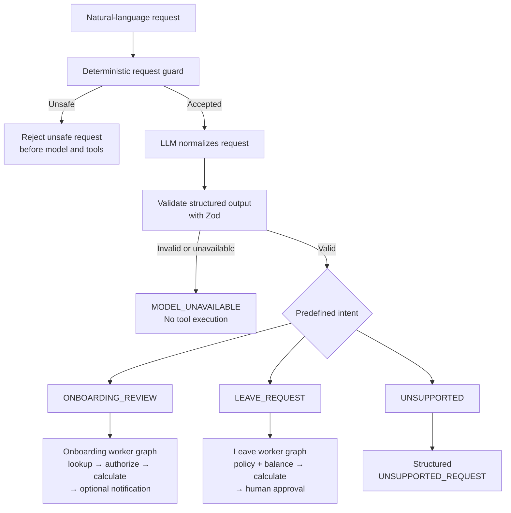

# Public Readiness Documentation Implementation Plan

> **For agentic workers:** REQUIRED SUB-SKILL: Use superpowers:subagent-driven-development (recommended) or superpowers:executing-plans to implement this plan task-by-task. Steps use checkbox (`- [ ]`) syntax for tracking.

**Goal:** Make the repository's public documentation accurately explain the implemented HR agent, intent routing, observability, limitations, production-readiness path, Agile delivery record, and expected outcomes for every public curl example.

**Architecture:** The README remains the public entry point and links to focused guides instead of duplicating every operational detail. The documentation distinguishes implemented runtime behavior from development boundaries and production extensions, and every executable curl receives a representative contract directly beside it.

**Tech Stack:** GitHub-flavored Markdown, Mermaid, Node.js/TypeScript API contracts, GitHub Project #7, Prettier, repository quality scripts.

## Global Constraints

- Work on `docs/public-readiness-roadmap`; rebase it onto `main` after the on-demand leave-document PR is merged.
- Create `TASK: Complete Public Documentation and Production Roadmap` as a child of Story #8 and add it to GitHub Project #7 with Sprint 2, Area Documentation, Priority P0, Size M, and In progress.
- The pull request closes only the new task; the repository owner remains the sole merger to `main`.
- Do not rename the repository, npm package, local directory, source identifiers, database names, Docker resources, prompts, graphs, traces, or GitHub Project title.
- Do not claim production readiness, unimplemented integrations, additional HR workflows, additional file formats, or multiple model providers.
- Use the exact approved public description and preserve HCM terminology inside the project.
- Keep all examples synthetic and all generated identifiers, dates, timestamps, and document IDs visibly variable.
- Exclude historical plans under `docs/superpowers/plans` from the public curl audit.
- Do not add runtime functionality in this documentation PR.
- Keep comments, commits, issues, branches, pull-request text, and documentation free of assistant/model attribution.

---

### Task 1: Create and parent the documentation task

**Files:**

- No repository files in this task.

**Interfaces:**

- Consumes: GitHub Story #8 and Project #7.
- Produces: one issue number for the documentation PR.

- [ ] **Step 1: Synchronize the documentation branch after runtime integration**

```bash
git checkout docs/public-readiness-roadmap
git fetch origin
git rebase origin/main
```

Resolve only genuine documentation overlap from the on-demand-document PR. Do not restore claims about stored PDF bytes.

- [ ] **Step 2: Create the parented GitHub task**

Use title `TASK: Complete Public Documentation and Production Roadmap` with:

```markdown
## Purpose

Give public readers an accurate, testable explanation of the implemented HR agent and a practical path from this development implementation to a production backend.

## Expected outcome

The README explains intent routing and observability, limitations and roadmap items are explicit, the completed Agile delivery project is linked, and every public curl has a representative expected result.

## Included work

- Update the README opening and intent-routing explanation.
- Add intent observability, current limitations, production roadmap, provider/indexing extension guidance, and HR extension pattern.
- Link the completed two-sprint GitHub Project.
- Audit README and public guides so every curl shows status, relevant headers, body/output, and variable fields.

## Acceptance criteria

- Documentation distinguishes implemented behavior from production recommendations.
- All three predefined intents and technical model failure behavior are shown accurately.
- Runtime integrations are described as real when configured; test/Studio dependencies are described as fakes.
- Every public curl in README, API examples, RAG testing, and usage guide has a representative expected response.
- Mermaid renders and all links/commands match the repository.

## Verification

Run the curl inventory, Markdown formatting, repository quality suite, and documented manual scenarios.

## Dependencies

Story #8 and the merged on-demand leave-document change.

## Exclusions

Runtime features, production deployment, provider abstraction, new document formats, and new HR workflows.
```

- [ ] **Step 3: Add it to Project #7 and set hierarchy/fields**

Set parent Story #8. Set Item Type `Task`, Sprint `Sprint 2`, Area `Documentation`, Priority `P0`, Size `M`, and both status fields to `In progress`. Reopen the Story, Sprint 2 Epic, and Project only while delivery is active.

### Task 2: Rewrite the README opening and intent explanation

**Files:**

- Modify: `README.md`

**Interfaces:**

- Consumes: `HcmIntentType`, `hcmIntentSchema`, request guard, supervisor routing, and model failure mapping.
- Produces: accurate public overview and intent-routing Mermaid diagram.

- [ ] **Step 1: Replace the opening summary exactly**

Use:

```markdown
A TypeScript HR backend for Human Capital Management (HCM), demonstrating LLM orchestration, LangGraph workflows, RAG, MCP tools, guardrails, human approval, automated triggers, and LangSmith observability.
```

Replace `The system separates language understanding from business execution:` with:

```markdown
The system translates natural-language requests into a validated, predefined intent. Deterministic application code then:
```

The following bullets must say that code resolves identity, authorizes access, selects a worker graph, performs deterministic calculations, persists workflow/audit state, and executes only explicitly permitted side effects.

- [ ] **Step 2: Add `Intent normalization and routing` after `Where the LLM is used`**

Insert this diagram:



Add this table:

```markdown
| Intent              | Meaning                                                    | Route                           |
| ------------------- | ---------------------------------------------------------- | ------------------------------- |
| `ONBOARDING_REVIEW` | Review an active onboarding or probationary period         | Onboarding worker graph         |
| `LEAVE_REQUEST`     | Prepare an annual-leave proposal from explicit dates       | Leave worker graph              |
| `UNSUPPORTED`       | The request does not match an implemented agent capability | Structured unsupported response |
```

- [ ] **Step 3: Explain routing boundaries in plain English**

State all of the following explicitly:

- the model may select only a predefined enum value and must satisfy strict Zod output;
- it cannot create routes, authorize, calculate, or execute side effects;
- missing supported fields return `NEED_MORE_INFORMATION` and can continue on the same thread;
- missing fields are not an intent;
- deterministic guards reject unsafe input before OpenAI/tools;
- invalid output, timeout, or model failure after one bounded retry returns HTTP `503 MODEL_UNAVAILABLE` and no protected tool runs;
- `UNSUPPORTED` is a valid normalized intent returning `UNSUPPORTED_REQUEST`;
- typed schedule, webhook, and RabbitMQ commands skip model normalization but enter the same deterministic workflow/audit path.

- [ ] **Step 4: Update README contents links**

Add links for `Intent normalization and routing`, `Current limitations`, `Production-readiness roadmap`, `Extending the system`, and `Project delivery`; remove `Current boundaries`.

- [ ] **Step 5: Format-check this increment**

```bash
npx prettier --check README.md
```

Expected: exit `0` after applying Prettier formatting if needed.

- [ ] **Step 6: Commit the intent explanation**

```bash
git add README.md
git commit -m "docs: explain intent normalization and routing"
```

### Task 3: Document intent observability and current implementation boundaries

**Files:**

- Modify: `README.md`
- Modify: `docs/architecture.md`

**Interfaces:**

- Consumes: existing PostgreSQL audit, SSE, LangSmith, Pino, security event, OpenAI, RabbitMQ, pgvector, and Docker behavior.
- Produces: an evidence map and precise `Current limitations` section.

- [ ] **Step 1: Add the intent evidence map to README observability**

Document:

| Evidence                                    | What it shows                                                                                                                     |
| ------------------------------------------- | --------------------------------------------------------------------------------------------------------------------------------- |
| PostgreSQL `agent_runs` / `agent_run_steps` | Durable execution and `intent_normalization` outcome codes                                                                        |
| SSE                                         | Safe intent, node, tool, approval, document, and response progress                                                                |
| LangSmith agent trace                       | Raw query when explicitly traced, normalized intent, prompt/model, path, tools, authorization, latency, tokens, retries, failures |
| Pino                                        | Safe request/operation metadata without complete employee records                                                                 |
| `security_events`                           | Unsafe-request, indirect-injection, and authorization evidence                                                                    |

Explain that missing fields and `UNSUPPORTED` are valid outcomes, while `MODEL_UNAVAILABLE` is a technical failure.

- [ ] **Step 2: Replace `Current boundaries` with `Current limitations`**

Use a table with columns `Current implementation`, `Why it is limited`, and `Production direction`. It must cover:

1. `X-Employee-Id` development identity;
2. development manager-notification adapter;
3. local PostgreSQL employee/policy data rather than Oracle Fusion or another external HR system;
4. only onboarding review, annual leave, and policy Q&A business use cases;
5. fake external dependencies in unit tests and Studio while configured OpenAI/PostgreSQL/pgvector/RabbitMQ/LangGraph/LangSmith runtime integrations are real;
6. repository-managed PDF-only policy ingestion and future business-dependent DOCX, CSV/spreadsheet, HTML, text/Markdown, OCR, and document connectors;
7. OpenAI-only language and embedding adapters;
8. detailed LangSmith traces restricted to approved synthetic data under the present privacy model;
9. Monday–Friday leave calendar without public holidays;
10. on-demand leave PDFs not retained as immutable legal artifacts;
11. focused unit coverage with manual infrastructure verification;
12. Docker Compose development runtime without production secrets, deployment, monitoring, DR, or SLOs.

- [ ] **Step 3: Explain why detailed LangSmith data is restricted**

State that raw questions/answers, normalized intent, paths, tools, tokens, latency, and failures help debug non-deterministic behavior. State that real HR data needs a trace-data policy, PII filtering, access control, sampling, retention, regional/legal review, and the ability to omit payloads.

- [ ] **Step 4: Align the architecture guide**

In `docs/architecture.md`, add a short `Development and production boundaries` subsection pointing to README and repeating only the architecture-specific distinctions: real configured infrastructure vs fake test/Studio adapters, development identity/notification, and provider/storage extension points.

In README's data table, change the Leave purpose from `approved requests, and PDFs` to `policy, eligibility, submitted requests, and document template versions`. State that PDFs are derived on demand after authorization rather than persisted.

- [ ] **Step 5: Commit the limitations and evidence map**

```bash
git add README.md docs/architecture.md
git commit -m "docs: define observability and current limitations"
```

### Task 4: Add the production roadmap and extension patterns

**Files:**

- Modify: `README.md`

**Interfaces:**

- Consumes: approved design roadmap.
- Produces: ordered production path and non-claimed extension opportunities.

- [ ] **Step 1: Add `Production-readiness roadmap`**

Use this order:

1. trusted SSO/OAuth identity and authorization governance;
2. Oracle Fusion or approved HR REST/SOAP adapters;
3. approved notification providers with retry, idempotency, and delivery tracking;
4. managed secrets, TLS, encryption, PII governance, retention, and audit controls;
5. managed PostgreSQL/RabbitMQ, backups, and disaster recovery;
6. immutable object storage for official/legal documents when required;
7. transactional event publishing, circuit breakers, and operational DLQ handling;
8. production containers, horizontal scaling, scheduler coordination, and worker isolation;
9. centralized metrics, OpenTelemetry, dashboards, alerts, and SLOs;
10. integration, contract, end-to-end, security, load, and fault-injection tests;
11. prompt/model release gates, evaluations, cost budgets, caching, provider fallback, and rollback;
12. additional HR intents/worker graphs/tools/authorization/traces/evaluations/docs.

Conclude that legal, security, data-residency, availability, and operational requirements remain organization-specific.

- [ ] **Step 2: Add provider and ingestion extensibility**

Explain that additional formats are requirements-driven, not universally mandatory. For CSV/spreadsheets, mention schema-aware header/row/column handling; for scans, OCR; for connectors, ownership/access/lifecycle/deletion/reindexing/malware scanning.

Explain separate provider-neutral interfaces for intent normalization, grounded answer generation, and embeddings. Mention other approved language providers without implying they provide the same embeddings. Require structured-output compatibility, provider-specific timeout/retry/rate limits, evaluation, fallback policy, and embedding dimension/version compatibility; changed embeddings require side-by-side reindex/activation.

- [ ] **Step 3: Add `Extending HR capabilities`**

Include exactly:

```text
business requirement
→ predefined structured intent
→ supervisor route
→ domain worker graph
→ authorized tools
→ repository or external adapter
→ audit, traces, evaluations, and documentation
```

List employee profiles, absence categories, benefits, performance reviews, recruitment, document workflows, and more external HR integrations as opportunities, not implemented features.

- [ ] **Step 4: Add `Project delivery`**

Link [GitHub Project #7](https://github.com/users/ramioooz/projects/7) and use this paragraph exactly:

```markdown
Development was managed through the linked GitHub Project using a lightweight Agile delivery process. Work was organized into two fast-paced sprints with epics, stories, parented tasks, acceptance criteria, pull-request-based delivery, and a working increment at the end of each sprint.
```

Do not describe the work as a job application, portfolio, interview task, or generated project.

- [ ] **Step 5: Commit roadmap content**

```bash
git add README.md
git commit -m "docs: add production readiness roadmap"
```

### Task 5: Add representative results to README and API examples

**Files:**

- Modify: `README.md`
- Modify: `docs/api-examples.md`

**Interfaces:**

- Consumes: health, readiness, onboarding, leave, webhook, and trace contracts.
- Produces: status/header/body documentation immediately after each public curl.

- [ ] **Step 1: Inventory curls in these two files**

```bash
rg -n "curl( |$)" README.md docs/api-examples.md
```

Expected baseline: four README curls and three API-example curls. If the count differs because current `main` advanced, document every returned occurrence rather than preserving the old count.

- [ ] **Step 2: Document health and readiness separately**

After `curl /health`, add HTTP `200` and:

```json
{ "status": "ok" }
```

After `curl /ready`, add HTTP `200` with:

```json
{ "status": "ready" }
```

Also show HTTP `503` when PostgreSQL is unavailable:

```json
{ "status": "not_ready" }
```

Do not combine the two commands under one ambiguous result.

- [ ] **Step 3: Document onboarding invocation output**

Show HTTP `200`, `Content-Type: application/json`, and a representative body containing `COMPLETED`, `<run-id>`, `<thread-id>`, `<correlation-id>`, employee code/name, review end date, days remaining, threshold result, action, and `actionPerformed`. Note that IDs and date-derived values vary.

- [ ] **Step 4: Document annual-leave proposal and webhook output**

For an eligible leave proposal, show HTTP `202` and this representative final result (the runner converts the graph interrupt into this public contract):

```json
{
  "status": "AWAITING_APPROVAL",
  "code": "LEAVE_APPROVAL_REQUIRED",
  "message": "Approve or reject the leave request proposal before creation.",
  "threadId": "<thread-id>",
  "runId": "<run-id>",
  "correlationId": "<correlation-id>"
}
```

For webhook, show its synchronous accepted/completed response exactly as implemented, including trace IDs. If processing is asynchronous, label the HTTP acknowledgement separately from the later workflow evidence instead of inventing an immediate business result.

- [ ] **Step 5: Document explicit trace request output**

Where `docs/api-examples.md` shows a trace-enabled call, document the normal API response and explain that the trace is inspected in LangSmith rather than returned as a second HTTP payload.

- [ ] **Step 6: Commit these public contracts**

```bash
git add README.md docs/api-examples.md
git commit -m "docs: add API example responses"
```

### Task 6: Complete RAG curl response documentation

**Files:**

- Modify: `docs/rag-testing-and-troubleshooting.md`

**Interfaces:**

- Consumes: cross-document, document-scoped, not-found, insufficient-evidence, unsafe-query, authentication, and validation contracts.
- Produces: a complete RAG manual-test matrix.

- [ ] **Step 1: Inventory the seven RAG curls**

```bash
rg -n "curl( |$)" docs/rag-testing-and-troubleshooting.md
```

Each curl must be followed immediately by expected HTTP status, `application/json`, and a complete representative body.

- [ ] **Step 2: Preserve the grounded answer examples**

For cross-document and single-document success, show:

```json
{
  "status": "ANSWERED",
  "answer": "<representative grounded answer>",
  "sources": [
    {
      "documentId": "<document-id>",
      "documentTitle": "<mock policy title>",
      "chunkId": "<chunk-id>",
      "chunkIndex": 0,
      "pageNumber": 1
    }
  ]
}
```

Use the existing mock policy facts, not invented HR rules. Note that similarity, selected chunks, IDs, and answer phrasing can vary with embeddings/model versions.

- [ ] **Step 3: Preserve all failure contracts**

Show complete bodies for:

- stale document ID: `404 KNOWLEDGE_DOCUMENT_NOT_FOUND`;
- insufficient evidence: HTTP `200`, `INSUFFICIENT_EVIDENCE`, empty sources;
- unsafe question: the actual stable unsafe-query status/code/message;
- missing `X-Employee-Id`: `401 AUTHENTICATION_REQUIRED`;
- caller-provided `limit`: `400 KNOWLEDGE_QUERY_INVALID`, explaining that retrieval limits are server-controlled.

- [ ] **Step 4: Keep database/CLI examples distinct from HTTP examples**

For `knowledge:index` and SQL curls/commands, show representative terminal rows/output instead of HTTP status. Mark hashes, IDs, counts, durations, and index status as variable.

- [ ] **Step 5: Commit the RAG matrix**

```bash
git add docs/rag-testing-and-troubleshooting.md
git commit -m "docs: complete RAG response examples"
```

### Task 7: Complete the usage-guide response documentation

**Files:**

- Modify: `docs/usage-guide.md`

**Interfaces:**

- Consumes: all manually demonstrated HTTP, SSE, PDF, trigger, MCP, audit, Studio, and evaluation behavior.
- Produces: a self-contained rehearsal guide with representative outputs.

- [ ] **Step 1: Inventory all usage-guide curls**

```bash
rg -n "curl( |$)" docs/usage-guide.md
```

Expected baseline: sixteen curls. Cover every current occurrence if the count differs after rebasing.

- [ ] **Step 2: Add complete onboarding and failure bodies**

For self, direct report, notification, ambiguous-thread start/continuation, authorization denial, unsafe request, and cross-identity continuation, show the full structured JSON fields returned by the API. Use placeholders for run/thread/correlation IDs and date-derived data. State explicitly that unsafe input is blocked before the model/tool path.

- [ ] **Step 3: Add an SSE event excerpt**

After the streaming curl, show representative frames rather than a JSON object:

```text
event: run
data: {"runId":"<run-id>","threadId":"<thread-id>","correlationId":"<correlation-id>","status":"started","triggerType":"HTTP"}

event: intent
data: {"runId":"<run-id>","status":"normalized","intent":"ONBOARDING_REVIEW","requestedAction":"REVIEW_ONLY"}

event: response
data: {"runId":"<run-id>","status":"completed","httpStatus":200,"body":{"status":"COMPLETED"}}
```

Note that node/tool frames depend on the selected workflow path.

- [ ] **Step 4: Add leave approval and on-demand PDF results**

Show the HTTP `202` proposal, HTTP `201` approval body with stable document URL, and HTTP `200` download headers:

```http
Content-Type: application/pdf
Cache-Control: no-store
Content-Disposition: inline; filename="leave-request-<leave-request-id>.pdf"
```

Show verification:

```bash
file leave-request.pdf
head -c 5 leave-request.pdf
```

with representative output `PDF document` and `%PDF-`. Explain that bytes are generated from the authorized submitted snapshot on each download and are not stored in PostgreSQL.

- [ ] **Step 5: Add RAG, webhook, and development-event results**

Use the same RAG success structure as the dedicated guide. For webhook and development publisher, distinguish the immediate HTTP acknowledgement from asynchronous RabbitMQ consumption, idempotency row, run evidence, retry, or DLQ result.

- [ ] **Step 6: Document non-curl tool outputs**

For MCP Inspector, SQL audit checks, Studio startup, and evaluation commands, show representative UI/terminal outcomes and state which values vary. Do not label non-HTTP commands with an HTTP status.

- [ ] **Step 7: Commit the usage guide**

```bash
git add docs/usage-guide.md
git commit -m "docs: complete manual verification outputs"
```

### Task 8: Audit accuracy, formatting, links, and full repository quality

**Files:**

- Verify: `README.md`
- Verify: `docs/api-examples.md`
- Verify: `docs/rag-testing-and-troubleshooting.md`
- Verify: `docs/usage-guide.md`
- Verify: `docs/architecture.md`

**Interfaces:**

- Consumes: all documentation changes.
- Produces: a ready-for-review documentation PR with no undocumented public curl.

- [ ] **Step 1: Run the final curl inventory**

```bash
rg -n "curl( |$)" README.md docs/api-examples.md docs/rag-testing-and-troubleshooting.md docs/usage-guide.md
```

For every occurrence, inspect the immediately following section and confirm it contains status or command outcome, relevant headers, representative body/output, placeholders, and varying-value notes. Historical `docs/superpowers/plans` remain excluded.

- [ ] **Step 2: Scan for stale or prohibited claims**

```bash
rg -n "Current boundaries|stored in PostgreSQL|document_pdf|production-ready|portfolio|interview|job application|generated by|ChatGPT|Codex" README.md docs --glob '*.md' --glob '!docs/superpowers/**'
```

Expected: no stale stored-PDF/current-boundaries or employment/assistant-attribution claim. `production-ready` may appear only in an explicit negation such as `not production-ready`; review rather than mechanically deleting that accurate statement.

- [ ] **Step 3: Check Mermaid intent names against source**

```bash
rg -n "ONBOARDING_REVIEW|LEAVE_REQUEST|UNSUPPORTED|MODEL_UNAVAILABLE" README.md src/enums/hcm-agent.enum.ts src/enums/error.enum.ts
```

Expected: README names match source enums exactly.

- [ ] **Step 4: Run formatting and full quality checks**

```bash
npm run db:generate
npm test
npm run typecheck
npm run lint
npm run format:check
npm run db:format:check
npm run build
```

Expected: every command exits `0`.

- [ ] **Step 5: Review the complete diff**

```bash
git status --short
git diff --check
git diff origin/main...HEAD
```

Confirm the PR contains documentation/spec/plan content only, all runtime statements match current `main`, links resolve, no broad source rename occurred, and the GitHub Project link is present.

- [ ] **Step 6: Push and open the ready-for-review PR**

```bash
git push -u origin docs/public-readiness-roadmap
```

Open a PR titled `docs: complete public readiness guidance`, target `main`, include the curl-audit counts, quality results, and `Closes #<the issue number created in Task 1>`. Do not merge it.

### Task 9: Perform public-release actions only after both PRs reach main

**Files:**

- Verify the final `main`; no planned code change.

**Interfaces:**

- Consumes: owner-merged runtime and documentation PRs.
- Produces: a public repository and completed public Project record only after explicit action-time approval.

- [ ] **Step 1: Clean merged branches and synchronize main**

After the owner merges each PR, delete its local and remote feature branch, prune remote references, and fast-forward local `main` to `origin/main`.

- [ ] **Step 2: Run the final public-readiness audit**

Run the complete quality suite, documented manual flows, tracked-file secret scan, Git-history credential/private-data scan, and synthetic employee/policy review. Confirm README claims and expected results match the merged runtime.

- [ ] **Step 3: Close delivery hierarchy**

Confirm both task issues are closed/Done, close Story #6 and Story #8 only when every child is complete, close the Sprint 2 Epic and milestones when their children are complete, and keep Project #7 closed as the historical delivery record.

- [ ] **Step 4: Request action-time approval for external visibility/security changes**

Immediately before mutation, ask the repository owner to approve updating GitHub visibility and settings. Do not infer this permission from approval of the implementation plan.

- [ ] **Step 5: Apply approved public settings**

Set the GitHub About description exactly to:

```text
A TypeScript HR backend for Human Capital Management (HCM), demonstrating LLM orchestration, LangGraph workflows, RAG, MCP tools, guardrails, human approval, automated triggers, and LangSmith observability.
```

Make Project #7 public while keeping it closed, make the repository public, protect `main`, and require pull requests. Preserve repository-owner-only merges to `main`.
