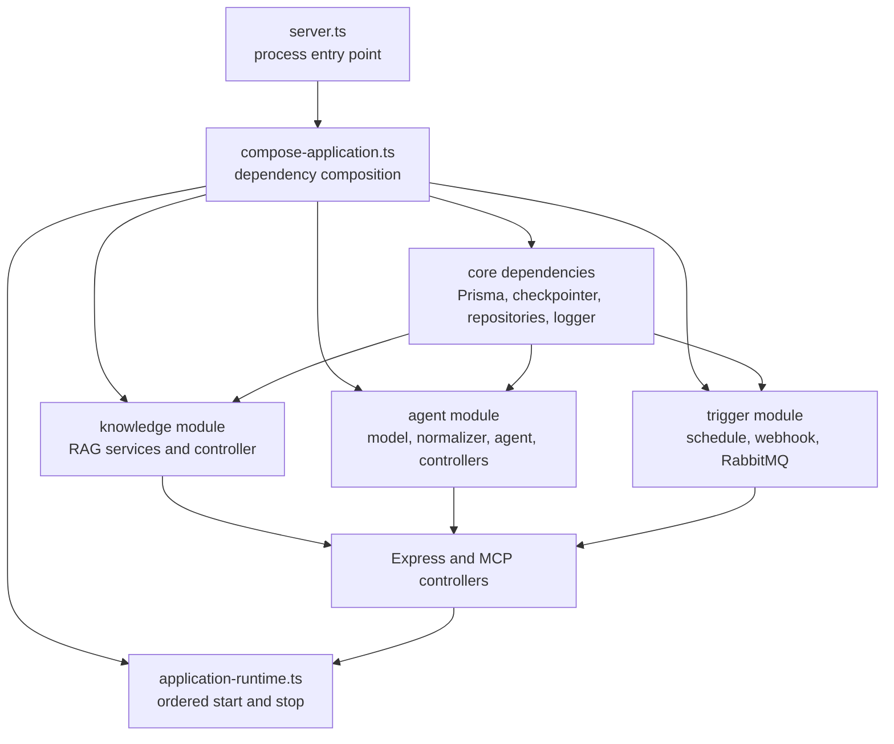

# Functional Application Bootstrap Design

## Purpose

`src/server.ts` currently creates every repository, adapter, service, controller, trigger, and external resource. It also starts the HTTP server, registers operating-system signals, and performs partial-startup cleanup. The file therefore combines dependency composition with process and resource lifecycle management.

This refactor will keep `server.ts` as the executable entry point while moving dependency composition into small functional bootstrap modules. Runtime behavior, public APIs, business rules, database schema, and environment variables will remain unchanged.

## Goals

- Make the startup path understandable without reading one large file.
- Give core infrastructure, agent composition, knowledge composition, and trigger composition one clear owner each.
- Centralize ordered startup, graceful shutdown, and partial-startup cleanup.
- Keep constructors and factory inputs explicit so dependencies remain easy to test.
- Preserve the current lightweight dependency-injection approach without adding a framework.

## Non-goals

- No controller, service, graph, tool, repository, or business-rule redesign.
- No dependency-injection container, decorators, reflection, or framework.
- No endpoint, response, database, environment, tracing, queue, scheduler, or authorization change.
- No new generic lifecycle framework intended for reuse outside this application.
- No expansion of the automated test suite beyond one critical lifecycle test.

## Considered Approaches

### 1. Functional bootstrap modules — selected

Small factory functions compose each functional area, and one runtime function owns resource lifecycle. Dependencies remain visible in function arguments and return values. This fits the current code style and separates responsibilities without adding a new abstraction layer.

### 2. One `ApplicationRuntime` class — rejected

A class could hide startup and shutdown behind methods, but it would still contain most of the current construction logic. That would relocate the oversized method rather than create meaningful boundaries.

### 3. Dependency-injection container — rejected

A container could register and resolve dependencies automatically, but the application does not need dynamic resolution or multiple runtime implementations. It would obscure the composition path and add complexity unrelated to the project requirements.

## Proposed Structure

```text
src/
├── bootstrap/
│   ├── create-core-dependencies.ts
│   ├── create-agent-module.ts
│   ├── create-knowledge-module.ts
│   ├── create-trigger-module.ts
│   ├── compose-application.ts
│   └── application-runtime.ts
├── types/
│   ├── application-environment.ts
│   └── application-runtime.ts
├── app.ts
└── server.ts
```

Only exported cross-file contracts belong in `src/types`. Factory-specific input shapes remain local to their factory files when no other module needs to name them.

## Module Responsibilities

### `create-core-dependencies.ts`

Creates resources shared by multiple functional areas:

- Prisma client.
- PostgreSQL LangGraph checkpointer.
- Pino application logger.
- Employee, run, leave, and processed-event repositories.

It returns the concrete dependencies plus two lifecycle functions:

- `initialize()` runs the checkpointer setup.
- `close()` ends the checkpointer and disconnects Prisma.

The factory does not start HTTP, RabbitMQ, or the scheduler.

### `create-agent-module.ts`

Creates the agent-specific runtime objects:

- OpenAI chat model and intent normalizer.
- Optional LangSmith trace recorder.
- Development manager-notification adapter.
- `HcmAgentService`.
- Agent and leave-request controllers.

It receives repositories, checkpointer, logger, clock, and environment values explicitly. It does not own external-resource startup or shutdown.

### `create-knowledge-module.ts`

Creates the knowledge-query capability according to `RAG_EXTERNAL_PROCESSING_ENABLED`:

- When disabled, it returns the existing disabled `KnowledgeController` and no query service.
- When enabled, it creates the knowledge repository, embedding adapter, grounded-answer adapter, security service, ingestion service, query service, and enabled controller.

The returned optional query service is reused by the MCP controller. The feature flag and current API behavior remain unchanged.

### `create-trigger-module.ts`

Creates the trigger subsystem:

- Onboarding trigger processor.
- RabbitMQ transport.
- Scheduled onboarding trigger.
- Webhook controller.
- Development event controller when the application is running in development.

It returns its controllers and lifecycle functions:

- `start()` starts RabbitMQ before enabling the scheduler.
- `stopScheduling()` disables the scheduler immediately so it cannot create new work.
- `close()` closes RabbitMQ after the HTTP listener stops accepting requests.

The module routes every trigger through the existing shared agent service and does not duplicate workflow behavior.

### `compose-application.ts`

This is the dependency-composition function. It performs construction only:

1. Create core dependencies.
2. Create the knowledge module.
3. Create the agent module.
4. Create the trigger module.
5. Create health and MCP controllers, which bridge shared capabilities.
6. Pass the complete controller collection to the unchanged `createApp()` function.
7. Pass the Express application and module lifecycle functions to `createApplicationRuntime()`.

This file may import concrete implementations because it is the composition boundary. It must not contain workflow decisions, HTTP handlers, resource-cleanup algorithms, or operating-system signal handling.

### `application-runtime.ts`

Owns application lifecycle using required function dependencies rather than optional test-only parameters. It exposes:

```ts
export type ApplicationRuntime = {
  start(): Promise<void>;
  stop(): Promise<void>;
};
```

`start()` performs the following ordered operations:

1. Initialize persistence and the LangGraph checkpointer.
2. Start RabbitMQ and the scheduler through the trigger module.
3. Start the HTTP listener only after required resources are ready.

`stop()` is idempotent and performs cleanup in dependency-safe order:

1. Stop the scheduler so it cannot create new work.
2. Stop accepting new HTTP connections and allow the listener to close.
3. Close RabbitMQ consumers and connections.
4. End the checkpointer and disconnect Prisma.

If any startup step fails, the runtime closes every resource that may already have started and then rethrows the original startup error. Cleanup errors must not replace that original error. Repeated shutdown signals or a shutdown call after startup failure must not close a resource more than once.

### `server.ts`

Becomes the small process entry point:

1. Load and validate environment variables.
2. Compose the application runtime.
3. Start it.
4. Register `SIGINT` and `SIGTERM` handlers that call the same idempotent `stop()` function.
5. Report a stable startup or shutdown failure without exposing secrets or internal error details.

It will not import repositories, adapters, services, controllers, Prisma, RabbitMQ, OpenAI, or LangGraph directly.

### `app.ts`

Remains unchanged. It configures Express middleware and mounts the supplied controller collection.

## Dependency Flow



Dependencies flow from bootstrap composition into existing application components. Controllers continue to depend on services, services on repositories and tools, and business code never imports bootstrap modules.

## Startup and Shutdown Behavior

The externally visible startup contract stays the same:

- A successful start prints the listening port.
- A startup failure prints the current stable failure message and sets a failing process exit code.
- `SIGINT` and `SIGTERM` initiate graceful shutdown.

The refactor improves internal guarantees:

- HTTP does not listen before persistence and required trigger resources are ready.
- A scheduler cannot remain active after shutdown begins.
- A failed RabbitMQ start still closes initialized persistence resources.
- A repeated signal cannot execute cleanup twice.
- Resource-specific cleanup remains inside the module that created the resource.

## Error Handling

- Configuration validation continues to fail before composition begins.
- Bootstrap factories do not swallow construction errors.
- Runtime startup rethrows the original failure after best-effort cleanup with `Promise.allSettled` where independent cleanup operations can run together.
- Shutdown attempts every required cleanup step even if one step fails.
- HTTP response error contracts are unaffected because controllers and services are not behaviorally changed.

## Testing and Verification

Add one focused unit test for `application-runtime.ts`. It will use required fake lifecycle functions to prove the highest-risk behavior: a partially failed startup cleans initialized resources, preserves the original error, and a later `stop()` call does not repeat cleanup.

Existing tests remain the regression safety net for controllers, services, graphs, triggers, logging, security, RAG, and MCP. No Supertest, integration tests, Testcontainers, or new test framework will be introduced.

Implementation verification will run:

```bash
npm run db:generate
npm test
npm run typecheck
npm run lint
npm run format:check
npm run build
```

Manual verification will start PostgreSQL and RabbitMQ, run the API locally, verify `/health` and `/ready`, exercise one onboarding invocation, and confirm `SIGINT` shuts down cleanly.

## Documentation Changes

- Update the README repository structure and architecture explanation so `server.ts` is described as the process entry point and `src/bootstrap` as the composition boundary.
- Update `docs/architecture.md` with the module ownership, dependency direction, and lifecycle sequence.
- Do not change API examples because no public interface changes.

## GitHub Delivery

Create one task titled `TASK: Refactor Application Startup into Functional Bootstrap Modules` under Story #3, `STORY: Build the LLM-Powered Employee Onboarding Agent`.

The implementation will use one feature branch and one pull request targeting `release`. The PR will close only its task. It will not close Story #3, an Epic, or merge into `main`.

## Acceptance Criteria

- `server.ts` contains only environment loading, runtime startup, signal registration, and top-level failure reporting.
- Core, agent, knowledge, and trigger construction live in focused functional bootstrap modules.
- Startup ordering and shutdown ordering are centralized and explicit.
- Shutdown is idempotent, and partial startup failure cleans initialized resources.
- Existing endpoints, response bodies, headers, workflows, authorization rules, trace behavior, and trigger behavior remain unchanged.
- README and architecture documentation accurately describe the new composition boundary.
- The one focused lifecycle test and the complete quality suite pass.
- No dependency-injection framework or unrelated refactor is introduced.
