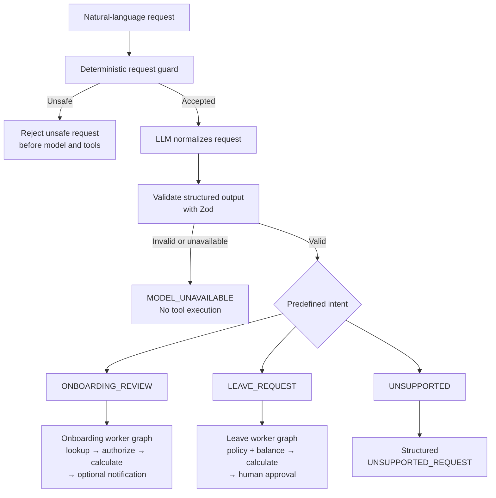

# Public Readiness and On-Demand Leave Documents Design

## Goal

Improve the repository's public explanation, make intent routing and production limitations easy to understand, provide representative responses for every public curl example, and replace PostgreSQL-stored leave PDF bytes with authorized on-demand generation.

The work prepares the repository and its completed GitHub delivery project for public access without presenting the application as production-ready.

## Scope

The approved work contains two related deliverables:

1. Generate submitted leave-request PDFs on demand from persisted business data and a stored template version.
2. Complete the public documentation, production-readiness roadmap, intent-routing explanation, curl response examples, and Agile delivery reference.

The runtime change and the broader documentation change will use separate pull requests so the behavior change remains independently reviewable.

## Naming and public description

The repository, package, local directory, source identifiers, database names, Docker resources, prompts, graphs, traces, and GitHub Project title remain unchanged.

The GitHub About description and README opening summary become:

> A TypeScript HR backend for Human Capital Management (HCM), demonstrating LLM orchestration, LangGraph workflows, RAG, MCP tools, guardrails, human approval, automated triggers, and LangSmith observability.

The README phrase:

> The system separates language understanding from business execution:

becomes:

> The system translates natural-language requests into a validated, predefined intent. Deterministic application code then:

The supporting bullets explain that application code resolves identity, authorizes access, selects a worker graph, performs deterministic calculations, persists workflow and audit state, and executes only explicitly permitted side effects.

## Intent normalization and routing

The README gains an `Intent normalization and routing` section after `Where the LLM is used` and before the workflow details.

The section contains this conceptual flow:



The accompanying table defines the three implemented intents:

| Intent              | Meaning                                                    | Route                           |
| ------------------- | ---------------------------------------------------------- | ------------------------------- |
| `ONBOARDING_REVIEW` | Review an active onboarding or probationary period         | Onboarding worker graph         |
| `LEAVE_REQUEST`     | Prepare an annual-leave proposal from explicit dates       | Leave worker graph              |
| `UNSUPPORTED`       | The request does not match an implemented agent capability | Structured unsupported response |

The section must make these boundaries explicit:

- The model selects only from the predefined intent enum and returns strict structured output.
- Zod rejects malformed output.
- The model cannot create routes, authorize access, calculate business outcomes, or execute side effects.
- A recognized intent with missing fields returns `NEED_MORE_INFORMATION`; missing information is not a fourth intent.
- The same thread can continue a missing-information conversation.
- Unsafe requests are rejected by deterministic controls before OpenAI and protected tools.
- Invalid model output, timeout, or model unavailability after the bounded retry returns HTTP `503` with `MODEL_UNAVAILABLE`, and no protected tool runs.
- A valid `UNSUPPORTED` intent returns the stable `UNSUPPORTED_REQUEST` response.
- Typed schedule, webhook, and RabbitMQ onboarding commands skip model normalization but enter the same deterministic graph, authorization, business, and audit flow.

## Intent observability

The README explains where an operator can inspect intent behavior:

- PostgreSQL `agent_runs` and `agent_run_steps` provide durable run and step evidence, including `intent_normalization` and stable outcome codes.
- SSE provides safe intent, node, tool, approval, document, and response progress events.
- Explicit LangSmith agent traces can include the raw query, normalized intent, prompt version, model, graph path, tool names, authorization result, latency, token usage, retries, and failures.
- Pino operational logs contain safe request metadata rather than raw queries or complete employee records.
- Security events record unsafe-request and authorization evidence.

The documentation distinguishes an unrecognized supported field from an unavailable model. Missing fields and `UNSUPPORTED` are valid model outcomes; `MODEL_UNAVAILABLE` is a technical failure.

## On-demand leave PDF generation

### Current behavior

Approval currently generates a PDF buffer and stores it in `leave_requests.document_pdf`. The download endpoint reads and returns those stored bytes.

This kept the initial implementation transactional and self-contained, avoided an object-storage dependency, and made duplicate approval return the same stored document. The trade-off is that binary data increases database storage, backup, and replication cost.

### New behavior

Approval persists the immutable submitted leave-request business values and a document template version. It does not generate or store PDF bytes.

The existing download endpoint performs this sequence:

```text
GET /api/v1/leave-requests/:leaveRequestId/document
→ resolve actor identity
→ load submitted leave-request snapshot
→ enforce employee-or-HR authorization
→ select the stored document template version
→ generate the deterministic PDF
→ return application/pdf
```

The endpoint remains:

```http
GET /api/v1/leave-requests/:leaveRequestId/document
```

Its successful response remains HTTP `200` with:

```http
Content-Type: application/pdf
Cache-Control: no-store
Content-Disposition: inline; filename="leave-request-<id>.pdf"
```

### Persistence change

The Prisma model and controlled migration will:

- remove `document_pdf` from `leave_requests`;
- add required `document_template_version`, mapped to `document_template_version`;
- use `leave-request-v1` for existing and new rows.

The migration drops the existing development PDF bytes. Existing submitted rows remain renderable because their request ID, employee, leave type through policy, dates, working days, status, and submission data are already stored. Anyone applying the migration to data that must be preserved must back up the database first.

### Service boundaries

- Approval no longer calls the PDF generator and no longer passes bytes to the leave repository.
- Duplicate approval identifies an existing submitted request without requiring stored document bytes.
- The repository returns an authorized, bounded leave-request document snapshot rather than a PDF buffer.
- A focused leave-document service chooses a generator by the stored template version and creates the buffer after authorization.
- The controller remains an HTTP adapter and does not own template selection or PDF business logic.
- Unknown template versions fail with a stable internal document error rather than silently using a different template.
- The existing `documentUrl` contract remains unchanged.
- Approval-time progress reports the document as `available`, not `generated`.
- Actual download emits safe generation/served operational evidence without PDF contents.

The submitted business values and template version are immutable inputs. Repeated downloads of the same request under the same code version produce the same document.

### Production boundary

On-demand generation is appropriate for the current small derived document. A legally significant or externally signed artifact may require generation once, immutable object storage, a content hash, retention policy, and an auditable storage reference. That remains a production roadmap item rather than an implemented dependency.

## Current limitations

The README replaces the short `Current boundaries` section with a structured `Current limitations` section that explains the reason and production implication of each boundary.

The section covers:

- `X-Employee-Id` is a development identity, not production authentication.
- Manager notification uses a development adapter and does not contact an external provider.
- Employee and policy data come from local PostgreSQL, not Oracle Fusion or another HR platform.
- Implemented HR scope is limited to onboarding review, annual leave, and policy Q&A.
- Studio scenarios and automated tests use fake external dependencies.
- Runtime OpenAI, PostgreSQL, pgvector, RabbitMQ, LangGraph, and optional LangSmith integrations are real when configured and must not be described as mocks.
- Policy ingestion supports repository-managed PDFs only.
- OpenAI is the only implemented language-model and embedding provider.
- Detailed LangSmith traces may include raw questions and answers and are limited to approved synthetic data under the current privacy design.
- Leave calculations use a Monday–Friday work week without a public-holiday calendar.
- Leave PDFs are generated on demand and are not preserved as immutable legal artifacts.
- Automated coverage focuses on unit tests, while infrastructure behavior is verified manually.
- Docker Compose is a development environment, not a production deployment.
- Production secrets management, centralized monitoring, alerting, disaster recovery, and formal SLOs are not implemented.

The rationale for detailed LangSmith development traces is also explicit: raw inputs, answers, normalized intent, graph paths, tools, tokens, latency, and failures make agent behavior debuggable, but real HR data requires a production trace-data policy, PII filtering, access controls, sampling, retention, regional review, and the ability to omit sensitive payloads.

## Production-readiness roadmap

The README provides an ordered, actionable roadmap rather than claiming that the repository is production-ready:

1. Introduce trusted SSO/OAuth identity and production authorization governance.
2. Add Oracle Fusion or another approved HR platform through REST/SOAP adapters.
3. Replace the development notification adapter with approved delivery providers, retries, idempotency, and delivery tracking.
4. Add managed secrets, TLS, encryption, PII governance, retention, and audit controls.
5. Move infrastructure to managed PostgreSQL, RabbitMQ, backup, and disaster-recovery services.
6. Use immutable object storage for official documents where the business and legal requirements demand it.
7. Add transactional event publishing, circuit breakers, and operational dead-letter handling.
8. Add production container deployment, horizontal scaling, scheduler coordination, and worker isolation.
9. Add centralized metrics, OpenTelemetry, dashboards, alerts, and SLOs.
10. Add integration, contract, end-to-end, security, load, and failure-injection testing.
11. Add prompt/model release controls, evaluation gates, cost budgets, caching, provider fallback, and rollback.
12. Add more HR workflows with corresponding intents, worker graphs, tools, authorization, traces, evaluations, and documentation.

Production readiness remains dependent on the deploying organization's legal, security, data-residency, availability, and operational requirements.

## Knowledge-ingestion extensibility

The README identifies PDF-only indexing as a current limitation. Production extensions may include:

- DOCX and other office documents;
- CSV and spreadsheets with schema-aware row, column, and header handling;
- HTML and knowledge-base pages;
- plain text and Markdown;
- scanned documents using OCR;
- SharePoint, Google Drive, or document-management connectors;
- malware scanning, ownership, access controls, lifecycle, deletion, and reindexing.

This is described as business-dependent extensibility. The repository does not claim that every RAG system must accept every format.

## Model-provider extensibility

The README identifies OpenAI-only runtime adapters as a current limitation. A production extension should separate provider-neutral interfaces for:

- intent normalization;
- grounded answer generation; and
- embeddings.

Other approved language providers can implement language tasks, while embeddings remain independently selectable. Provider portability requires capability checks, common structured-output contracts, provider-specific timeout/retry/rate-limit behavior, accuracy/latency/cost evaluation, fallback policy, and embedding-dimension compatibility. Changing an embedding model or dimension requires versioned side-by-side reindexing before activation.

## Extending HR capabilities

The README explains the extension pattern:

```text
business requirement
→ predefined structured intent
→ supervisor route
→ domain worker graph
→ authorized tools
→ repository or external adapter
→ audit, traces, evaluations, and documentation
```

Possible future business capabilities include employee profiles, absence categories, benefits, performance reviews, recruitment, document workflows, and additional HR-system integrations. They are clearly labelled as opportunities rather than implemented features.

## Curl response documentation standard

The public documentation currently contains 30 curl commands across:

- `README.md`;
- `docs/api-examples.md`;
- `docs/rag-testing-and-troubleshooting.md`; and
- `docs/usage-guide.md`.

Every public curl example will be immediately followed by:

1. the expected HTTP status;
2. relevant response headers;
3. a representative response body or output;
4. placeholders for generated IDs, dates, and timestamps; and
5. a short note identifying values that vary.

Special cases use the correct response form:

- SSE examples show a representative event sequence.
- PDF examples show response headers, output-file behavior, and file verification.
- RabbitMQ/development publisher examples show the accepted response and explain the asynchronous downstream result.
- RAG examples include representative answer and source structures.
- Error examples show the complete structured failure.
- Health and readiness commands receive separate expected responses.

Historical implementation plans under `docs/superpowers/plans` are excluded because they are development records rather than public usage instructions.

The leave-document database example will show the submitted request metadata and `document_template_version`, not PDF bytes.

## Agile project delivery

The README gains a `Project delivery` section linked to [GitHub Project #7](https://github.com/users/ramioooz/projects/7):

> Development was managed through the linked GitHub Project using a lightweight Agile delivery process. Work was organized into two fast-paced sprints with epics, stories, parented tasks, acceptance criteria, pull-request-based delivery, and a working increment at the end of each sprint.

Project #7 is currently private and closed. It remains closed as the completed delivery record but must be made public before repository visitors can follow the link.

## GitHub work organization

The GitHub delivery project receives two parented tasks:

1. `TASK: Generate Leave Request PDFs on Demand`
   - Parent: Story #6, the existing leave-workflow story.
   - Owns the Prisma migration, repository/service/controller behavior, focused tests, and directly affected API documentation.
2. `TASK: Complete Public Documentation and Production Roadmap`
   - Parent: Story #8, the existing documentation/interoperability story.
   - Owns the README changes, intent diagram, limitations, roadmap, Agile link, and expected public curl responses.

The Project, relevant parent items, and Sprint 2 Epic can be reopened while work is active and closed again only after both changes reach `main` and final verification passes.

## Pull-request boundaries

### PR 1: On-demand leave documents

- Branch: `feat/on-demand-leave-documents`
- Closes only its assigned task.
- Contains runtime, migration, focused test, and directly affected leave documentation.
- Does not contain the broad README rewrite.

### PR 2: Public documentation and roadmap

- Branch: `docs/public-readiness-roadmap`
- Closes only its assigned task.
- Contains the README and public-documentation audit.
- Rebases on the leave-document change before final response examples are verified.

The repository owner remains the sole merger to `main`.

## Testing and verification

The runtime PR updates existing leave tests and adds at most one focused new test for the essential on-demand behavior: an authorized submitted request is rendered through its stored template version without persisted PDF bytes. Existing authorization, repeat approval, and PDF-signature assertions are updated rather than duplicated.

Each PR runs:

```bash
npm run db:generate
npm test
npm run typecheck
npm run lint
npm run format:check
npm run db:format:check
npm run build
```

Manual verification covers:

- eligible leave proposal and approval;
- submitted row with template version and no PDF column;
- authorized repeated PDF downloads;
- PDF signature and response headers;
- unauthorized document access;
- every public curl and representative documented response;
- README intent, limitations, and roadmap claims against the implementation.

## Public-release actions

After both pull requests are merged and verified:

1. scan tracked files and Git history for secrets and private data;
2. confirm all employee and policy examples are synthetic;
3. update the GitHub About description;
4. make GitHub Project #7 public while keeping it closed as the completed delivery record;
5. make the repository public;
6. protect `main` and require pull requests;
7. keep repository-owner-only merges to `main`.

Permission changes and publication are external side effects and require final action-time confirmation immediately before they are applied.

## Exclusions

This work does not implement:

- production authentication or authorization;
- an external HR platform adapter;
- a real notification provider;
- object storage;
- additional document formats;
- additional model providers;
- new HR business workflows;
- a production deployment; or
- broad new test suites.

Those capabilities are documented accurately in the production-readiness roadmap rather than presented as implemented behavior.
