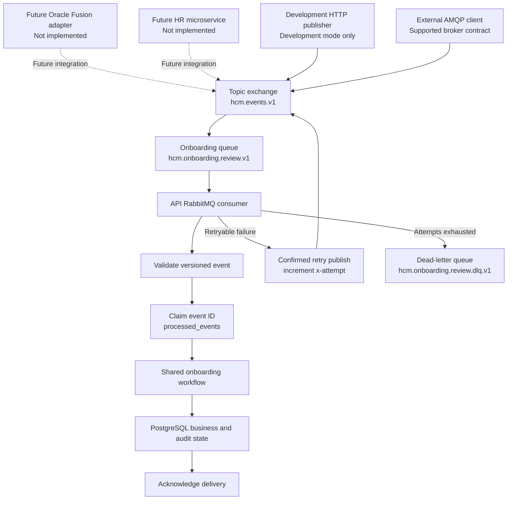

# Manual Testing and RabbitMQ Documentation Design

**Status:** Approved design awaiting implementation planning

**Date:** 2026-08-18

## Context

The repository already documents many local usage scenarios, but readers do not have one canonical pre-publication manual test procedure. RabbitMQ is summarized in the README and architecture guide without enough detail to explain the producer boundary, broker topology, asynchronous completion semantics, retry counter, database idempotency, dead-letter storage, or operational verification.

Manual verification also exposed two RabbitMQ observability gaps:

1. invalid broker messages are dead-lettered with the generic `INTERNAL_ERROR` code; and
2. the application does not emit dedicated safe lifecycle logs when broker messages are received, completed, retried, rejected, or dead-lettered.

The documentation must describe the implementation accurately without implying that a concrete Oracle Fusion or other external HR producer, automated DLQ consumer, or production broker security model already exists.

## Goals

- Make the README the discoverable entry point for containerized manual verification.
- Rename the existing usage guide to a clearly named canonical manual testing guide.
- Preserve detailed curls, expected responses, dynamic-value notes, and server-side verification for the implemented application use cases.
- Add a dedicated RabbitMQ guide covering architecture, contracts, operation, testing, limitations, and troubleshooting.
- Use vertical Mermaid diagrams for the broker lifecycle.
- Explain the difference between producer confirmation, broker routing, consumer processing, and database completion.
- Add safe Pino lifecycle evidence and a specific validation failure code so RabbitMQ behavior is diagnosable.
- Keep RabbitMQ testing focused on one successful scenario and one failure/retry/DLQ scenario.

## Non-goals

- Implementing an Oracle Fusion, external HR, batch, or other concrete event producer.
- Implementing an automated DLQ consumer, redrive worker, replay API, or event-correction UI.
- Adding delayed retry queues or exponential backoff.
- Adding production RabbitMQ TLS, service identities, vhost isolation, monitoring infrastructure, or alerting.
- Expanding RabbitMQ beyond the existing onboarding-review event.
- Adding broad integration or end-to-end test suites.

## Documentation ownership

| File                                      | Responsibility                                                                                                                                                   |
| ----------------------------------------- | ---------------------------------------------------------------------------------------------------------------------------------------------------------------- |
| `README.md`                               | Docker Compose quick start, categorized manual-test title matrix, additional tools, high-level RabbitMQ explanation and vertical diagram, limitations, and links |
| `docs/manual-testing.md`                  | Canonical step-by-step manual verification guide with commands, curls, expected results, and server-side evidence                                                |
| `docs/rabbitmq.md`                        | RabbitMQ concepts, topology, event contract, lifecycle, retries, DLQ, testing, limitations, and troubleshooting                                                  |
| `docs/rag-testing-and-troubleshooting.md` | Deep RAG indexing, retrieval, tracing, and diagnostic scenarios                                                                                                  |
| `docs/mcp.md`                             | MCP architecture, authorization, tools, Inspector use, and production considerations                                                                             |
| `docs/architecture.md`                    | Overall component boundaries and a link to the dedicated RabbitMQ guide                                                                                          |
| `docs/api-examples.md`                    | Compact HTTP and MCP request/response contracts and links to complete procedures                                                                                 |

`docs/usage-guide.md` will be renamed to `docs/manual-testing.md`. All repository links and anchors that reference the old path will be updated. No duplicate compatibility file will remain.

## README design

The README will add a **Manual testing** section containing:

- full Docker Compose startup, migration, seed, indexing, health, readiness, logs, and shutdown commands;
- the complete categorized test-title inventory for infrastructure, onboarding, state, streaming, routing, security, leave, PDF, RAG, MCP, webhook, RabbitMQ, scheduler, observability, tracing, Studio, evaluation, and quality checks;
- a compact tools table covering Insomnia, curl, MCP Inspector, RabbitMQ Management UI, DBeaver/psql, LangSmith, LangGraph Studio, Docker logs, and a PDF viewer;
- a link to `docs/manual-testing.md` for executable procedures; and
- a high-level vertical RabbitMQ diagram plus a link to `docs/rabbitmq.md`.

The README will not embed every detailed curl. This keeps it navigable while still exposing the full verification surface.

## Canonical manual testing guide

Each detailed scenario in `docs/manual-testing.md` will use a consistent contract:

1. test identifier and title;
2. purpose;
3. prerequisites and required seed identity;
4. recommended tool;
5. exact command or curl;
6. expected HTTP status and relevant response headers;
7. representative response or command output;
8. dynamic identifiers, dates, model-dependent text, or other variable-value notes;
9. optional PostgreSQL, RabbitMQ, Pino, LangSmith, Studio, or filesystem verification; and
10. cleanup or reset instructions where state changes.

The guide will use the containerized base URL `http://localhost:3300` as its primary pre-publication path. It will explain that the default Compose project can use unqualified commands, while an isolated project such as `agentic-hr-prepublic` requires `docker compose -p agentic-hr-prepublic ...` consistently.

Detailed non-RabbitMQ scenarios will continue to include the implemented success and critical failure paths. RabbitMQ will deliberately use only the two complete scenarios defined below; secondary broker behaviors will be summarized in a compact reference table.

## RabbitMQ purpose and implemented boundary

RabbitMQ decouples an event producer from onboarding-workflow execution. A publisher receives confirmation that RabbitMQ accepted and routed a persistent event. The API consumes that event asynchronously, validates it, claims its event ID for idempotency, runs the shared onboarding workflow, records durable results, and acknowledges the delivery.

Implemented producer and consumer boundaries are:

| Capability                                                                                      | Status                                       |
| ----------------------------------------------------------------------------------------------- | -------------------------------------------- |
| Durable exchanges, queues, consumer, publisher confirms, manual acknowledgement, retry, and DLQ | Implemented                                  |
| Versioned onboarding event and Zod validation                                                   | Implemented                                  |
| `processed_events` idempotency and processing state                                             | Implemented                                  |
| Development HTTP publisher                                                                      | Implemented only when `NODE_ENV=development` |
| Direct publication by a compatible AMQP client                                                  | Supported by the implemented broker contract |
| Oracle Fusion or another concrete external producer adapter                                     | Not implemented; extension point             |
| Production RabbitMQ identity, TLS, vhost, network, monitoring, and alerting controls            | Not implemented                              |

An external producer could later be an Oracle Fusion integration adapter, another HR microservice, an enterprise integration platform, or a governed batch service. The repository will not claim those producers are included.

## RabbitMQ topology

| Element                  | Value                          |
| ------------------------ | ------------------------------ |
| Event exchange           | `hcm.events.v1`                |
| Exchange type            | `topic`                        |
| Event routing key        | `onboarding.review.requested`  |
| Consumer queue           | `hcm.onboarding.review.v1`     |
| Dead-letter exchange     | `hcm.events.dlx.v1`            |
| Dead-letter routing key  | `onboarding.review.dead`       |
| Dead-letter queue        | `hcm.onboarding.review.dlq.v1` |
| Default maximum attempts | `3`                            |
| Attempt header           | `x-attempt`                    |

The primary architecture diagram will flow from top to bottom:



Dashed producer edges identify extension points rather than shipped integrations.

## Event contract and validation

The guide will include a valid event example and explain every field. `correlationId` and optional `threadId` must be UUID v4 values. `eventId` must use the safe identifier format, and `employeeCode`, action, threshold, timestamp, type, and version are validated before a database event claim.

RabbitMQ can return `{"routed":true}` for a syntactically valid broker publication whose JSON payload later fails application validation. Broker routing is not business acceptance.

If application validation fails:

- `processed_events` has no row because the claim has not started;
- the retry counter is still advanced through RabbitMQ headers;
- the message reaches the DLQ after the configured final attempt; and
- the new stable failure code and Pino lifecycle records make the reason observable without storing or logging the raw payload.

## Retry and persistence semantics

`x-attempt` controls the RabbitMQ retry decision. Missing, invalid, or less-than-one values are interpreted as attempt `1`. On failure before the configured maximum, the consumer republishes the same content to the main exchange with `x-attempt + 1`, waits for broker confirmation, and then acknowledges the original delivery. After the final failure, it confirms publication to the dead-letter exchange before acknowledging the original.

If retry or dead-letter publication confirmation fails, the original delivery remains unacknowledged and can be redelivered.

`processed_events.attempt` records the latest successfully claimed processing attempt. It supports audit and idempotency but does not decide whether RabbitMQ has attempts remaining.

The DLQ is a durable RabbitMQ queue, not a PostgreSQL table. In the isolated Compose project it is stored under the RabbitMQ-managed volume `agentic-hr-prepublic_hcm_rabbitmq_data`, mounted internally at `/var/lib/rabbitmq`. It survives a normal container restart but not explicit volume deletion.

The application has no DLQ consumer, automated replay, redrive API, event correction workflow, or DLQ alert. Operators must currently inspect and manage dead-letter messages manually.

## RabbitMQ observability correction

Pino is the application-side operational log. RabbitMQ remains responsible for broker-level queue depth, consumer count, and publish/delivery metrics.

The runtime change will add these safe events:

- `rabbitmq.event.publish_confirmed` for an application-owned development publication after `waitForConfirms()`;
- `rabbitmq.event.received` when the consumer receives a delivery;
- `rabbitmq.event.completed` after successful idempotent processing;
- `rabbitmq.event.duplicate` when processing is skipped as an existing event;
- `rabbitmq.event.conflict` for incompatible reuse of an event ID;
- `rabbitmq.event.validation_failed` for an invalid application payload;
- `rabbitmq.event.retry_published` after the next attempt is confirmed; and
- `rabbitmq.event.dead_lettered` after dead-letter publication is confirmed.

The stable validation outcome will be `RABBITMQ_EVENT_VALIDATION_FAILED` rather than `INTERNAL_ERROR`.

Allowlisted fields are limited to safe operational metadata such as message/event ID, correlation ID, current and next attempt, routing key, status, and stable failure code. Raw payloads, employee codes, names, contact information, credentials, exception messages, and stack traces will not be logged.

When an external client receives `{"routed":true}`, no application publisher log exists because the API did not perform that publication. The first application evidence is `rabbitmq.event.received`. When the development endpoint publishes through the application, `rabbitmq.event.publish_confirmed` provides the publisher-side evidence.

## Two detailed RabbitMQ manual scenarios

### Scenario 1: successful asynchronous processing

The guide will provide one complete Management API curl using a valid UUID v4 and unique event ID, followed by:

- expected `{"routed":true}` broker response;
- expected `rabbitmq.event.received` and `rabbitmq.event.completed` Pino records;
- a DBeaver/psql query proving `processed_events.status = COMPLETED`, `attempt = 1`, populated run/thread identifiers, and no error code; and
- an agent-run/step query linked by correlation ID.

### Scenario 2: validation failure, retries, and DLQ

The guide will provide one intentionally invalid Management API curl, followed by:

- expected `{"routed":true}` broker response;
- expected validation-failure and retry logs for attempts `1` and `2`;
- expected validation-failure and dead-letter log for attempt `3`;
- a RabbitMQ UI, CLI, and non-destructive Management API method for inspecting `hcm.onboarding.review.dlq.v1`;
- proof that the message contains final attempt and stable validation failure headers; and
- a database query confirming that no `processed_events` row exists because validation failed before claiming.

Management credentials/topology, duplicate behavior, durable storage, immediate retry behavior, development-endpoint availability, external producers, and the lack of automated redrive will remain compact reference notes rather than separate detailed tests.

## Limitations and production direction

The README and RabbitMQ guide will state:

| Current limitation                                | Production direction                                                                  |
| ------------------------------------------------- | ------------------------------------------------------------------------------------- |
| No concrete Oracle Fusion or external HR producer | Add an authenticated, versioned integration adapter                                   |
| Development broker uses `guest` credentials       | Add service identities, rotated secrets, TLS, vhosts, and least-privilege permissions |
| Only onboarding-review events are supported       | Add versioned contracts only for required business domains                            |
| Retries are immediate                             | Add delayed retry queues or scheduled exponential backoff where required              |
| No automated DLQ consumer or replay               | Add authorized, audited redrive tooling with correction controls                      |
| No DLQ monitoring or alerting                     | Add broker metrics, ownership, dashboards, thresholds, and alerts                     |
| No transactional outbox                           | Add one where a database change and event publication must be atomic                  |

## Implementation and PR boundaries

The runtime correction and documentation remain separately reviewable:

1. Create a task parented under Story #7 for RabbitMQ validation and lifecycle logging.
2. Implement the stable error code and safe Pino events in one focused runtime branch and PR to `main`.
3. Add or update only the smallest critical unit-test coverage needed for the new validation/logging behavior.
4. Do not merge the runtime PR automatically.
5. After the repository owner merges it, synchronize the documentation branch with `main`.
6. Update existing documentation PR #89 with the README, renamed manual guide, RabbitMQ guide, limitations, architecture, API examples, configuration links, and all renamed-path references.
7. Do not merge PR #89 automatically.

## Verification

Documentation verification will include:

- link and anchor validation after the guide rename;
- an inventory of public curls and immediately adjacent expected responses;
- JSON/JSONL parsing for representative bodies and outputs;
- Mermaid syntax and source-value review;
- scans for stale `docs/usage-guide.md` references;
- scans ensuring no external producer or DLQ consumer is described as implemented; and
- confirmation that the README remains a navigable summary rather than a duplicate procedural manual.

Repository verification will run:

```bash
npm run db:generate
npm test
npm run typecheck
npm run lint
npm run format:check
npm run db:format:check
npm run build
```

Manual verification will execute the two RabbitMQ scenarios against the full Docker Compose stack and confirm broker, Pino, PostgreSQL, retry, and DLQ evidence.

## Acceptance criteria

- A public reader can start the full Docker stack and locate every manual test category from the README.
- `docs/manual-testing.md` is the single canonical procedural guide, and no stale usage-guide links remain.
- Every detailed curl has status, relevant headers, representative body/output, and variable-value notes.
- RabbitMQ documentation accurately separates external publication, broker routing, consumer processing, and database completion.
- The diagrams flow vertically and match the implemented topology.
- A valid event is traceable from `routed:true` through Pino and PostgreSQL completion.
- An invalid event is traceable through validation, three attempts, and the DLQ without a `processed_events` row.
- Validation failures use a specific stable code rather than `INTERNAL_ERROR`.
- Safe logs contain no raw event payload or employee data.
- The absence of a DLQ consumer, external producer adapter, delayed retry, production broker security, and alerting is explicit.
- Runtime and documentation changes are delivered through reviewable PRs and never merged into `main` automatically.
